## Deploy a vanilla Azure Arc Data Controller in a directly connected mode on AKS using an ARM Template

The following Jumpstart scenario will guide you on how to deploy a "Ready to Go" environment so you can start using [Azure Arc-enabled data services](https://docs.microsoft.com/azure/azure-arc/data/overview) deployed on [Azure Kubernetes Service (AKS)](https://docs.microsoft.com/azure/aks/intro-kubernetes) cluster using [Azure ARM Template](https://docs.microsoft.com/azure/azure-resource-manager/templates/overview).

By the end of this scenario, you will have an AKS cluster deployed with an Azure Arc Data Controller and a Microsoft Windows Server 2022 (Datacenter) Azure VM, installed & pre-configured with all the required tools needed to work with Azure Arc Data Services:


> **Note:** Currently, Azure Arc-enabled PostgreSQL is in [public preview](https://docs.microsoft.com/azure/azure-arc/data/release-notes).

## Prerequisites

- Clone the Azure Arc Jumpstart repository

    ```shell
    git clone https://github.com/microsoft/azure_arc.git
    ```

- [Install or update Azure CLI to version 2.49.0 and above](https://docs.microsoft.com/cli/azure/install-azure-cli?view=azure-cli-latest). Use the below command to check your current installed version.

  ```shell
  az --version
  ```

- [Generate a new SSH key pair](https://docs.microsoft.com/azure/virtual-machines/linux/create-ssh-keys-detailed) or use an existing one (Windows 10 and above now comes with a built-in ssh client).

  ```shell
  ssh-keygen -t rsa -b 4096
  ```

  To retrieve the SSH public key after it's been created, depending on your environment, use one of the below methods:
  - In Linux, use the `cat ~/.ssh/id_rsa.pub` command.
  - In Windows (CMD/PowerShell), use the SSH public key file that by default, is located in the _`C:\Users\WINUSER/.ssh/id_rsa.pub`_ folder.

  SSH public key example output:

  ```shell
  ssh-rsa o1djFhyNe5NXyYk7XVF7wOBAAABgQDO/QPJ6IZHujkGRhiI+6s1ngK8V4OK+iBAa15GRQqd7scWgQ1RUSFAAKUxHn2TJPx/Z/IU60aUVmAq/OV9w0RMrZhQkGQz8CHRXc28S156VMPxjk/gRtrVZXfoXMr86W1nRnyZdVwojy2++sqZeP/2c5GoeRbv06NfmHTHYKyXdn0lPALC6i3OLilFEnm46Wo+azmxDuxwi66RNr9iBi6WdIn/zv7tdeE34VAutmsgPMpynt1+vCgChbdZR7uxwi66RNr9iPdMR7gjx3W7dikQEo1djFhyNe5rrejrgjerggjkXyYk7XVF7wOk0t8KYdXvLlIyYyUCk1cOD2P48ArqgfRxPIwepgW78znYuwiEDss6g0qrFKBcl8vtiJE5Vog/EIZP04XpmaVKmAWNCCGFJereRKNFIl7QfSj3ZLT2ZXkXaoLoaMhA71ko6bKBuSq0G5YaMq3stCfyVVSlHs7nzhYsX6aDU6LwM/BTO1c= user@pc
  ```

- Create Azure service principal (SP). To deploy this scenario, an Azure service principal assigned with multiple Role-based access control (RBAC) roles is required:

  - "Contributor" - Required for provisioning Azure resources
  - "Security admin" - Required for installing Cloud Defender Azure-Arc enabled Kubernetes extension and dismiss alerts
  - "Security reader" - Required for being able to view Azure-Arc enabled Kubernetes Cloud Defender extension findings
  - "Monitoring Metrics Publisher" - Required for being Azure Arc-enabled data services billing, monitoring metrics, and logs management

    To create it login to your Azure account run the below command (this can also be done in [Azure Cloud Shell](https://shell.azure.com/).

    ```shell
    az login
    subscriptionId=$(az account show --query id --output tsv)
    az ad sp create-for-rbac -n "<Unique SP Name>" --role "Contributor" --scopes /subscriptions/$subscriptionId
    az ad sp create-for-rbac -n "<Unique SP Name>" --role "Security admin" --scopes /subscriptions/$subscriptionId
    az ad sp create-for-rbac -n "<Unique SP Name>" --role "Security reader" --scopes /subscriptions/$subscriptionId
    az ad sp create-for-rbac -n "<Unique SP Name>" --role "Monitoring Metrics Publisher" --scopes /subscriptions/$subscriptionId
    ```

    For example:

    ```shell
    az login
    subscriptionId=$(az account show --query id --output tsv)
    az ad sp create-for-rbac -n "JumpstartArcAppSvc" --role "Contributor" --scopes /subscriptions/$subscriptionId
    az ad sp create-for-rbac -n "JumpstartArcAppSvc" --role "Security admin" --scopes /subscriptions/$subscriptionId
    az ad sp create-for-rbac -n "JumpstartArcAppSvc" --role "Security reader" --scopes /subscriptions/$subscriptionId
    az ad sp create-for-rbac -n "JumpstartArcAppSvc" --role "Monitoring Metrics Publisher" --scopes /subscriptions/$subscriptionId
    ```

    Output should look like this:

    ```json
    {
    "appId": "XXXXXXXXXXXXXXXXXXXXXXXXXXXX",
    "displayName": "JumpstartArcAppSvc",
    "password": "XXXXXXXXXXXXXXXXXXXXXXXXXXXX",
    "tenant": "XXXXXXXXXXXXXXXXXXXXXXXXXXXX"
    }
    ```

    > **Note:** If you create multiple subsequent role assignments on the same service principal, your client secret (password) will be destroyed and recreated each time. Therefore, make sure you grab the correct password.

    > **Note:** The Jumpstart scenarios are designed with as much ease of use in-mind and adhering to security-related best practices whenever possible. It is optional but highly recommended to scope the service principal to a specific [Azure subscription and resource group](https://docs.microsoft.com/cli/azure/ad/sp?view=azure-cli-latest) as well considering using a [less privileged service principal account](https://docs.microsoft.com/azure/role-based-access-control/best-practices).

## Automation Flow

For you to get familiar with the automation and deployment flow, below is an explanation.

- User is editing the ARM template parameters file (1-time edit). These parameters values are being used throughout the deployment.

- Main [_azuredeploy_ ARM template](https://github.com/microsoft/azure_arc/blob/main/azure_arc_data_jumpstart/aks/ARM/azuredeploy.json) will initiate the deployment of the linked ARM templates:

  - [_VNET_](https://github.com/microsoft/azure_arc/blob/main/azure_arc_data_jumpstart/aks/ARM/VNET.json) - Deploys a Virtual Network with a single subnet to be used by the Client virtual machine.
  - [_aks_](https://github.com/microsoft/azure_arc/blob/main/azure_arc_data_jumpstart/aks/ARM/aks.json) - Deploys the AKS cluster where all the Azure Arc data services will be deployed.
  - [_clientVm_](https://github.com/microsoft/azure_arc/blob/main/azure_arc_data_jumpstart/aks/ARM/clientVm.json) - Deploys the client Windows VM. This is where all user interactions with the environment are made from.
  - [_logAnalytics_](https://github.com/microsoft/azure_arc/blob/main/azure_arc_data_jumpstart/aks/ARM/logAnalytics.json) - Deploys Azure Log Analytics workspace to support Azure Arc-enabled data services logs uploads.

- User remotes into client Windows VM, which automatically kicks off the [_DataServicesLogonScript_](https://github.com/microsoft/azure_arc/blob/main/azure_arc_data_jumpstart/aks/ARM/artifacts/DataServicesLogonScript.ps1) PowerShell script that deploy and configure Azure Arc-enabled data services on the AKS cluster including the data controller.

## Deployment

As mentioned, this deployment will leverage ARM templates. You will deploy a single template that will initiate the entire automation for this scenario.

- The deployment is using the ARM template parameters file. Before initiating the deployment, edit the [_azuredeploy.parameters.json_](https://github.com/microsoft/azure_arc/blob/main/azure_arc_data_jumpstart/aks/ARM/azuredeploy.parameters.json) file located in your local cloned repository folder. An example parameters file is located [here](https://github.com/microsoft/azure_arc/blob/main/azure_arc_data_jumpstart/aks/ARM/artifacts/azuredeploy.parameters.example.json).

  - _`sshRSAPublicKey`_ - Your SSH public key
  - _`spnClientId`_ - Your Azure service principal id
  - _`spnClientSecret`_ - Your Azure service principal secret
  - _`spnTenantId`_ - Your Azure tenant id
  - _`windowsAdminUsername`_ - Client Windows VM Administrator name
  - _`windowsAdminPassword`_ - Client Windows VM Password. Password must have 3 of the following: 1 lower case character, 1 upper case character, 1 number, and 1 special character. The value must be between 12 and 123 characters long.
  - _`logAnalyticsWorkspaceName`_ - Unique name for the deployment log analytics workspace.
  - _`deploySQLMI`_ - Boolean that sets whether or not to deploy SQL Managed Instance, for this data controller vanilla scenario we leave it set to _**false**_.
  - _`SQLMIHA`_ - Boolean that sets whether or not to deploy SQL Managed Instance with high-availability (business continuity) configurations, for this data controller vanilla scenario we leave it set to _**false**_.
  - _`deployPostgreSQL`_ - Boolean that sets whether or not to deploy PostgreSQL, for this data controller vanilla scenario we leave it set to _**false**_.
  - _`deployBastion`_ - Choice (true | false) to deploy Azure Bastion or not to connect to the client VM.
  - _`bastionHostName`_ - Azure Bastion host name.

- To deploy the ARM template, navigate to the local cloned [deployment folder](https://github.com/microsoft/azure_arc/blob/main/azure_arc_data_jumpstart/aks/ARM) and run the below command:

    ```shell
    az group create --name <Name of the Azure resource group> --location <Azure Region>
    az deployment group create \
    --resource-group <Name of the Azure resource group> \
    --name <The name of this deployment> \
    --template-uri https://raw.githubusercontent.com/microsoft/azure_arc/main/azure_arc_data_jumpstart/aks/ARM/azuredeploy.json \
    --parameters <The _azuredeploy.parameters.json_ parameters file location>
    ```

    > **Note:** Make sure that you are using the same Azure resource group name as the one you've just used in the _`azuredeploy.parameters.json`_ file.

    For example:

    ```shell
    az group create --name Arc-Data-Demo --location "East US"
    az deployment group create \
    --resource-group Arc-Data-Demo \
    --name arcdata \
    --template-uri https://raw.githubusercontent.com/microsoft/azure_arc/main/azure_arc_data_jumpstart/aks/ARM/azuredeploy.json \
    --parameters azuredeploy.parameters.json
    ```

    > **Note:** The deployment time for this scenario can take ~15-20min.

    > **Note:** If you receive an error message stating that the requested VM size is not available in the desired location (as an example: 'Standard_D8s_v3'), it means that there is currently a capacity restriction for that specific VM size in that particular region. Capacity restrictions can occur due to various reasons, such as high demand or maintenance activities. Microsoft Azure periodically adjusts the available capacity in each region based on usage patterns and resource availability. To continue deploying this scenario, please try to re-run the deployment using another region.

- Once Azure resources have been provisioned, you will be able to see them in the Azure portal. At this point, the resource group should have **8 various Azure resources** deployed.

    

    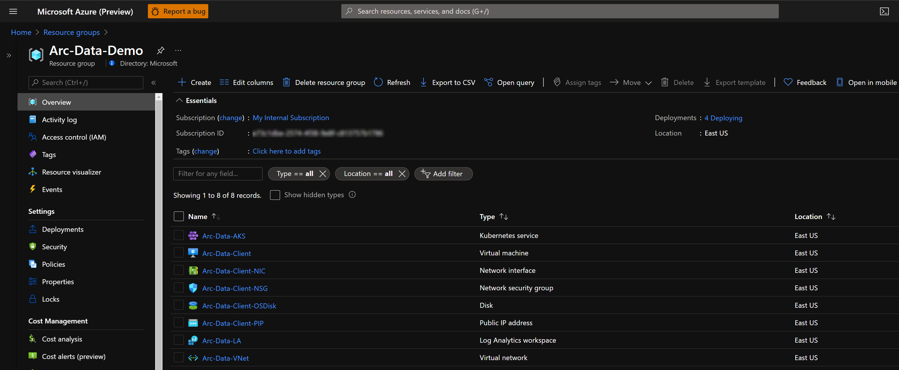

## Windows Login & Post Deployment

Various options are available to connect to _Arc-Data-Client_ VM, depending on the parameters you supplied during deployment.

- [RDP](/azure_arc_jumpstart/azure_arc_data/aks/aks_dc_vanilla_arm_template/#connecting-directly-with-rdp) - available after configuring access to port 3389 on the _Arc-Data-Client-NSG_, or by enabling [Just-in-Time access (JIT)](/azure_arc_jumpstart/azure_arc_data/aks/aks_dc_vanilla_arm_template/#connect-using-just-in-time-access-jit).
- [Azure Bastion](/azure_arc_jumpstart/azure_arc_data/aks/aks_dc_vanilla_arm_template/#connect-using-azure-bastion) - available if ```true``` was the value of your _`deployBastion`_ parameter during deployment.

### Connecting directly with RDP

By design, port 3389 is not allowed on the network security group. Therefore, you must create an NSG rule to allow inbound 3389.

- Open the _Arc-Data-Client-NSG_ resource in Azure portal and click "Add" to add a new rule.

  

  

- Specify the IP address that you will be connecting from and select RDP as the service with "Allow" set as the action. You can retrieve your public IP address by accessing [https://icanhazip.com](https://icanhazip.com) or [https://whatismyip.com](https://whatismyip.com).

  

  

  

### Connect using Azure Bastion

- If you have chosen to deploy Azure Bastion in your deployment, use it to connect to the VM.

  

  > **Note:** When using Azure Bastion, the desktop background image is not visible. Therefore some screenshots in this guide may not exactly match your experience if you are connecting with Azure Bastion.

### Connect using just-in-time access (JIT)

If you already have [Microsoft Defender for Cloud](https://docs.microsoft.com/azure/defender-for-cloud/just-in-time-access-usage?tabs=jit-config-asc%2Cjit-request-asc) enabled on your subscription and would like to use JIT to access the Client VM, use the following steps:

- In the Client VM configuration pane, enable just-in-time. This will enable the default settings.

  

  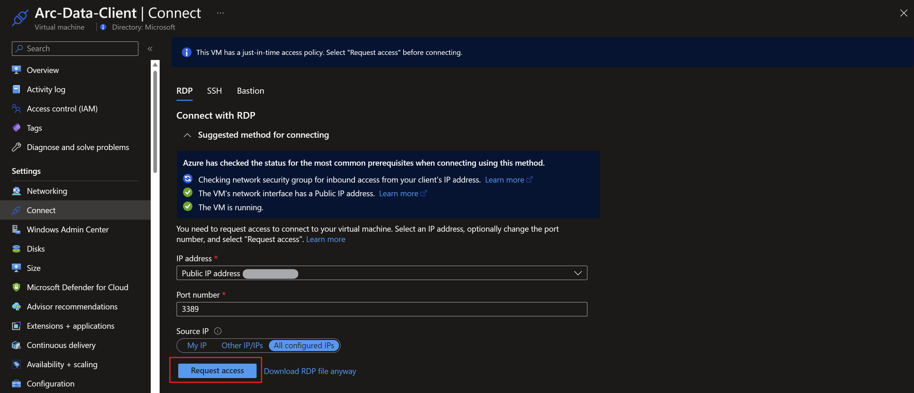

### Post Deployment

- At first login, as mentioned in the "Automation Flow" section above, the [_DataServicesLogonScript_](https://github.com/microsoft/azure_arc/blob/main/azure_arc_data_jumpstart/aks/ARM/artifacts/DataServicesLogonScript.ps1) PowerShell logon script will start it's run.

- Let the script to run its course and **do not close** the PowerShell session, this will be done for you once completed. Once the script will finish it's run, the logon script PowerShell session will be closed, the Windows wallpaper will change and the Azure Arc Data Controller will be deployed on the cluster and be ready to use.

    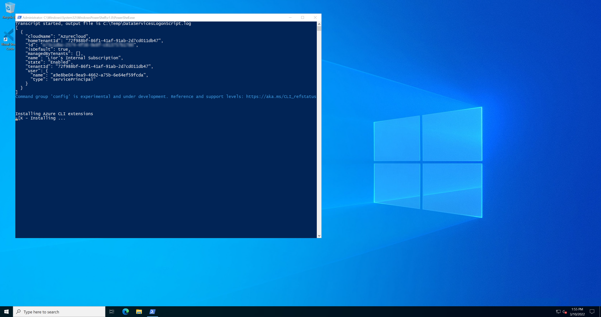

    

    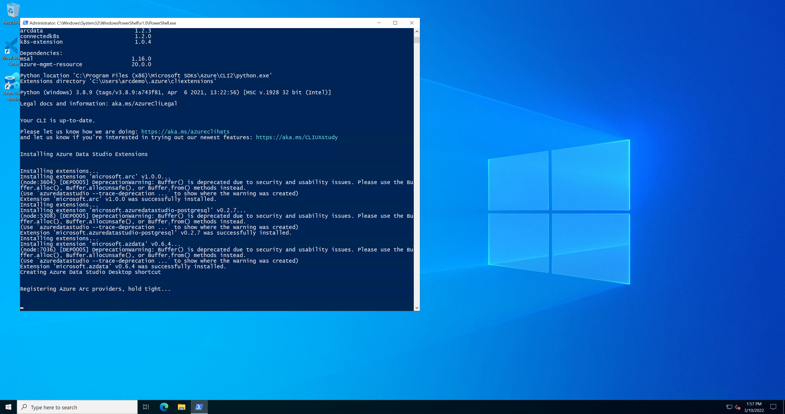

    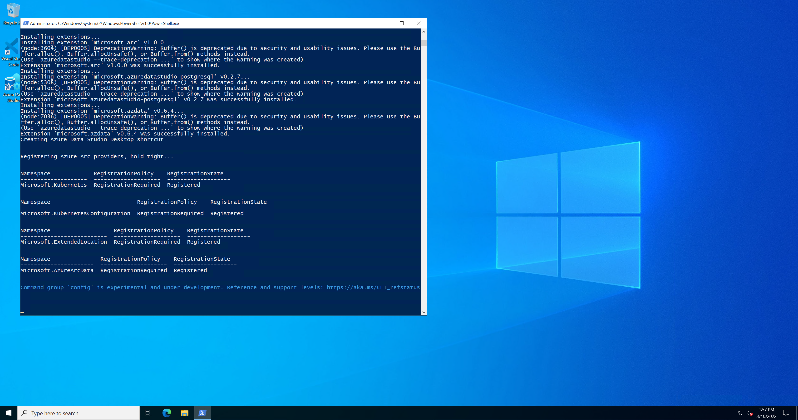

    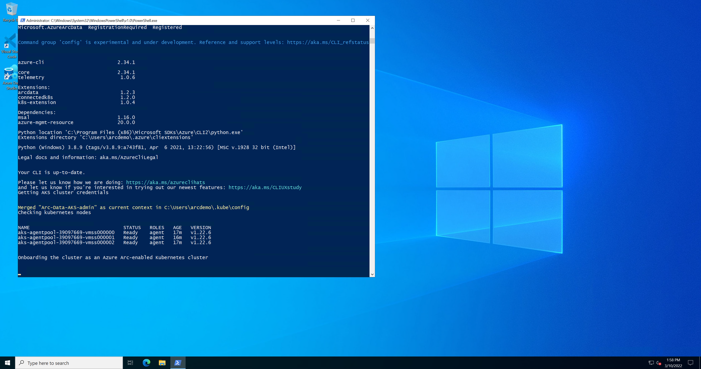

    

    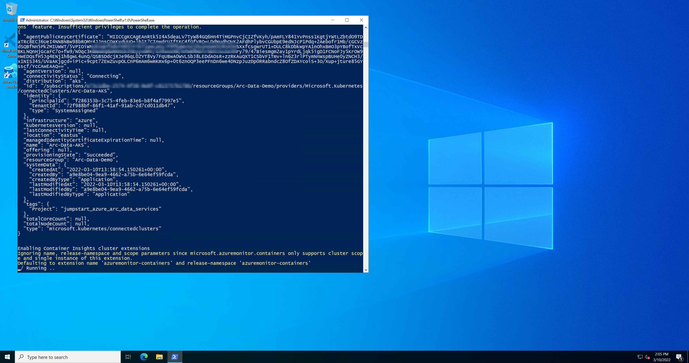

    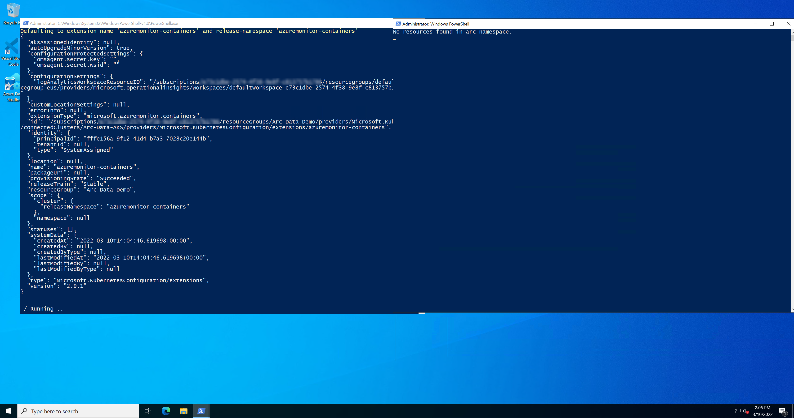

    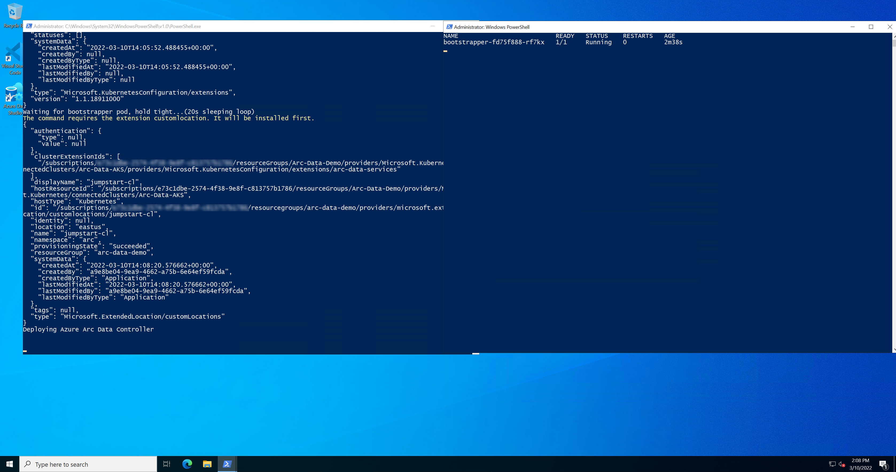

    

    

    

    

    

    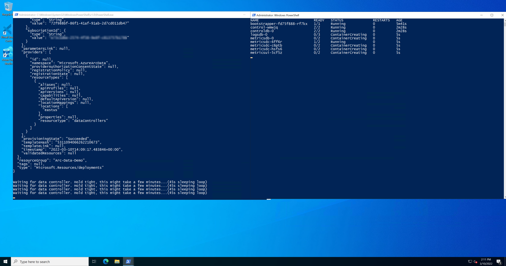

    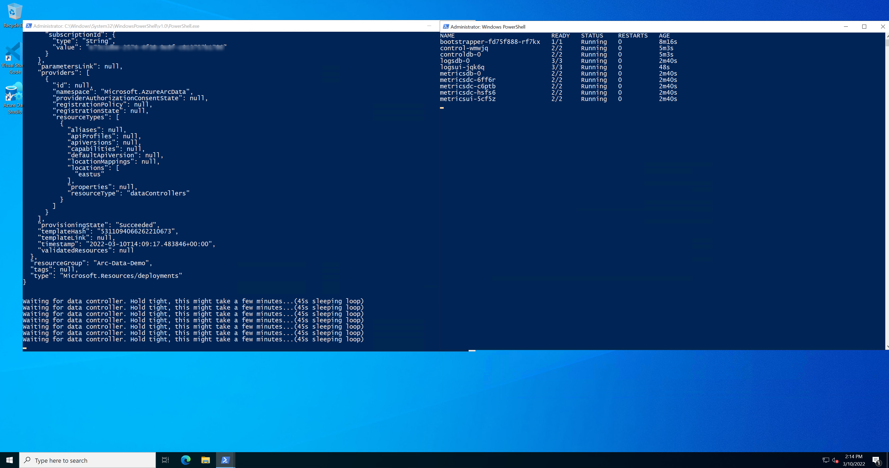

    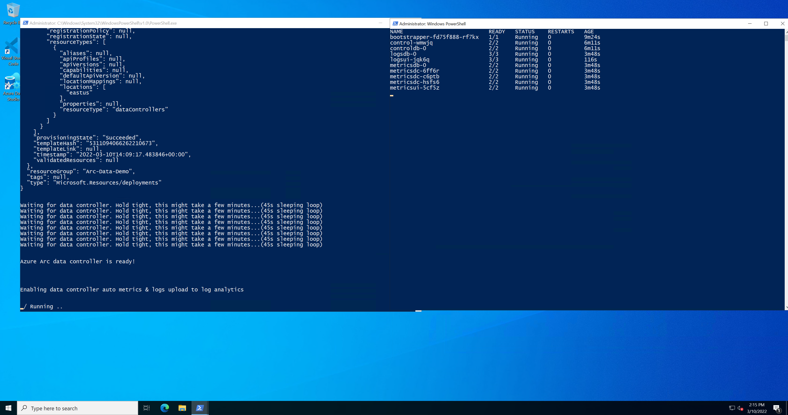

    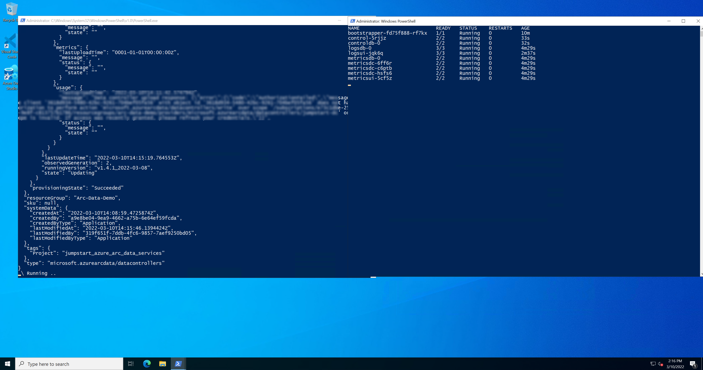

    

- Since this scenario is deploying the Azure Arc Data Controller, you will also notice additional newly deployed Azure resources in the resources group (at this point you should have **11 various Azure resources deployed**. The important ones to notice are:

  - _Azure Arc-enabled Kubernetes cluster_ - Azure Arc-enabled data services deployed in directly connected are using this type of resource in order to deploy the data services [cluster extension](https://docs.microsoft.com/azure/azure-arc/kubernetes/conceptual-extensions) as well as for using Azure Arc [Custom locations](https://docs.microsoft.com/azure/azure-arc/kubernetes/conceptual-custom-locations).

  - _Custom location_ - Provides a way for tenant administrators to use their Azure Arc-enabled Kubernetes clusters as target locations for deploying Azure services instances.

  - _Azure Arc Data Controller_ - The data controller that is now deployed on the Kubernetes cluster.

    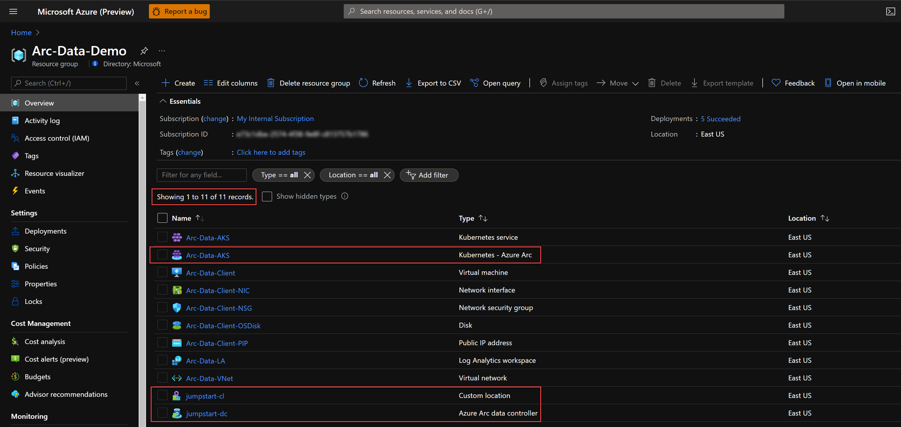

- As part of the automation, Azure Data Studio is installed along with the _Azure Data CLI_, _Azure CLI_, _Azure Arc_ and the _PostgreSQL_ extensions. Using the Desktop shortcut created for you, open Azure Data Studio and click the Extensions settings to see the installed extensions.

  

  

## Cluster extensions

In this scenario, two Azure Arc-enabled Kubernetes cluster extensions were installed:

- _azuremonitor-containers_ - The Azure Monitor Container Insights cluster extension. To learn more about it, you can check our Jumpstart ["Integrate Azure Monitor for Containers with GKE as an Azure Arc Connected Cluster using Kubernetes extensions](/azure_arc_jumpstart/azure_arc_k8s/day2/gke/gke_monitor_extension/) scenario.

- _arc-data-services_ - The Azure Arc-enabled data services cluster extension that was used throughout this scenario in order to deploy the data services infrastructure.

In order to view these cluster extensions, click on the Azure Arc-enabled Kubernetes resource Extensions settings.

  

  

## Cleanup

- If you want to delete the entire environment, simply delete the deployment resource group from the Azure portal.

    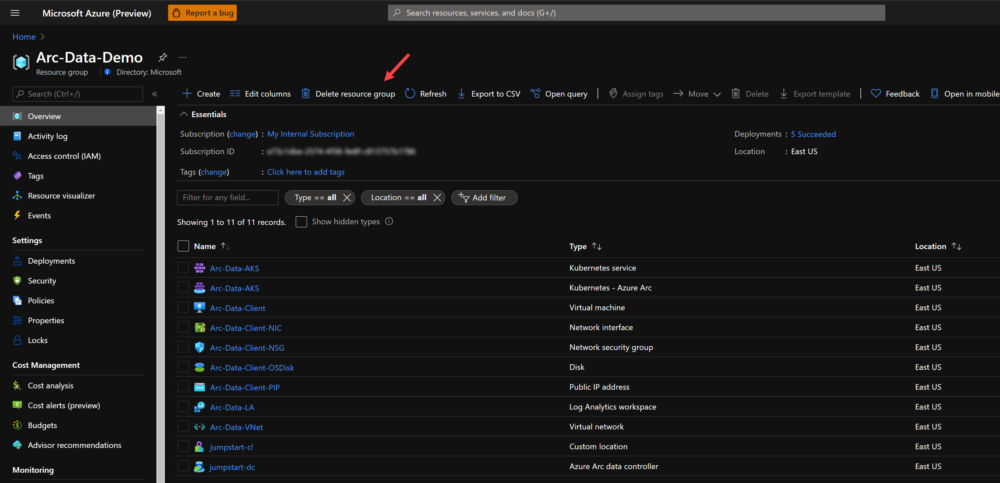
