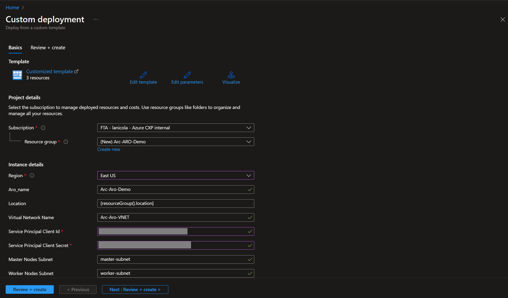
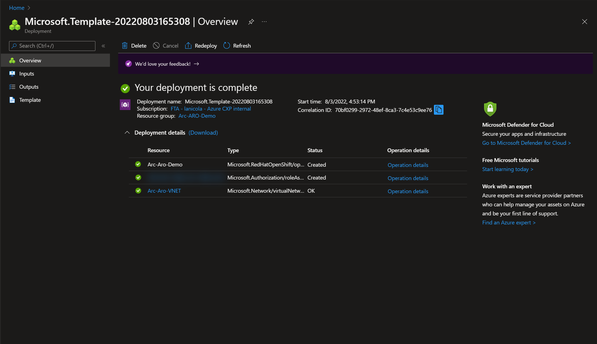
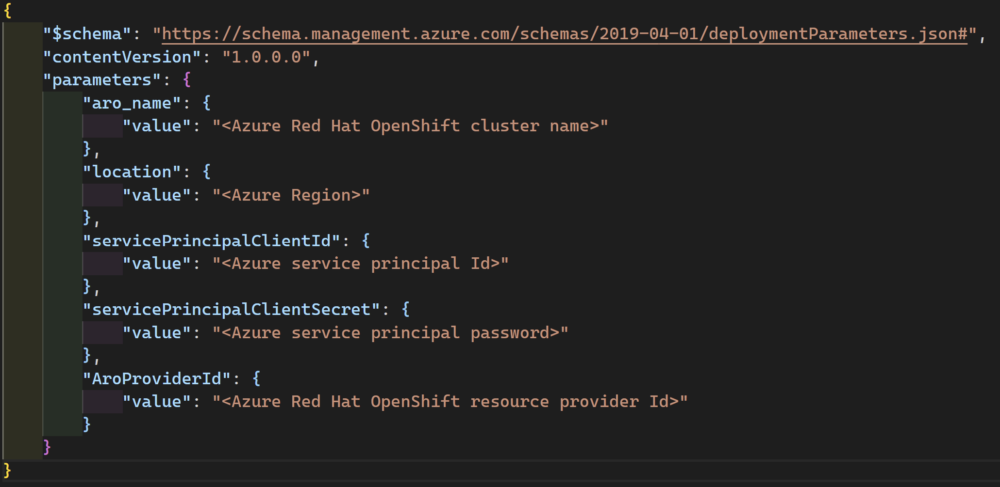
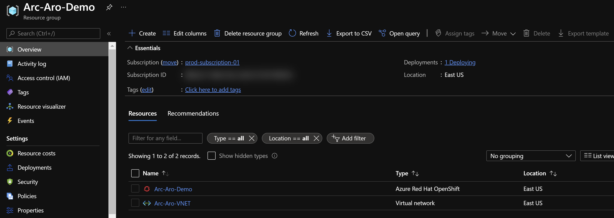
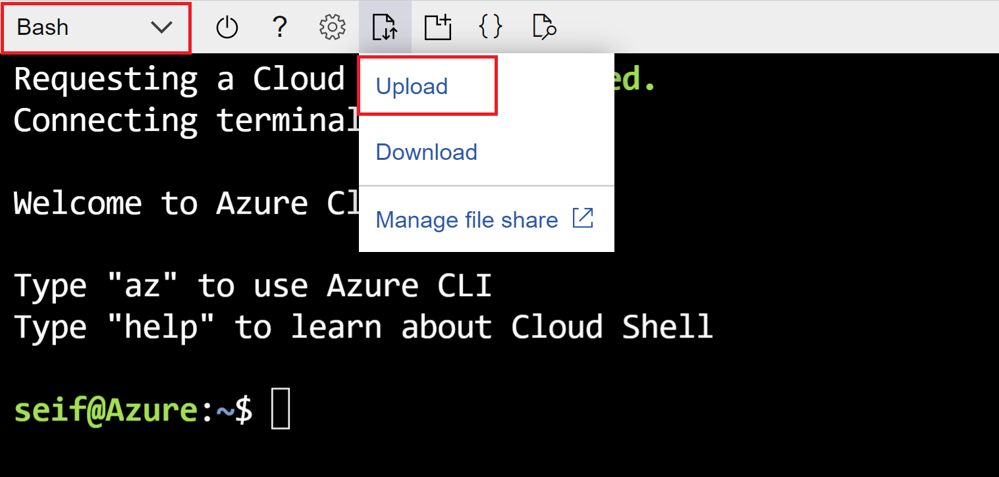
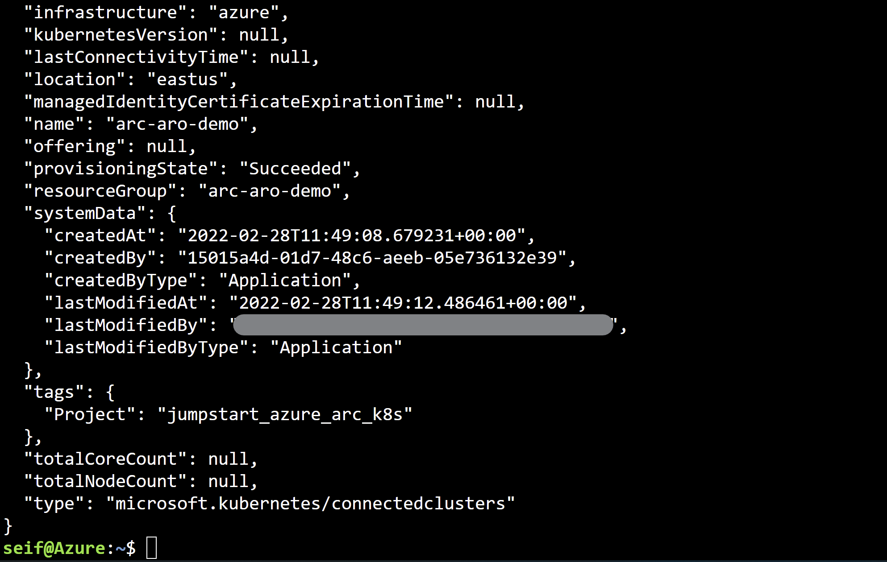
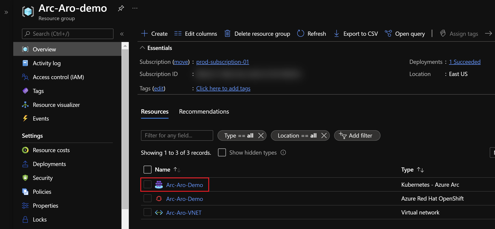
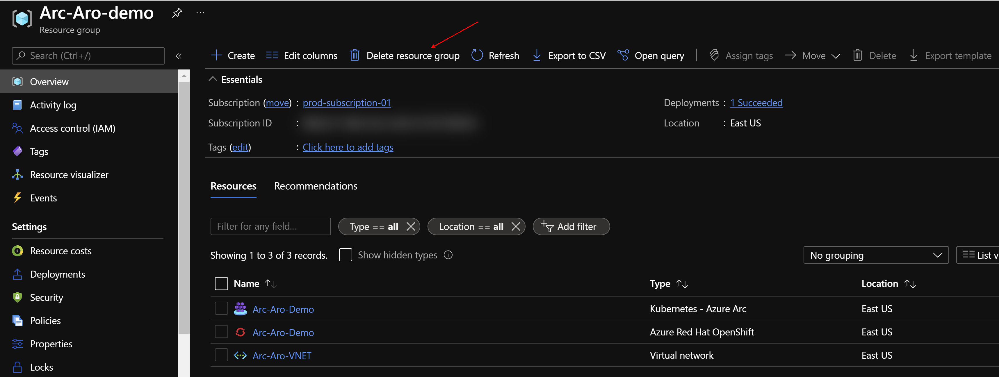

## Deploy an Azure Red Hat OpenShift cluster and connect it to Azure Arc using an Azure ARM template

The following Jumpstart scenario will guide you on how to use the provided [Azure ARM Template](https://learn.microsoft.com/azure/azure-resource-manager/templates/overview) to deploy an [Azure Red Hat OpenShift](https://learn.microsoft.com/azure/openshift/intro-openshift) cluster and connected it as an Azure Arc cluster resource.

## Prerequisites

- Clone the Azure Arc Jumpstart repository

    ```shell
    git clone https://github.com/microsoft/azure_arc.git
    ```

- [Install or update Azure CLI to version 2.53.0 and above](https://learn.microsoft.com/cli/azure/install-azure-cli?view=azure-cli-latest). Use the below command to check your current installed version.

  ```shell
  az --version
  ```

- Create Azure service principal (SP)

    To be able to complete the scenario and its related automation, Azure service principal assigned with the “Owner” role, or “Contributor” and “User Access Administrator” roles are required. To create it, login to your Azure account run the below command (this can also be done in [Azure Cloud Shell](https://shell.azure.com/)).

    ```shell
    az login
    subscriptionId=$(az account show --query id --output tsv)
    az ad sp create-for-rbac -n "<Unique SP Name>" --role "Contributor" --scopes /subscriptions/$subscriptionId
    az ad sp create-for-rbac -n "<Unique SP Name>" --role "User access administrator" --scopes /subscriptions/$subscriptionId
    ```

    For example:

    ```shell
    az login
    subscriptionId=$(az account show --query id --output tsv)
    az ad sp create-for-rbac -n "JumpstartArcK8s" --role "Contributor" --scopes /subscriptions/$subscriptionId
    az ad sp create-for-rbac -n "JumpstartArcK8s" --role "User access administrator" --scopes /subscriptions/$subscriptionId
    ```

    Output should look like this:

    ```json
    {
    "appId": "XXXXXXXXXXXXXXXXXXXXXXXXXXXX",
    "displayName": "JumpstartArcK8s",
    "password": "XXXXXXXXXXXXXXXXXXXXXXXXXXXX",
    "tenant": "XXXXXXXXXXXXXXXXXXXXXXXXXXXX"
    }
    ```

    > **Note:** If you create multiple subsequent role assignments on the same service principal, your client secret (password) will be destroyed and recreated each time. Therefore, make sure you grab the correct password.

    > **Note:** The Jumpstart scenarios are designed with as much ease of use in-mind and adhering to security-related best practices whenever possible. It is optional but highly recommended to scope the service principal to a specific [Azure subscription and resource group](https://learn.microsoft.com/cli/azure/ad/sp?view=azure-cli-latest) as well considering using a [less privileged service principal account](https://learn.microsoft.com/azure/role-based-access-control/best-practices).

- [Enable subscription with](https://learn.microsoft.com/azure/azure-resource-manager/management/resource-providers-and-types#register-resource-provider) the resource providers for Azure Arc-enabled Kubernetes and Azure Red Hat OpenShift. Registration is an asynchronous process, and registration may take approximately 10 minutes.

  ```shell
  az provider register --namespace Microsoft.Kubernetes --wait
  az provider register --namespace Microsoft.KubernetesConfiguration --wait
  az provider register --namespace Microsoft.ExtendedLocation --wait
  az provider register --namespace Microsoft.RedHatOpenShift --wait
  ```

  You can monitor the registration process with the following commands:

  ```shell
  az provider show -n Microsoft.Kubernetes -o table
  az provider show -n Microsoft.KubernetesConfiguration -o table
  az provider show -n Microsoft.ExtendedLocation -o table
  az provider show -n Microsoft.RedHatOpenShift -o table
  ```

- Check your subscription quota for the DSv3 family.

    > **Note:** Azure Red Hat OpenShift requires a [minimum of 40 cores](/azure/openshift/tutorial-create-cluster#before-you-begin) to create and run an OpenShift cluster.

  ```shell
  LOCATION=eastus
  az vm list-usage -l $LOCATION --query "[?contains(name.value, 'standardDSv3Family')]" -o table
  ```

  

- Get the Azure Red Hat OpenShift resource provider Id which needs to be assigned with the “Contributor” role.

  ```shell
  az ad sp list --filter "displayname eq 'Azure Red Hat OpenShift RP'" --query "[?appDisplayName=='Azure Red Hat OpenShift RP'].{name: appDisplayName, objectId: id}"
  ```

  

## Deployment Options and Automation Flow

This Jumpstart scenario provides multiple paths for deploying and configuring resources. Deployment options include:

- Azure portal
- ARM template via Azure CLI

For you to get familiar with the automation and deployment flow, below is an explanation.

- User provides the ARM template parameter values, either via the portal or editing the [ARM template parameters file](https://github.com/microsoft/azure_arc/blob/main/azure_arc_k8s_jumpstart/aro/arm_template/azuredeploy.parameters.json) (1-time edit). These parameters values are being used throughout the deployment.

- Main [_azuredeploy_ ARM template](https://github.com/microsoft/azure_arc/blob/main/azure_arc_k8s_jumpstart/aro/arm_template/azuredeploy.json) will initiate the deployment of the Azure Red Hat OpenShift cluster and the virtual network.

- User edits the environment variables section in the in the [az_connect_aro.sh script file](https://github.com/microsoft/azure_arc/blob/main/azure_arc_k8s_jumpstart/aro/arm_template/scripts/az_connect_aro.sh) (1-time edit). These variables' values will be used throughout the deployment.

- At a high level, the script will then perform the following tasks:
  - Install the required Azure Arc-enabled Kubernetes required Azure CLI extension
  - Automatically login to Azure using the provided service principal credentials and will create the deployment Azure resource group
  - Download and install all the Azure Red Hat OpenShift CLI.
  - Onboard the cluster as an Azure Arc-enabled Kubernetes cluster

## Deployment Option 1: Azure portal

- Click the <a href="https://portal.azure.com/#create/Microsoft.Template/uri/https%3A%2F%2Fraw.githubusercontent.com%2Fmicrosoft%2Fazure_arc%2Fmain%2Fazure_arc_k8s_jumpstart%2Faro%2Farm_template%2Fazuredeploy.json" target="_blank"></a> button and enter values for the the ARM template parameters.

  

  

## Deployment Option 2: ARM template with Azure CLI

- The deployment is using the template parameters file. Before initiating the deployment, edit the [_azuredeploy.parameters.json_](https://github.com/microsoft/azure_arc/blob/main/azure_arc_k8s_jumpstart/aro/arm_template/azuredeploy.parameters.json) file to match your environment.

  

  To deploy the ARM template, navigate to the [deployment folder](https://github.com/microsoft/azure_arc/tree/main/azure_arc_k8s_jumpstart/aro/arm_template) and run the below command:

  ```shell
  az group create --name <Name of the Azure resource group> --location <Azure Region>
  az deployment group create \
  --resource-group <Name of the Azure resource group> \
  --name <The name of this deployment> \
  --template-uri https://raw.githubusercontent.com/microsoft/azure_arc/main/azure_arc_k8s_jumpstart/aro/arm_template/azuredeploy.json \
  --parameters <The _azuredeploy.parameters.json_ parameters file location>
  ```

  For example:

  ```shell
  az group create --name Arc-Aro-Demo --location "East US"
  az deployment group create \
  --resource-group Arc-Aro-Demo \
  --name arcarodemo01 \
  --template-uri https://raw.githubusercontent.com/microsoft/azure_arc/main/azure_arc_k8s_jumpstart/aro/arm_template/azuredeploy.json \
  --parameters azuredeploy.parameters.json
  ```

    > **Note:** It normally takes about ~30-40 minutes for the ARO cluster to deploy.

- Once the ARM template deployment is completed, a new Azure Red Hat OpenShift cluster in a new Azure resource group is created.

  

  

## Connecting to Azure Arc

- Now that you have a running Azure Red Hat OpenShift cluster, edit the environment variables section in the included [az_connect_aro](https://github.com/microsoft/azure_arc/blob/main/azure_arc_k8s_jumpstart/aro/arm_template/scripts/az_connect_aro.sh) shell script.

  

- In order to keep your local environment clean and untouched, we will use [Azure Cloud Shell](https://learn.microsoft.com/azure/cloud-shell/overview) (located in the top-right corner of the Azure portal) to run the *az_connect_aro* shell script against the Aro cluster. **Make sure Cloud Shell is configured to use Bash.**

  

- After editing the environment variables in the [*az_connect_aro*](https://github.com/microsoft/azure_arc/blob/main/azure_arc_k8s_jumpstart/aro/arm_template/scripts/az_connect_aro.sh) shell script to match your parameters, save the file and then upload it to the Cloud Shell environment and run it using the ```. ./az_connect_aro.sh``` command.

  > **Note:** The extra dot is due to the script having an _export_ function and needs to have the vars exported in the same shell session as the other commands.

  

  

- Once the script run has finished, the Aro cluster will be projected as a new Azure Arc-enabled Kubernetes cluster resource.

  

  

  

## Logging

For ease of troubleshooting and tracking, a deployment log will be created automatically as part of the script runtime. To view the deployment log use the below command:

```shell
cat /home/<USER>/jumpstart_logs/onboardARO.log
```

## Cleanup

To delete the entire deployment, simply delete the resource group from the Azure portal.


