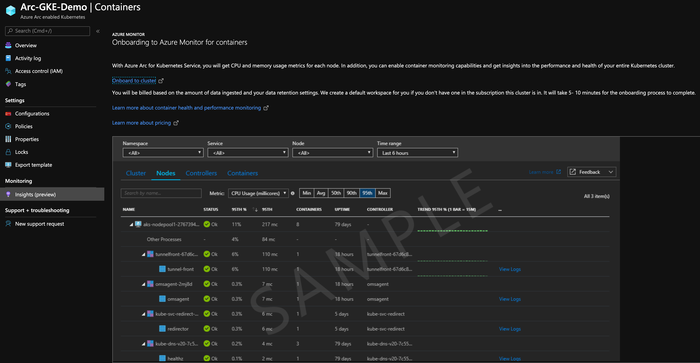
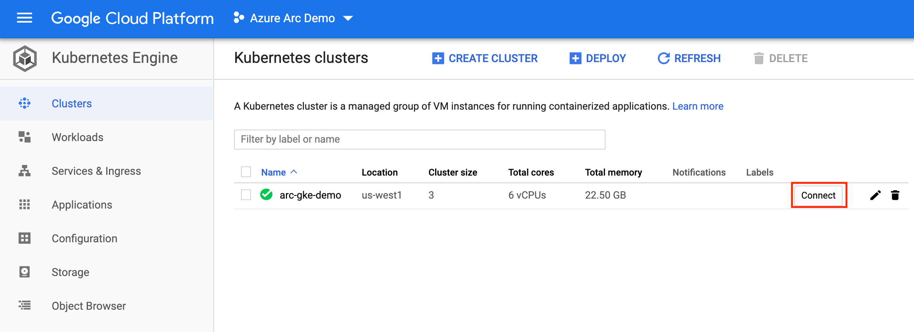
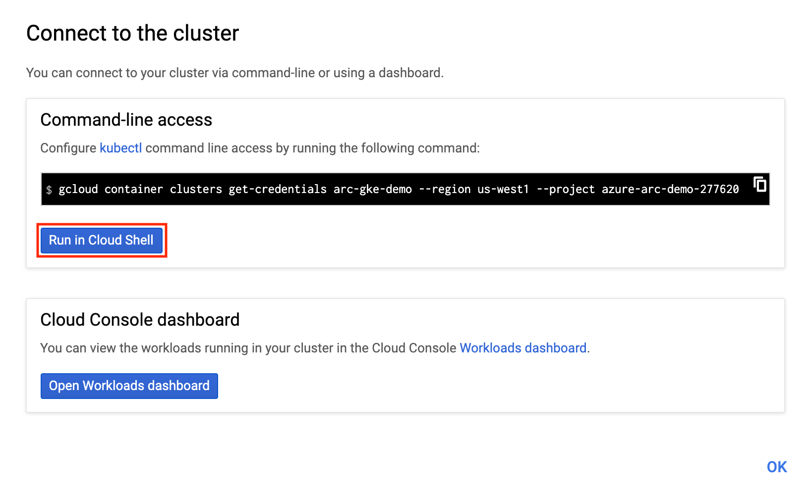
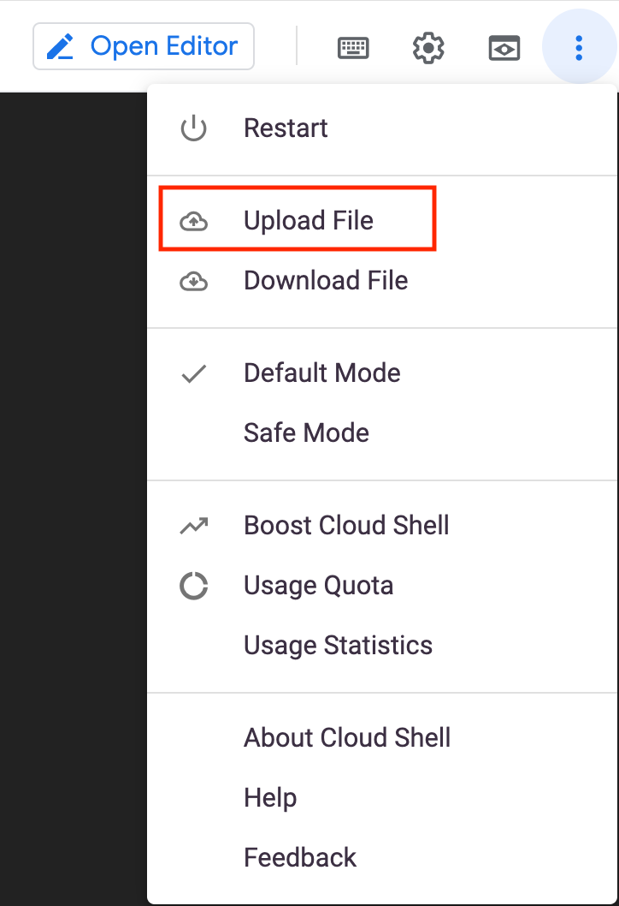
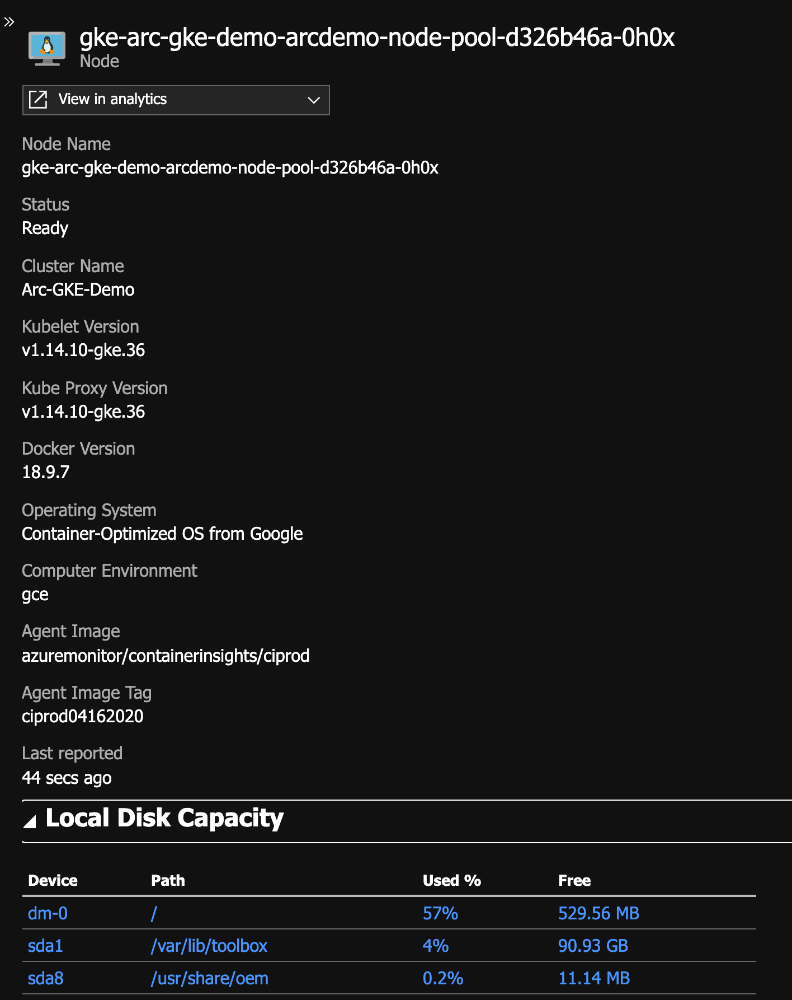
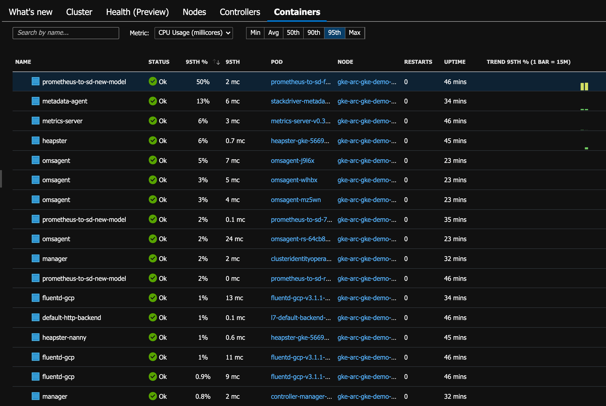

## Integrate Azure Monitor for Containers with GKE as an Arc Connected Cluster using scripting

The following Jumpstart scenario will guide you on how to enable [Azure Monitor for Containers](https://learn.microsoft.com/azure/azure-monitor/insights/container-insights-overview) for a Google Kubernetes Engine (GKE) cluster that is projected as an Azure Arc connected cluster using scripting.

in this scenario, you will hook the GKE cluster to Azure Monitor by deploying the [Azure Monitor agent](https://learn.microsoft.com/azure/azure-monitor/platform/log-analytics-agent) on your Kubernetes cluster in order to start collecting telemetry.  

> > **Note:** This guide assumes you already deployed a GKE cluster and connected it to Azure Arc. If you haven't, this repository offers you a way to do so in an automated fashion using [Terraform](/azure_arc_jumpstart/azure_arc_k8s/gke/gke_terraform/).

## Prerequisites

* Clone the Azure Arc Jumpstart repository

    ```shell
    git clone https://github.com/microsoft/azure_arc.git
    ```

* [Install or update Azure CLI to version 2.53.0 and above](https://learn.microsoft.com/cli/azure/install-azure-cli?view=azure-cli-latest). Use the below command to check your current installed version.

  ```shell
  az --version
  ```

* Create Azure service principal (SP)

    To be able to complete the scenario and its related automation, Azure service principal assigned with the “Contributor” role is required. To create it, login to your Azure account run the below command (this can also be done in [Azure Cloud Shell](https://shell.azure.com/)).

    ```shell
    az login
    subscriptionId=$(az account show --query id --output tsv)
    az ad sp create-for-rbac -n "<Unique SP Name>" --role "Contributor" --scopes /subscriptions/$subscriptionId
    ```

    For example:

    ```shell
    az login
    subscriptionId=$(az account show --query id --output tsv)
    az ad sp create-for-rbac -n "JumpstartArcK8s" --role "Contributor" --scopes /subscriptions/$subscriptionId
    ```

    Output should look like this:

    ```json
    {
    "appId": "XXXXXXXXXXXXXXXXXXXXXXXXXXXX",
    "displayName": "JumpstartArcK8s",
    "password": "XXXXXXXXXXXXXXXXXXXXXXXXXXXX",
    "tenant": "XXXXXXXXXXXXXXXXXXXXXXXXXXXX"
    }
    ```

    > **Note:** If you create multiple subsequent role assignments on the same service principal, your client secret (password) will be destroyed and recreated each time. Therefore, make sure you grab the correct password.

    > **Note:** The Jumpstart scenarios are designed with as much ease of use in-mind and adhering to security-related best practices whenever possible. It is optional but highly recommended to scope the service principal to a specific [Azure subscription and resource group](https://learn.microsoft.com/cli/azure/ad/sp?view=azure-cli-latest) as well considering using a [less privileged service principal account](https://learn.microsoft.com/azure/role-based-access-control/best-practices).

## Azure Monitor for Containers Integration

* In order to keep your local environment clean and untouched, we will use [Google Cloud Shell](https://cloud.google.com/shell) to run the [*gke_monitor_onboarding*](https://github.com/microsoft/azure_arc/blob/main/azure_arc_k8s_jumpstart/gke/gke_monitor/gke_monitor_onboarding.sh) shell script against the GKE connected cluster.

* Before integrating the cluster with Azure Monitor for Containers, click on the "Insights (preview)" blade for the connected Arc cluster to show how the cluster is not currently being monitored.

    

    

* Edit the environment variables in the script to match your environment parameters, upload it to the Cloud Shell environment and run it using the ```. ./gke_monitor_onboarding.sh``` command.

    > **Note:** The extra dot is due to the shell script having an _export_ function and needs to have the vars exported in the same shell session as the rest of the commands.

    

    

    

    

    

    The script will:

  * Login to your Azure subscription using the SPN credentials
  * Download the Azure Monitor agent script
  * Retrieve cluster Azure resource ID as well as the cluster credentials (KUBECONFIG)
  * Execute the script which will create Azure Log Analytics workspace, deploy the Azure Monitor agent on the Kubernetes cluster and tag the cluster
  * Delete the downloaded script

* Once the script will complete it's run, you will have an Azure Arc connected cluster integrated with Azure Monitor for Containers. At the end of it's run, the script generates URL for you to click on. This URL will open a new browser tab leading to the Azure Monitor for Containers Insights page.a

    > **Note:** As the Azure Monitor agent starts collecting telemetry from the cluster nodes and pods, it will take 5-10min for data to start show up in the Azure portal.

    

    

* Click the "Connected Clusters" tab and see the Azure Arc connected cluster was added. Now that your cluster is being monitored, navigate through the different tabs and sections and watch the monitoring telemetry for the cluster nodes and pods.  

    

    

    

    

    
