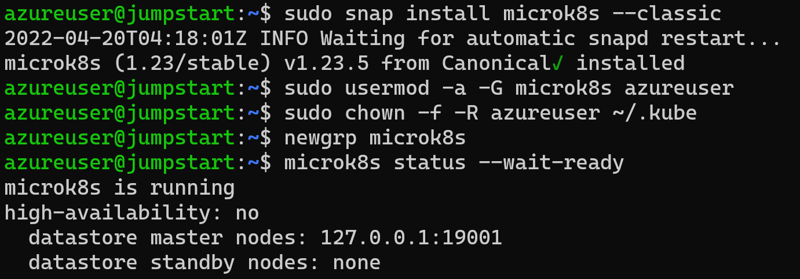
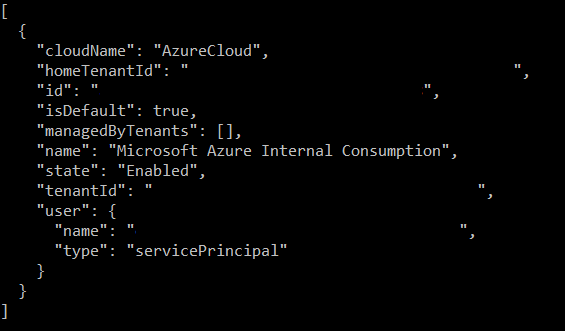
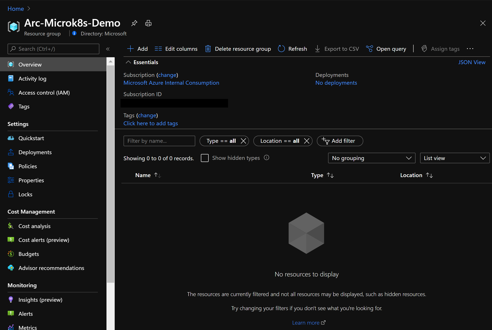
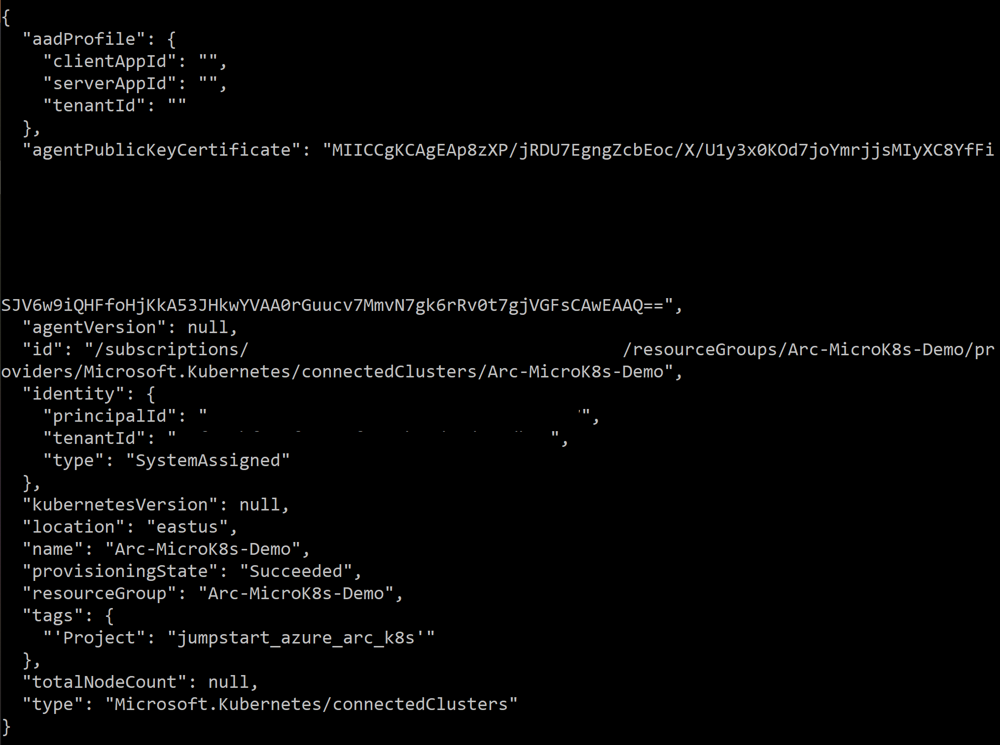
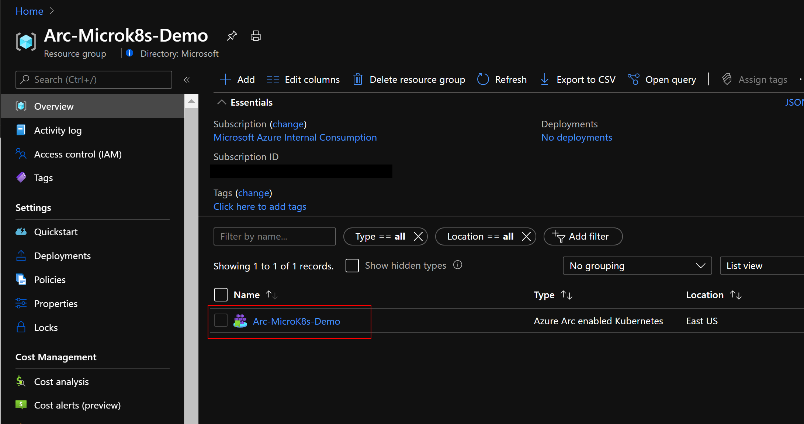
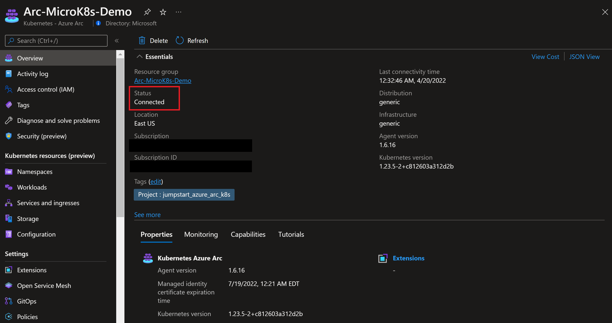
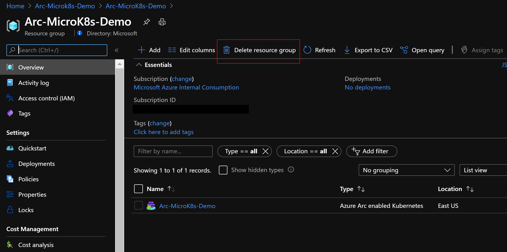
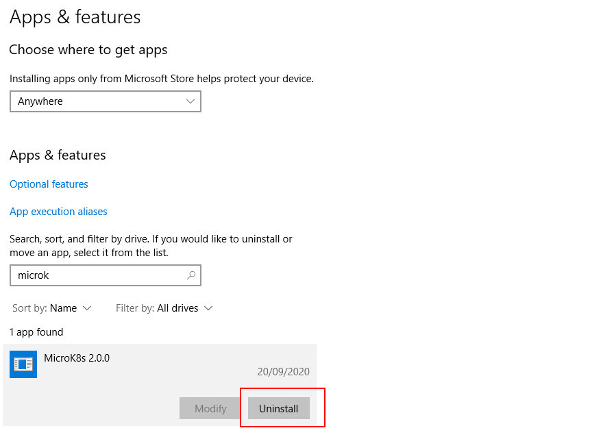
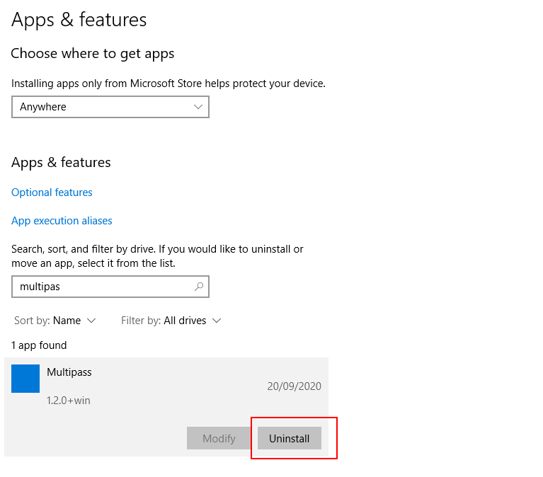

## Deploy a local Kubernetes Cluster using MicroK8s and connect it to Azure Arc

The following Jumpstart scenario will guide you on how to use [MicroK8s](https://microk8s.io/) to run a Kubernetes cluster locally and connect it as an Azure Arc-enabled Kubernetes cluster resource.

## Prerequisites

- Clone the Azure Arc Jumpstart repository

    ```shell
    git clone https://github.com/microsoft/azure_arc.git
    ```

- [Install or update Azure CLI to version 2.53.0 and above](https://learn.microsoft.com/cli/azure/install-azure-cli?view=azure-cli-latest). Use the below command to check your current installed version.

  ```shell
  az --version
  ```

- [Install and Set Up kubectl](https://kubernetes.io/docs/tasks/tools/install-kubectl/)

- [Install Helm 3](https://helm.sh/docs/intro/install/)

- Create Azure service principal (SP)

  To be able to complete the scenario and its related automation, Azure service principal assigned with the “Contributor” role is required. To create it, login to your Azure account run the below command (this can also be done in [Azure Cloud Shell](https://shell.azure.com/).

    ```shell
    az login
    subscriptionId=$(az account show --query id --output tsv)
    az ad sp create-for-rbac -n "<Unique SP Name>" --role "Contributor" --scopes /subscriptions/$subscriptionId
    ```

    For example:

    ```shell
    az login
    subscriptionId=$(az account show --query id --output tsv)
    az ad sp create-for-rbac -n "JumpstartArcK8s" --role "Contributor" --scopes /subscriptions/$subscriptionId
    ```

    Output should look like this:

    ```json
    {
    "appId": "XXXXXXXXXXXXXXXXXXXXXXXXXXXX",
    "displayName": "JumpstartArcK8s",
    "password": "XXXXXXXXXXXXXXXXXXXXXXXXXXXX",
    "tenant": "XXXXXXXXXXXXXXXXXXXXXXXXXXXX"
    }
    ```

    > **Note:** If you create multiple subsequent role assignments on the same service principal, your client secret (password) will be destroyed and recreated each time. Therefore, make sure you grab the correct password.
    > **Note:** The Jumpstart scenarios are designed with as much ease of use in-mind and adhering to security-related best practices whenever possible. It is optional but highly recommended to scope the service principal to a specific [Azure subscription and resource group](https://learn.microsoft.com/cli/azure/ad/sp?view=azure-cli-latest) as well considering using a [less privileged service principal account](https://learn.microsoft.com/azure/role-based-access-control/best-practices).

- [Enable subscription with](https://learn.microsoft.com/azure/azure-resource-manager/management/resource-providers-and-types#register-resource-provider) the two resource providers for Azure Arc-enabled Kubernetes. Registration is an asynchronous process, and registration may take approximately 10 minutes.

  ```shell
  az provider register --namespace Microsoft.Kubernetes
  az provider register --namespace Microsoft.KubernetesConfiguration
  az provider register --namespace Microsoft.ExtendedLocation
  ```

  You can monitor the registration process with the following commands:

  ```shell
  az provider show -n Microsoft.Kubernetes -o table
  az provider show -n Microsoft.KubernetesConfiguration -o table
  az provider show -n Microsoft.ExtendedLocation -o table
  ```

- Install the Azure Arc for Kubernetes CLI extensions ***connectedk8s*** and ***k8s-configuration***:

  ```shell
  az extension add --name connectedk8s
  az extension add --name k8s-configuration
  ```

  > **Note:** If you already used this guide before and/or have the extensions installed, use the bellow commands.

  ```shell
  az extension update --name connectedk8s
  az extension update --name k8s-configuration
  ```

## Deployment

- Install MicroK8s following the [specific install guide](https://microk8s.io/) for your operating system. For convenience, we've added some commands below:

  Windows:
  
    Download the [MicroK8s installer for Windows](https://microk8s.io/docs/install-windows) and follow the instructions.

    

    Once installed, enable MicroK8s with:

    ```shell
    microk8s status --wait-ready
    microk8s enable dns
    ```

  Linux:

    ```shell
    sudo snap install microk8s --classic
    sudo usermod -a -G microk8s <username>
    sudo chown -f -R <username> ~/.kube
    newgrp microk8s
    microk8s status --wait-ready
    microk8s enable dns
    ```

    

  MacOS:

    ```shell
    brew install ubuntu/microk8s/microk8s
    microk8s install
    microk8s status --wait-ready
    microk8s enable dns
    ```

    

  WSL2:

  [This blog post](https://ubuntu.com/blog/kubernetes-on-windows-with-microk8s-and-wsl-2) walks through an installation of MicroK8s in WSL 2.

- Export MicroK8s cluster kubeconfig file path

  MicroK8s will not update your .kube/config file, and accessing the cluster is done using the microk8s cli, eg: `microk8s kubectl get nodes`. To be able to use this config with the Azure Arc CLI, we need to export it into a file.

  Windows:

    ```shell
    microk8s config view > %HOMEPATH%\.kube\microk8s
    ```

  Linux and MacOS:

    ```shell
    microk8s config view > ~/.kube/microk8s
    ```

## Connect the cluster to Azure Arc

- Authenticate Azure CLI

  We'll start by authenticating our CLI with Azure, **replacing the values below** with the output from the command we issued to create service principal earlier (`az ad sp create-for-rbac`) in the prerequisite section of this guide.

  ```shell
  az login --service-principal -u appId -p password --tenant tenant
  ```

  

- Create a resource group

  ```shell
  az group create -n Arc-MicroK8s-Demo -l EastUS
  ```

  

  

- Connect the cluster to Azure Arc

  Windows:

  ```shell
  az connectedk8s connect --name Arc-MicroK8s-Demo --resource-group Arc-MicroK8s-Demo --kube-config %HOMEPATH%\.kube\microk8s --kube-context microk8s --tags 'Project=jumpstart_azure_arc_k8s' --correlation-id "d009f5dd-dba8-4ac7-bac9-b54ef3a6671a"
  ```

  Linux and MacOS:

  ```shell
  az connectedk8s connect --name Arc-MicroK8s-Demo --resource-group Arc-MicroK8s-Demo  --kube-config ~/.kube/microk8s --kube-context microk8s --tags 'Project=jumpstart_azure_arc_k8s' --correlation-id "d009f5dd-dba8-4ac7-bac9-b54ef3a6671a"
  ```

  

- Upon completion, you will have your MicroK8s cluster connected as a new Azure Arc Kubernetes cluster resource in a new resource group.

  

  

## Optional - Day 2 Operations

Now that your Kubernetes cluster is connected to Azure Arc, you might want to explore the following Day 2 scenarios:

- [Deploy GitOps configurations and perform Helm-based GitOps flow on MicroK8s as an Azure Arc Connected Cluster](/azure_arc_jumpstart/azure_arc_k8s/day2/microk8s/local_microk8s_gitops_helm/)

## Delete the deployment

- In Azure, the most straightforward way is to delete the cluster or the resource group via the Azure portal or through the CLI.

  ```shell
  az group delete --name Arc-MicroK8s-Demo
  ```

  

- To stop the MicroK8s cluster locally, use the following command:

  ```shell
  microk8s stop
  ```

- The uninstall process of MicroK8s depends on your operating system.

  Windows

    Stop the MicroK8s VM in Multipass:

    ```shell
    multipass stop microk8s-vm
    ```

    Launch `Add or Remove Programs` and uninstall MicroK8s.

    

    ```shell
    multipass delete microk8s-vm
    multipass purge
    ```

    If you want to completely uninstall Multipass, launch `Add or Remove Programs` and uninstall Multipass.

    

  Linux:

    ```shell
    sudo snap remove microk8s
    ```
  
  MacOS:

    ```shell
    brew uninstall ubuntu/microk8s/microk8s
    ```
