## Deploy the Azure Monitor Agent (AMA) on Azure Arc-enabled servers

The following Jumpstart scenario will guide you on how to deploy the [Azure Monitor Agent (AMA)](https://docs.microsoft.com/azure/azure-monitor/agents/azure-monitor-agent-overview) as an extension on your Azure Arc-enabled servers, both Linux and Windows systems.

The Azure Monitor agent (AMA) collects monitoring data from the guest operating system of supported infrastructure and delivers it to Azure Monitor.

> **Note:** This scenario assumes you already deployed VMs or servers that are running on-premises or other clouds and you have connected them to Azure Arc. If you haven't, this repository offers you a way to do so in an automated fashion.

- **[GCP Ubuntu instance](/azure_arc_jumpstart/azure_arc_servers/gcp/gcp_terraform_ubuntu/)**
- **[GCP Windows instance](/azure_arc_jumpstart/azure_arc_servers/gcp/gcp_terraform_windows/)**
- **[AWS Ubuntu EC2 instance](/azure_arc_jumpstart/azure_arc_servers/aws/aws_terraform_ubuntu/)**
- **[AWS Amazon Linux 2 EC2 instance](/azure_arc_jumpstart/azure_arc_servers/aws/aws_terraform_al2/)**
- **[Azure Ubuntu VM](/azure_arc_jumpstart/azure_arc_servers/azure/azure_arm_template_linux/)**
- **[Azure Windows VM](/azure_arc_jumpstart/azure_arc_servers/azure/azure_arm_template_win/)**
- **[VMware vSphere Ubuntu VM](/azure_arc_jumpstart/azure_arc_servers/vmware/vmware_terraform_ubuntu/)**
- **[VMware vSphere Windows Server VM](/azure_arc_jumpstart/azure_arc_servers/vmware/vmware_terraform_winsrv/)**
- **[Vagrant Ubuntu box](/azure_arc_jumpstart/azure_arc_servers/vagrant/local_vagrant_ubuntu/)**
- **[Vagrant Windows box](/azure_arc_jumpstart/azure_arc_servers/vagrant/local_vagrant_windows/)**

Please review the [Azure Monitor Agent (AMA) supported OS documentation](https://docs.microsoft.com/azure/azure-monitor/agents/agents-overview#supported-operating-systems) and ensure that the VMs you will use for this exercise are supported. For Linux VMs, check both the Linux distribution and kernel to ensure you are using a supported configuration.

## Prerequisites

- As mentioned, this scenario starts at the point where you already deployed and connected VMs or servers to Azure Arc. In the screenshots below, you can see a Windows and a Linux server that have been connected with Azure Arc and are visible as resources in Azure.

    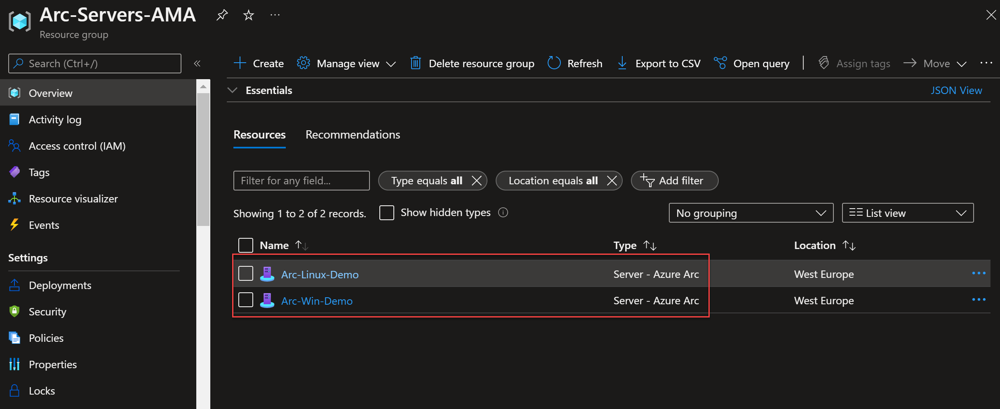

    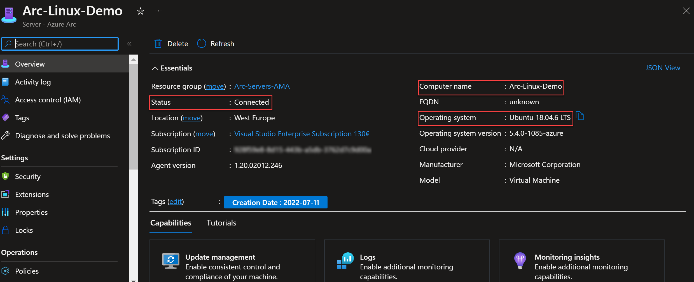

    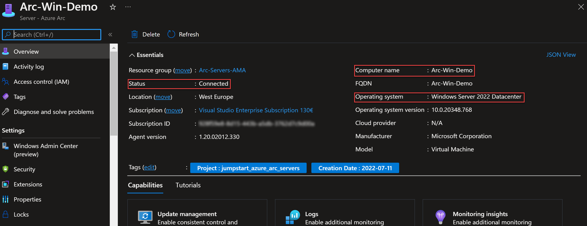

- [Install or update Azure CLI](https://docs.microsoft.com/cli/azure/install-azure-cli?view=azure-cli-latest). Azure CLI should be running version 2.49.0 or later. Use ```az --version``` to check your current installed version.

- To complete this scenario, the user or service principal running the automation need these minimum Role-based access control (RBAC) permissions: *Azure Connected Machine Resource Administrator* on your Azure Arc-enabled servers. *Monitoring Contributor* and *Microsoft.Resources/deployments/** on the resource group where you will deploy this scenario.

## Deployment Options and Automation Flow

This Jumpstart scenario provides multiple paths for deploying and configuring resources. Deployment options include:

- Azure portal
- ARM template via Azure CLI

The steps below will help you get familiar with the automation and deployment flow.

1. User provides the ARM template parameter values, either via the portal or editing the parameters file. These parameter values are being used throughout the deployment.

2. User deploys the ARM template at the resource group level.

3. User is verifying the successful extension deployment and data collection rules creation.

## Deployment Option 1: Azure portal

- For Windows VMs, click the <a href="https://portal.azure.com/#create/Microsoft.Template/uri/https%3A%2F%2Fraw.githubusercontent.com%2Fmicrosoft%2Fazure_arc%2Fmain%2Fazure_arc_servers_jumpstart%2Fazuremonitoragent%2Fama-windows-template.json" target="_blank"></a> button and enter values for the the ARM template parameters.

  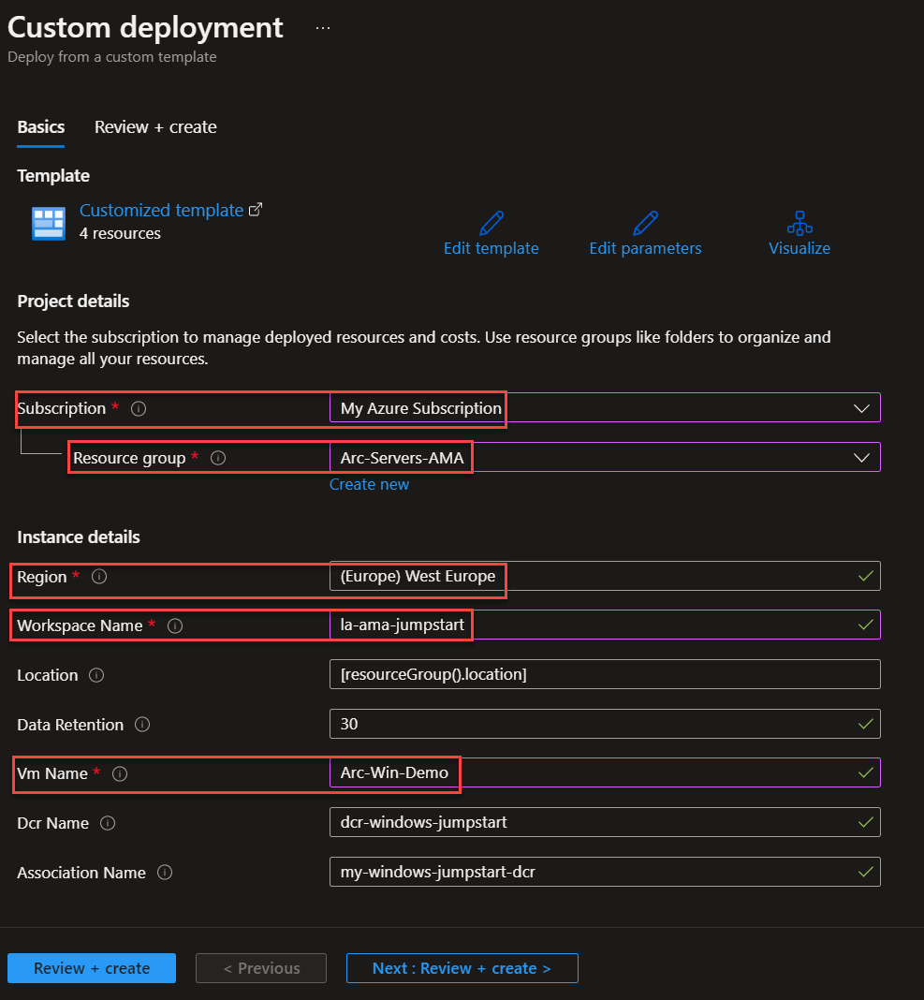

  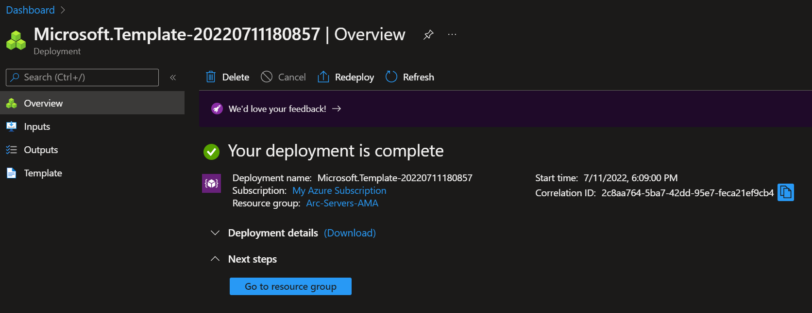

- For Linux VMs, click the <a href="https://portal.azure.com/#create/Microsoft.Template/uri/https%3A%2F%2Fraw.githubusercontent.com%2Fmicrosoft%2Fazure_arc%2Fmain%2Fazure_arc_servers_jumpstart%2Fazuremonitoragent%2Fama-linux-template.json" target="_blank"></a> button and enter values for the the ARM template parameters:

  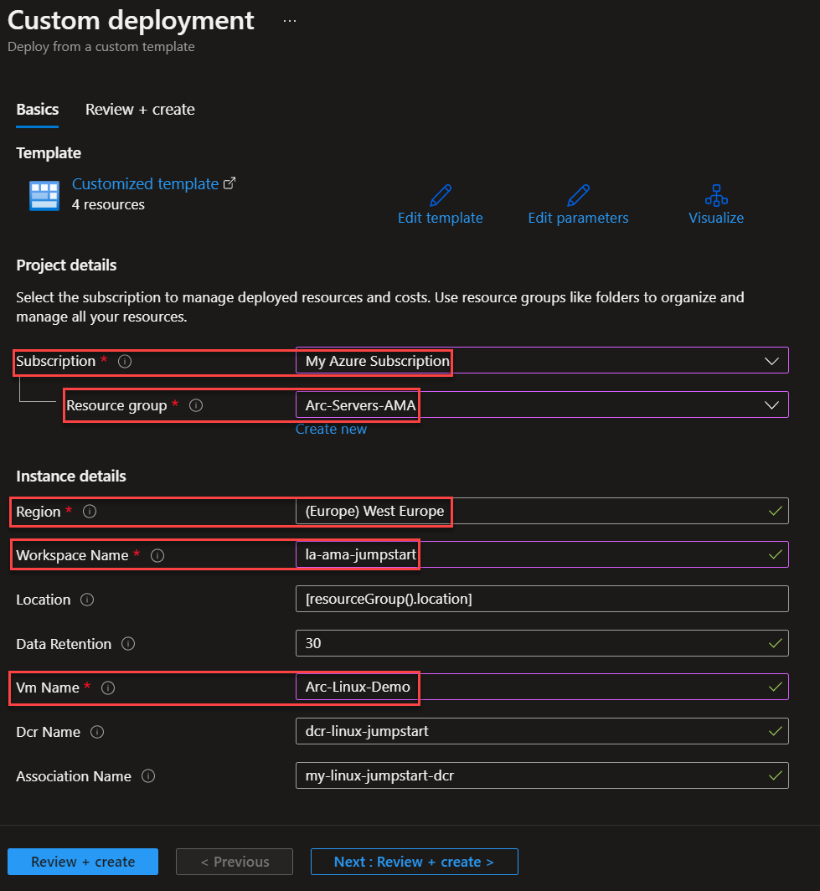

  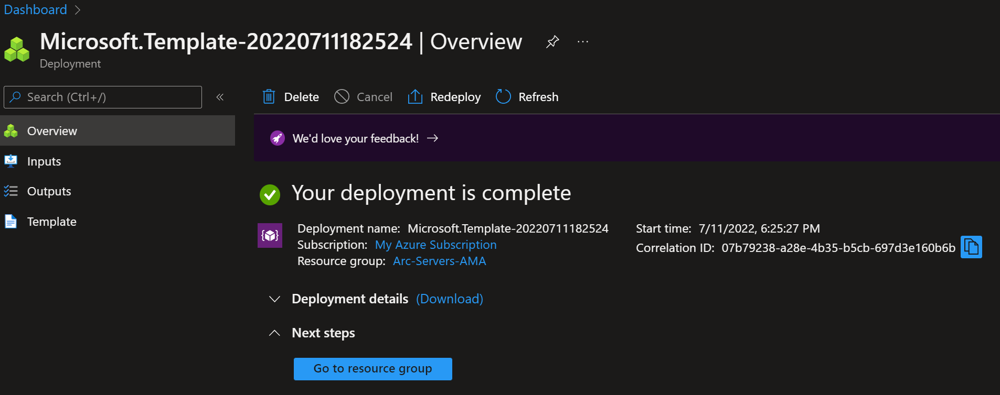

- To match your configuration you will need to provide:

  - The **subscription**, **resource group**, **Computer name** and **location** where you registered the Azure Arc-enabled server:

    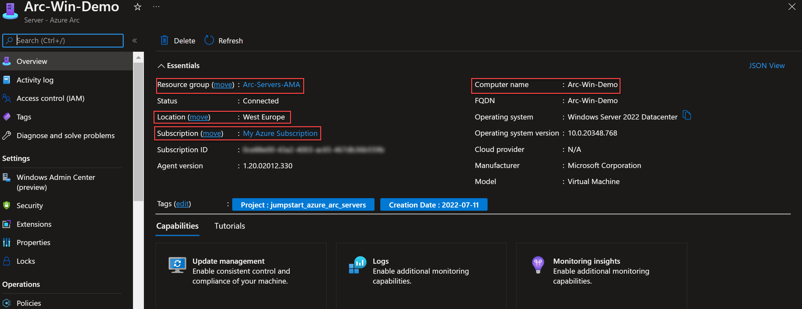

  - The **Log Analytics workspace name** that will be created.

## Deployment Option 2: ARM template with Azure CLI

As mentioned, this deployment will leverage ARM templates.

- Clone the Azure Arc Jumpstart repository

    ```shell
    git clone https://github.com/microsoft/azure_arc.git
    ```

- Edit the [*parameters file*](https://github.com/microsoft/azure_arc/blob/main/azure_arc_servers_jumpstart/azuremonitoragent/ama-template.parameters.json) providing the values that match your configuration as described above.

    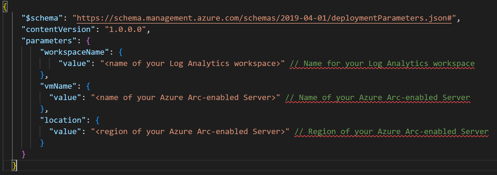

- Choose the ARM template that matches your operating system, for [*Windows*](https://github.com/microsoft/azure_arc/blob/main/azure_arc_servers_jumpstart/azuremonitoragent/ama-windows-template.json) and [*Linux*](https://github.com/microsoft/azure_arc/blob/main/azure_arc_servers_jumpstart/azuremonitoragent/ama-linux-template.json), deploy the template by running the following command:

    ```shell
    az deployment group create --resource-group <Name of the Azure resource group> \
    --template-file <The ama-**template.json template file location> \
    --parameters <The ama-template.parameters.json template file location>
    ```

- Once the template has completed its run, you should see an output as follows:

    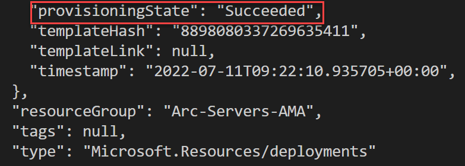

- You will have the Azure Monitor Agent (AMA) deployed on your Windows or Linux system and reporting to the Log Analytics workspace that has been created. You can verify by going back to your Azure Arc-enabled server, **Extensions** section:

    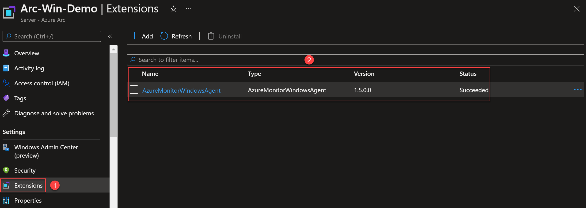

    

- Moreover, a **Data Collection Rule (DCR)** is created to send logs from the Azure Arc-enabled servers to the new **Log Analytics workspace**.

    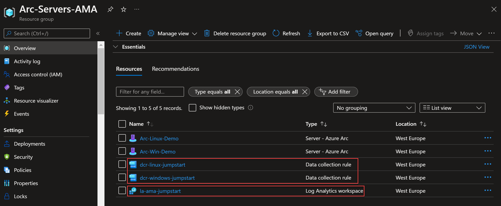

- If you click on any of the **Data Collection Rules (DCR)**, you will see the **Resources** attached to it and the collected **Data Sources**.

  - For **Windows**, the following **Data Collection Rule (DCR)** is created. On the **Resources** blade, you will see your Windows Azure Arc-enabled server:

    

  - On the **Data Sources** blade, you will see two Data Sources, *Performance Counters* and *Windows event logs*:

    

  - If you click on any of them, you will see the **Data source** that is collected and the **Destination**, which is the Log Analytics workspace created as part of this scenario:

    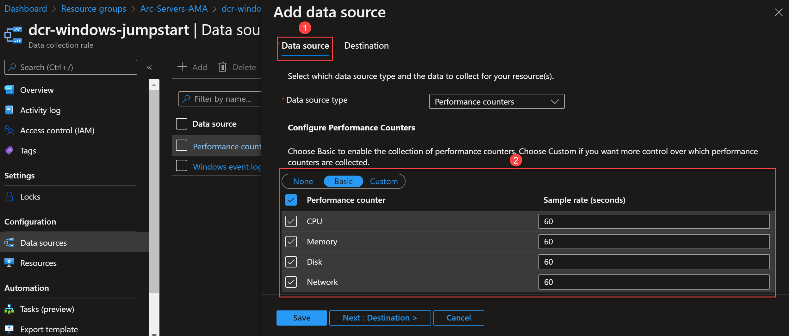

    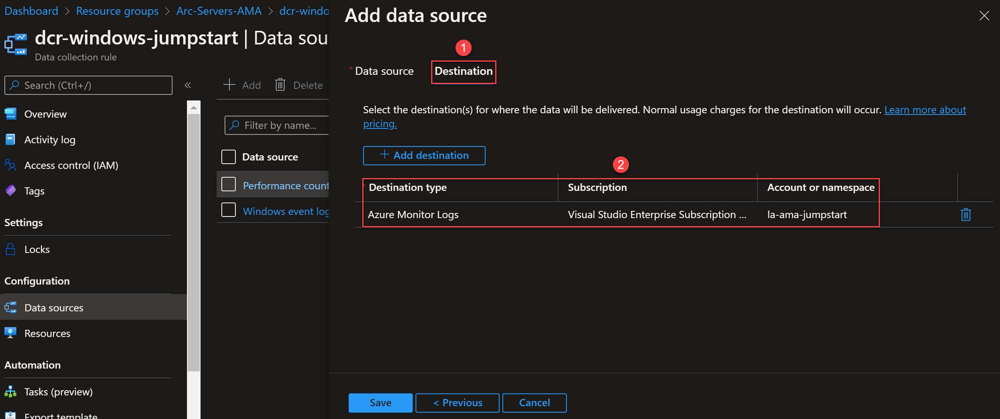

    

    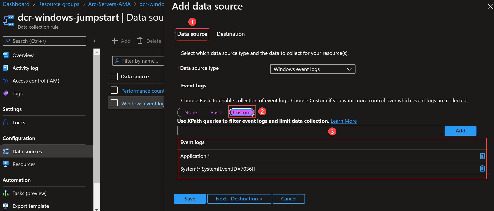

    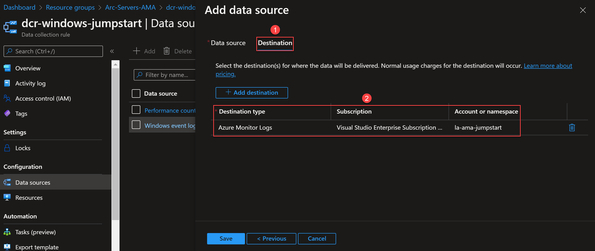

  - For **Linux**, this is the **Data Collection Rule (DCR)** created as part of this scenario. On the **Resources** blade, you will see your Linux Azure Arc-enabled server:

    

  - On the **Data Sources** blade, you will see two Data Sources, *Performance Counters* and *Linux syslog*:

    

  - If you click on any of them, you will see the **Data source** that is collected and the **Destination**, which is the Log Analytics workspace created as part of this scenario:

    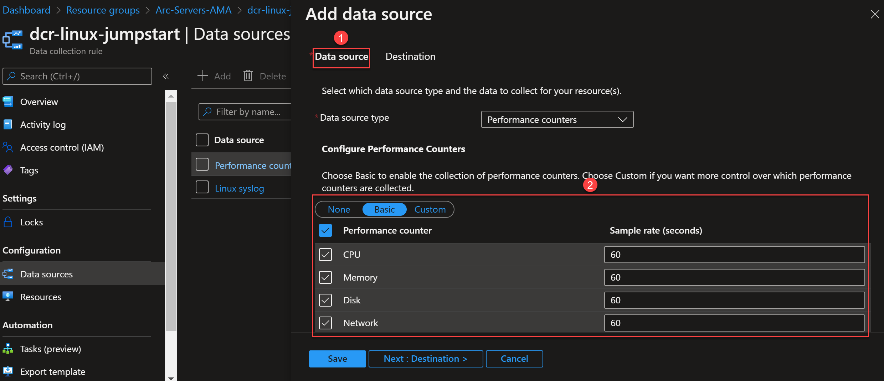

    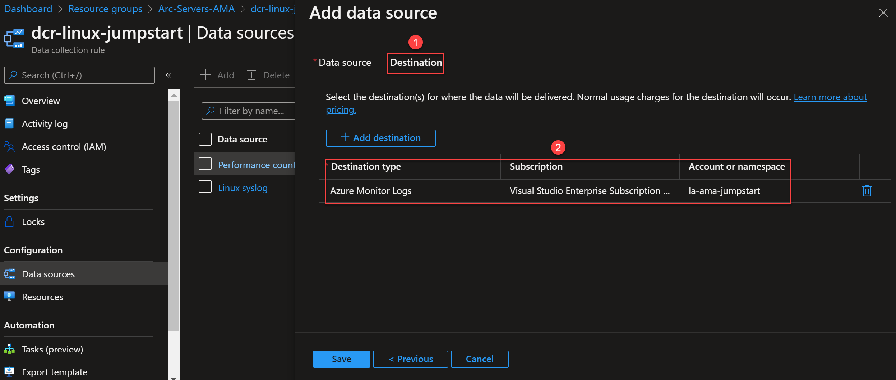

    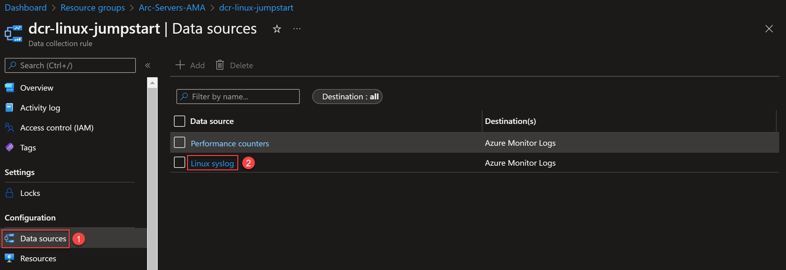

    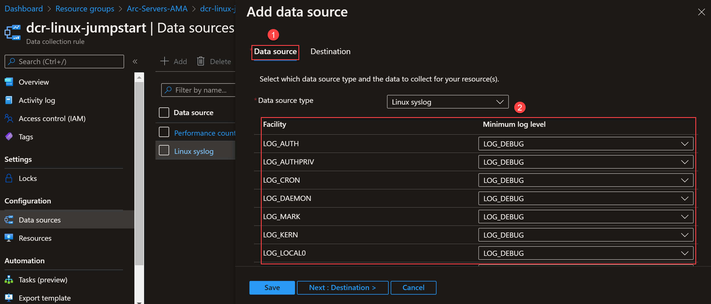

    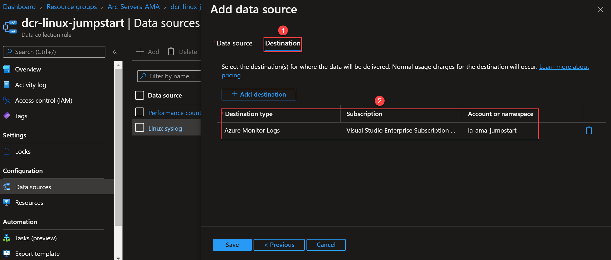

- Go back to your **resource group** and click on the **Log Analytics Workspace**:

  

- Click on **Logs**:

  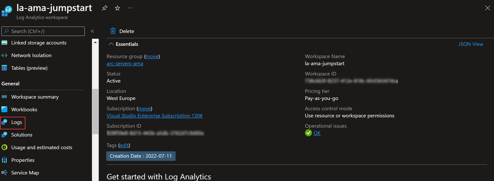

- **Run** the following **query**. It will show you the **data types collected** by the **Azure Monitor Agent (AMA)** on each machine by using the **Data Collection Rules (DCR)**:

  ```shell
  search * 
  | distinct Computer, Type
  | where Type != "Heartbeat" and Type != "Usage"
  | sort by Computer asc
  ```

  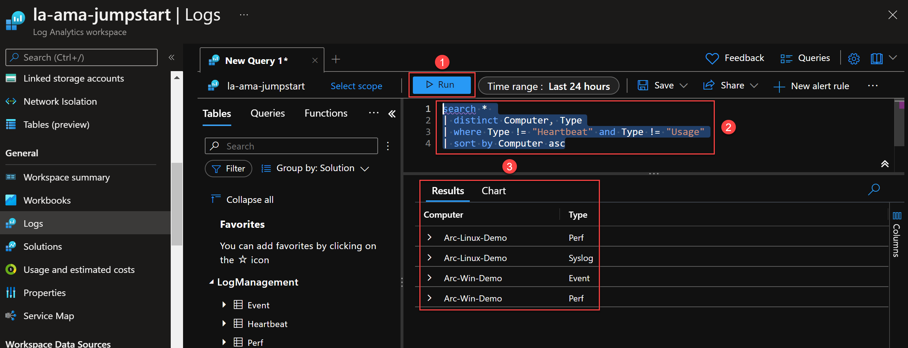

## Clean up environment

Complete the following steps to clean up your environment:

- [Remove Data Collection Rule Association](https://docs.microsoft.com/powershell/module/az.monitor/remove-azdatacollectionruleassociation?view=azps-8.1.0)
- [Remove Data Collection Rule](https://docs.microsoft.com/powershell/module/az.monitor/remove-azdatacollectionrule?view=azps-8.1.0)
- [Uninstall Azure Monitor Agent (AMA)](https://docs.microsoft.com/azure/azure-monitor/agents/azure-monitor-agent-manage?tabs=ARMAgentPowerShell%2CPowerShellWindows%2CPowerShellWindowsArc%2CCLIWindows%2CCLIWindowsArc#uninstall-on-azure-arc-enabled-servers)
- [Delete the Log Analytics workspace](https://docs.microsoft.com/azure/azure-monitor/logs/delete-workspace#powershell)
