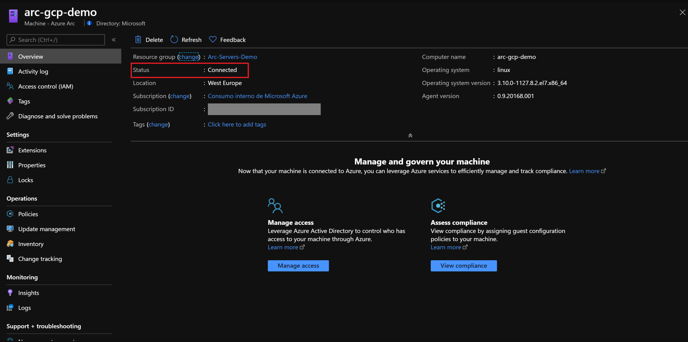
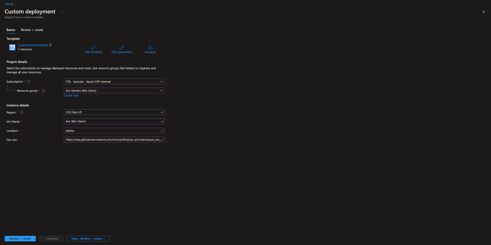
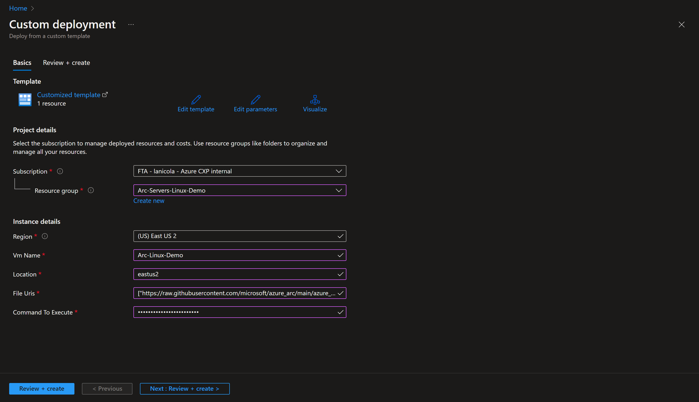
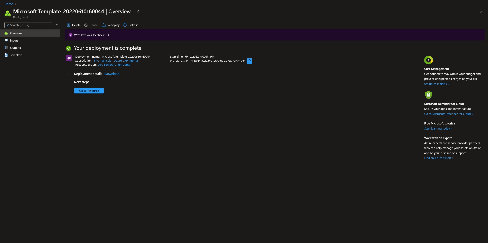
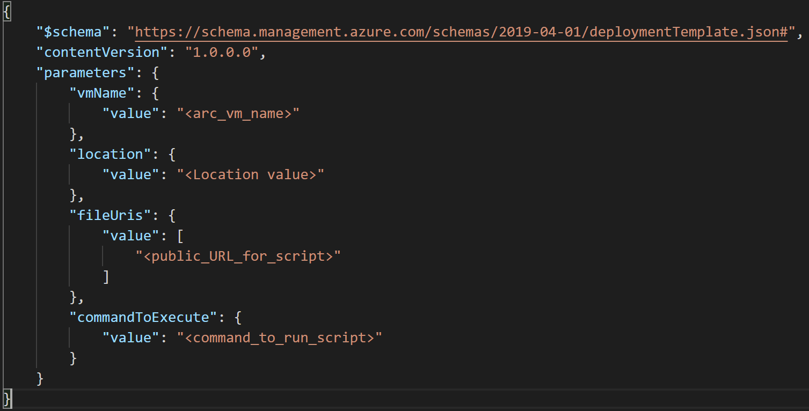
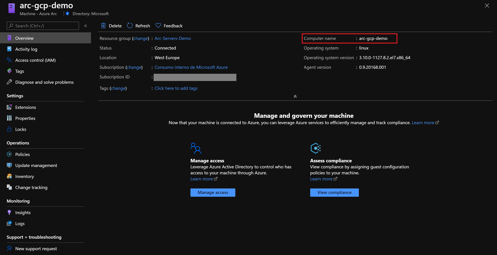
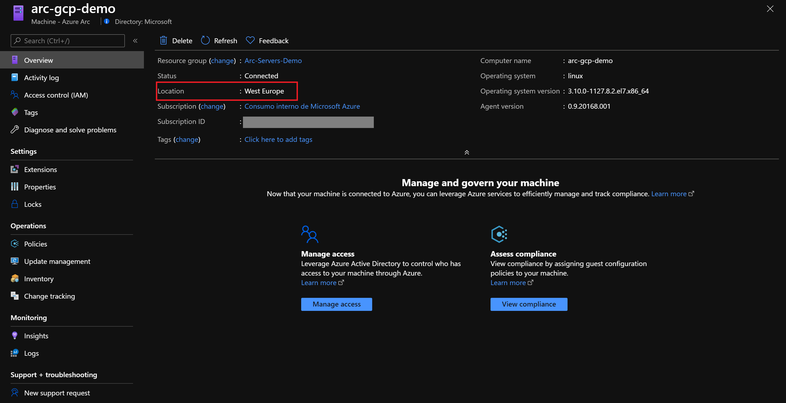
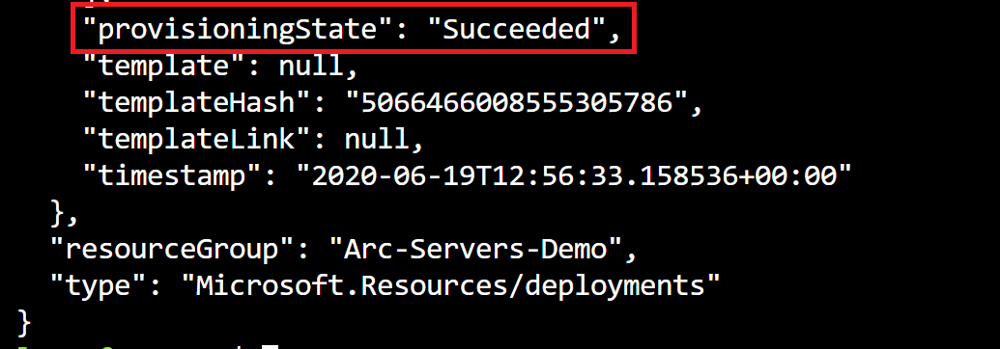
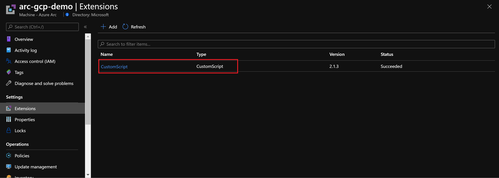
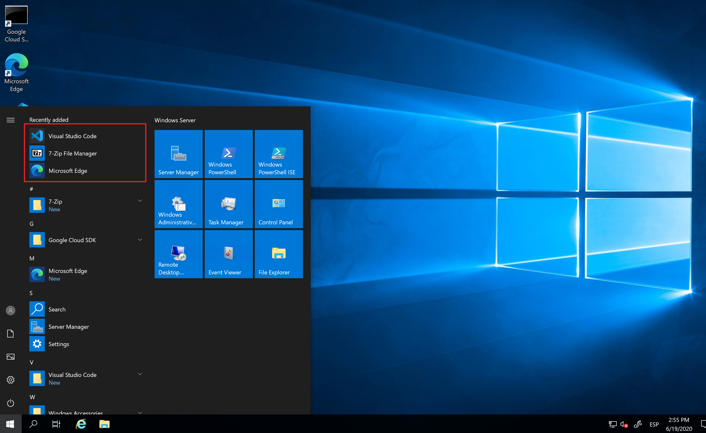

## Deploy Custom Script Extension on Azure Arc Linux and Windows servers using Extension Management

The following Jumpstart scenario will guide you on how to execute custom scripts on Azure Arc-enabled servers by using Virtual Machine extensions. Virtual machine extensions are small applications that provide post-deployment configuration and automation tasks such as software installation, anti-virus protection, or a mechanism to run a custom script.

You can use the Azure portal, Azure CLI, an ARM template, PowerShell or Linux Shell script, or Azure policies to manage the extension deployment to Azure Arc-enabled servers. In this scenario, we will use an ARM template to deploy the custom script extension. This extension downloads and executes scripts on virtual machines and it is useful for post deployment configuration, software installation, or any other configuration or management tasks.

> **Note:** This guide assumes you already deployed VMs or servers that are running on-premises or other clouds and you have connected them to Azure Arc but If you haven't, this repository offers you a way to do so in an automated fashion.

- **[GCP Ubuntu instance](/azure_arc_jumpstart/azure_arc_servers/gcp/gcp_terraform_ubuntu/)**
- **[GCP Windows instance](/azure_arc_jumpstart/azure_arc_servers/gcp/gcp_terraform_windows/)**
- **[AWS Ubuntu EC2 instance](/azure_arc_jumpstart/azure_arc_servers/aws/aws_terraform_ubuntu/)**
- **[AWS Amazon Linux 2 EC2 instance](/azure_arc_jumpstart/azure_arc_servers/aws/aws_terraform_al2/)**
- **[Azure Ubuntu VM](/azure_arc_jumpstart/azure_arc_servers/azure/azure_arm_template_linux/)**
- **[Azure Windows VM](/azure_arc_jumpstart/azure_arc_servers/azure/azure_arm_template_win/)**
- **[VMware vSphere Ubuntu VM](/azure_arc_jumpstart/azure_arc_servers/vmware/vmware_terraform_ubuntu/)**
- **[VMware vSphere Windows Server VM](/azure_arc_jumpstart/azure_arc_servers/vmware/vmware_terraform_winsrv/)**
- **[Vagrant Ubuntu box](/azure_arc_jumpstart/azure_arc_servers/vagrant/local_vagrant_ubuntu/)**
- **[Vagrant Windows box](/azure_arc_jumpstart/azure_arc_servers/vagrant/local_vagrant_windows/)**

## Prerequisites

- As mentioned, this scenario starts at the point where you already deployed and connected VMs or servers to Azure Arc. In the screenshots below you can see a GCP server has been connected with Azure Arc and is visible as a resource in Azure.

    

    

- [Install or update Azure CLI](https://docs.microsoft.com/cli/azure/install-azure-cli?view=azure-cli-latest). Azure CLI should be running version 2.53.0 or later. Use ```az --version``` to check your current installed version.

- Create Azure Service Principal (SP)

    To connect a VM or bare-metal server to Azure Arc, Azure service principal assigned with the "contributor" role is required. To create it, login to your Azure account run the below command (this can also be done in [Azure Cloud Shell](https://shell.azure.com/)).

    ```shell
    az login
    subscriptionId=$(az account show --query id --output tsv)
    az ad sp create-for-rbac -n "<Unique SP Name>" --role "Contributor" --scopes /subscriptions/$subscriptionId
    ```

    For example:

    ```shell
    az login
    subscriptionId=$(az account show --query id --output tsv)
    az ad sp create-for-rbac -n "JumpstartArc" --role "Contributor" --scopes /subscriptions/$subscriptionId
    ```

    Output should look like this:

    ```json
    {
    "appId": "XXXXXXXXXXXXXXXXXXXXXXXXXXXX",
    "displayName": "JumpstartArc",
    "password": "XXXXXXXXXXXXXXXXXXXXXXXXXXXX",
    "tenant": "XXXXXXXXXXXXXXXXXXXXXXXXXXXX"
    }
    ```

    > **Note:** If you create multiple subsequent role assignments on the same service principal, your client secret (password) will be destroyed and recreated each time. Therefore, make sure you grab the correct password.

    > **Note:** The Jumpstart scenarios are designed with as much ease of use in-mind and adhering to security-related best practices whenever possible. It is optional but highly recommended to scope the service principal to a specific [Azure subscription and resource group](https://docs.microsoft.com/cli/azure/ad/sp?view=azure-cli-latest) as well considering using a [less privileged service principal account](https://docs.microsoft.com/azure/role-based-access-control/best-practices).

- In order to demonstrate the custom script extension, we will use the below Linux and Windows scripts.
  - [*Linux*](https://github.com/microsoft/azure_arc/blob/main/azure_arc_servers_jumpstart/scripts/custom_script_linux.sh): The script will modify the message of the day (MOTD) on the operating system.
  - [*Windows*](https://github.com/microsoft/azure_arc/blob/main/azure_arc_servers_jumpstart/scripts/custom_script_windows.ps1): The script will install Windows Terminal, Microsoft Edge, 7zip and Visual Studio Code [Chocolaty](https://chocolatey.org/) packages on the VM.

## Deployment Options and Automation Flow

This Jumpstart scenario provides multiple paths for deploying and configuring resources. Deployment options include:

- Azure portal
- ARM template via Azure CLI

The steps below will help you get familiar with the automation and deployment flow.

1. User provides the ARM template parameter values, either via the portal or editing the parameters file. These parameter values are being used throughout the deployment.

2. User deploys the ARM template at the resource group level.

3. User logs in to the Azure Arc-enabled server to check the configurations made by the custom script extension.

## Deployment Option 1: Azure portal

- For the Windows VM custom script extension. Click the <a href="https://portal.azure.com/#create/Microsoft.Template/uri/https%3A%2F%2Fraw.githubusercontent.com%2Fmicrosoft%2Fazure_arc%2Fmain%2Fazure_arc_servers_jumpstart%2Fextensions%2Farm%2Fcustomscript-templatewindows.json" target="_blank"></a> button and enter values for the the ARM template parameters.

  - _`Resource Group`_: Azure Resource Group where your Azure Arc-enabled server is registered
  - _`Location`_: Azure region where your Azure Arc-enabled server is connected to
  - _`VM Name`_: name of your Azure Arc-enabled server
  - _`File Uris`_: for Windows provide https://raw.githubusercontent.com/microsoft/azure_arc/main/azure_arc_servers_jumpstart/scripts/custom_script_windows.ps1
  
  - _`Command to excute:`_ provide `./custom_script_linux.sh`

  

  

- For the Linux VM custom script extension. Click the <a href="https://portal.azure.com/#create/Microsoft.Template/uri/https%3A%2F%2Fraw.githubusercontent.com%2Fmicrosoft%2Fazure_arc%2Fmain%2Fazure_arc_servers_jumpstart%2Fextensions%2Farm%2Fcustomscript-templatelinux.json" target="_blank"></a> button and enter values for the the ARM template parameters:

  - _`Resource Group`_: Azure Resource Group where your Azure Arc-enabled server is registered
  - _`Location`_: Azure region where your Azure Arc-enabled server is connected to
  - _`VM Name`_: name of your Azure Arc-enabled server
  - _`File Uris`_: for Linux provide ["https://raw.githubusercontent.com/microsoft/azure_arc/main/azure_arc_servers_jumpstart/scripts/custom_script_linux.sh"] include the URL in brackets
  - _`Commant to Execute`_: provide ./custom_script_linux.sh

  

  

## Deployment Option 2: ARM template with Azure CLI

As mentioned, this deployment will leverage ARM templates.

- Clone the Azure Arc Jumpstart repository

    ```shell
    git clone https://github.com/microsoft/azure_arc.git
    ```

- Edit the extensions parameters file for [*Windows*](https://github.com/microsoft/azure_arc/blob/main/azure_arc_servers_jumpstart/extensions/arm/customscript-templatewindows.parameters.json) or for [*Linux*](https://github.com/microsoft/azure_arc/blob/main/azure_arc_servers_jumpstart/extensions/arm/customscript-templatelinux.parameters.json)

   

- To match your environment configuration, you will need to provide the following information:

  - The VM name as it is registered in Azure Arc.

    

  - The location of the resource group where you registered the Azure Arc-enabled server.

    

  - A public Uri for the script that you would like to run on the servers, in this case use the URL for the script in raw format.
    - For Windows: [Public Uri](https://raw.githubusercontent.com/microsoft/azure_arc/main/azure_arc_servers_jumpstart/scripts/custom_script_windows.ps1)
    - For Linux: [Public Uri](https://raw.githubusercontent.com/microsoft/azure_arc/main/azure_arc_servers_jumpstart/scripts/custom_script_linux.sh)

  - To run either script, use the below commands:

    - Windows:

         ```powershell
         powershell -ExecutionPolicy Unrestricted -File custom_script_windows.ps1
         ```

    - Linux:

         ```bash
         ./custom_script_linux.sh
         ```

- To deploy the ARM template for Linux or Windows, navigate to the [deployment folder](https://github.com/microsoft/azure_arc/tree/main/azure_arc_servers_jumpstart/extensions/arm) and run the below command with the templates that match your operating system:

    ```bash
    az deployment group create --resource-group <Name of the Azure resource group> \
    --template-file <The *customscript-template.json* template file location for Linux or Windows> \
    --parameters <The *customscript-template.parameters.json* template file location>
    ```

- Once the template deployment has completed it's run, you should see an output as follows:

    

- To verify a successful deployment on the Azure Arc-enabled server, in the Azure portal, by clicking on "Extensions" settings. You should see the Custom Script extension installed.

    

- Another way to verify successful custom script execution is by connecting to the VMs and verifying that the operating system has been configured.

  - For the Linux VM, use SSH to connect the VM and check out the message of the day which was customized by the script:

    

  - For the Windows VM, use RDP to connect the VM and verify that the additional software has been installed: Microsoft Edge, 7zip and Visual Studio Code.

    

## Clean up environment

Complete the following steps to clean up your environment.

Remove the virtual machines from each environment by following the teardown instructions from each guide.

- **[GCP Ubuntu instance](/azure_arc_jumpstart/azure_arc_servers/gcp/gcp_terraform_ubuntu/)**
- **[GCP Windows instance](/azure_arc_jumpstart/azure_arc_servers/gcp/gcp_terraform_windows/)**
- **[AWS Ubuntu EC2 instance](/azure_arc_jumpstart/azure_arc_servers/aws/aws_terraform_ubuntu/)**
- **[AWS Amazon Linux 2 EC2 instance](/azure_arc_jumpstart/azure_arc_servers/aws/aws_terraform_al2/)**
- **[Azure Ubuntu VM](/azure_arc_jumpstart/azure_arc_servers/azure/azure_arm_template_linux/)**
- **[Azure Windows VM](/azure_arc_jumpstart/azure_arc_servers/azure/azure_arm_template_win/)**
- **[VMware vSphere Ubuntu VM](/azure_arc_jumpstart/azure_arc_servers/vmware/vmware_terraform_ubuntu/)**
- **[VMware vSphere Windows Server VM](/azure_arc_jumpstart/azure_arc_servers/vmware/vmware_terraform_winsrv/)**
- **[Vagrant Ubuntu box](/azure_arc_jumpstart/azure_arc_servers/vagrant/local_vagrant_ubuntu/)**
- **[Vagrant Windows box](/azure_arc_jumpstart/azure_arc_servers/vagrant/local_vagrant_windows/)**
