## Deploy a GCP Windows instance and connect it to Azure Arc using a Terraform plan

The following Jumpstart scenario will guide you on how to use the provided [Terraform](https://www.terraform.io/) plan to deploy a Windows Server GCP virtual machine and connect it as an Azure Arc-enabled server resource.

## Prerequisites

- Clone the Azure Arc Jumpstart repository

    ```shell
    git clone https://github.com/microsoft/azure_arc.git
    ```

- [Install or update Azure CLI to version 2.53.0 and above](https://learn.microsoft.com/cli/azure/install-azure-cli?view=azure-cli-latest). Use the below command to check your current installed version.

  ```shell
  az --version
  ```

- [Install Terraform >=1.1.9](https://learn.hashicorp.com/terraform/getting-started/install.html)

- Google Cloud account with billing enabled - [Create a free trial account](https://cloud.google.com/free). To create Windows Server virtual machines, you must upgraded your account to enable billing. Click Billing from the menu and then select Upgrade in the lower right.

    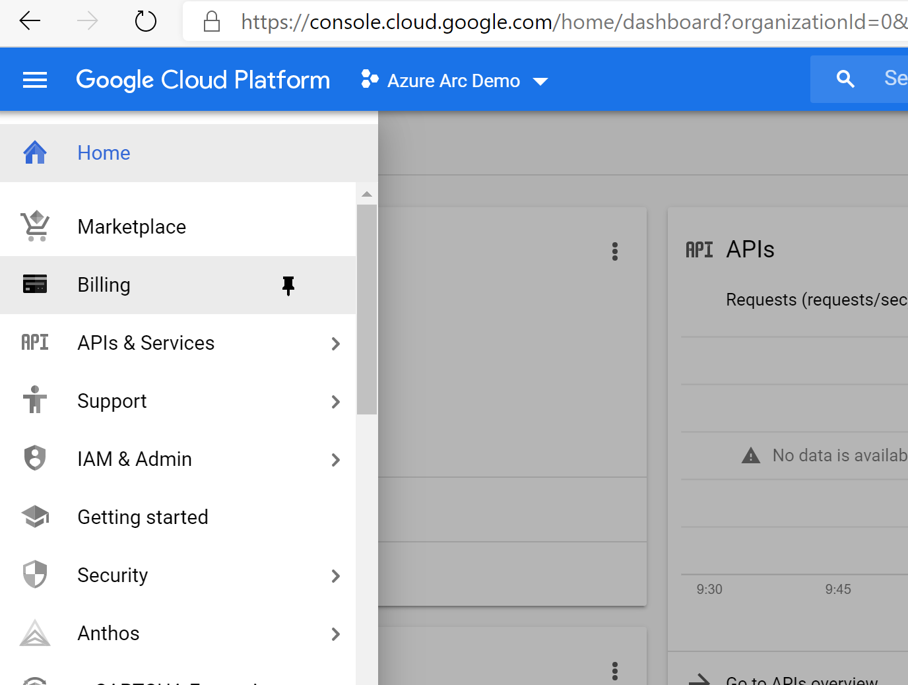

    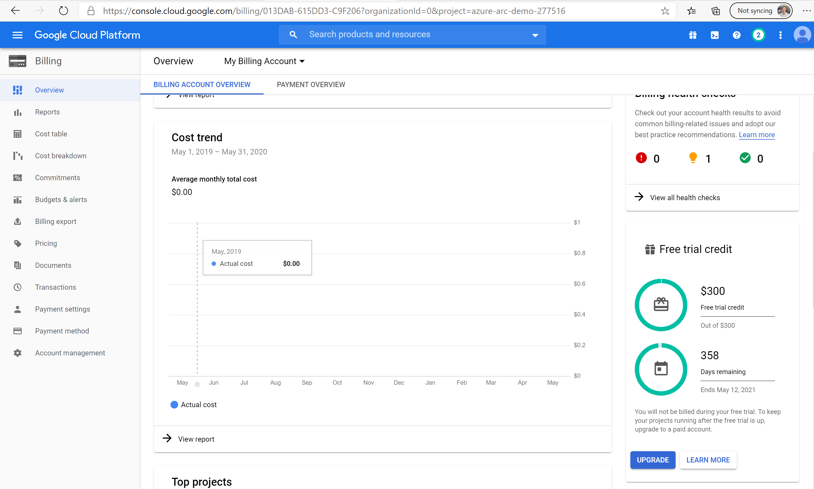

    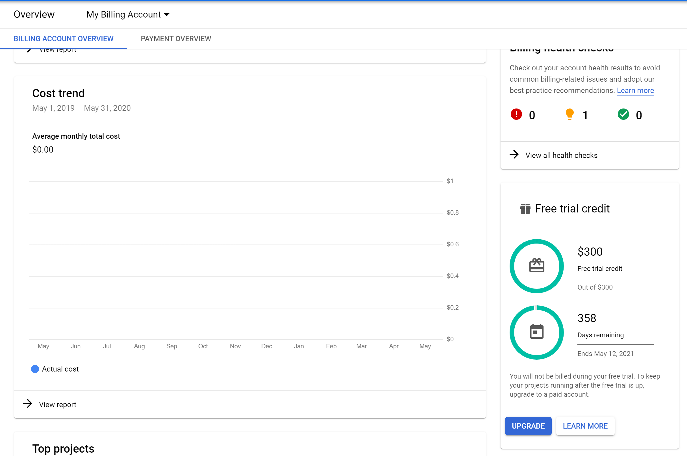

    > **Disclaimer:** To prevent unexpected charges, please follow the "Delete the deployment" section at the end of this README.

- Create Azure service principal (SP)

    To connect the GCP virtual machine to Azure Arc, an Azure service principal assigned with the "Contributor" role is required. To create it, login to your Azure account run the below command (this can also be done in [Azure Cloud Shell](https://shell.azure.com/).

    ```shell
    az login
    subscriptionId=$(az account show --query id --output tsv)
    az ad sp create-for-rbac -n "<Unique SP Name>" --role "Contributor" --scopes /subscriptions/$subscriptionId
    ```

    For example:

    ```shell
    az login
    subscriptionId=$(az account show --query id --output tsv)
    az ad sp create-for-rbac -n "JumpstartArc" --role "Contributor" --scopes /subscriptions/$subscriptionId
    ```

    Output should look like this:

    ```json
    {
    "appId": "XXXXXXXXXXXXXXXXXXXXXXXXXXXX",
    "displayName": "JumpstartArc",
    "password": "XXXXXXXXXXXXXXXXXXXXXXXXXXXX",
    "tenant": "XXXXXXXXXXXXXXXXXXXXXXXXXXXX"
    }
    ```

    > **Note:** If you create multiple subsequent role assignments on the same service principal, your client secret (password) will be destroyed and recreated each time. Therefore, make sure you grab the correct password.

    > **Note:** The Jumpstart scenarios are designed with as much ease of use in-mind and adhering to security-related best practices whenever possible. It is optional but highly recommended to scope the service principal to a specific [Azure subscription and resource group](https://learn.microsoft.com/cli/azure/ad/sp?view=azure-cli-latest) as well considering using a [less privileged service principal account](https://learn.microsoft.com/azure/role-based-access-control/best-practices).

- Azure Arc-enabled servers depends on the following Azure resource providers in your subscription in order to use this service. Registration is an asynchronous process, and registration may take approximately 10 minutes.

  - Microsoft.HybridCompute
  - Microsoft.GuestConfiguration
  - Microsoft.HybridConnectivity

      ```shell
      az provider register --namespace 'Microsoft.HybridCompute'
      az provider register --namespace 'Microsoft.GuestConfiguration'
      az provider register --namespace 'Microsoft.HybridConnectivity'
      ```

      You can monitor the registration process with the following commands:

      ```shell
      az provider show --namespace 'Microsoft.HybridCompute'
      az provider show --namespace 'Microsoft.GuestConfiguration'
      az provider show --namespace 'Microsoft.HybridConnectivity'
      ```

## Automation Flow

For you to get familiar with the automation and deployment flow, below is an explanation.

1. User creates and configures a new GCP project along with a Service Account key which Terraform will use to create and manage resources

2. User edits the tfvars to match the environment.

3. User runs *`terraform init`* to download the required terraform providers

4. User runs the automation. The terraform plan will:

    - Create a Windows Server VM in GCP
    - Create an Azure Resource Group
    - Install the Azure Connected Machine agent by executing a PowerShell script when the VM is first booted. Optionally a semi-automated deployment is provided if you want to demo/control the actual registration process.

5. User verifies the VM is create in GCP and the new Azure Arc-enabled resource in the Azure portal.

## Create a new GCP Project

- Browse to <https://console.cloud.google.com> and login with your Google Cloud account. Once logged in, [create a new project](https://cloud.google.com/resource-manager/docs/creating-managing-projects) named "Azure Arc Demo". After creating it, be sure to copy down the project id as it is usually different than the project name.

    

    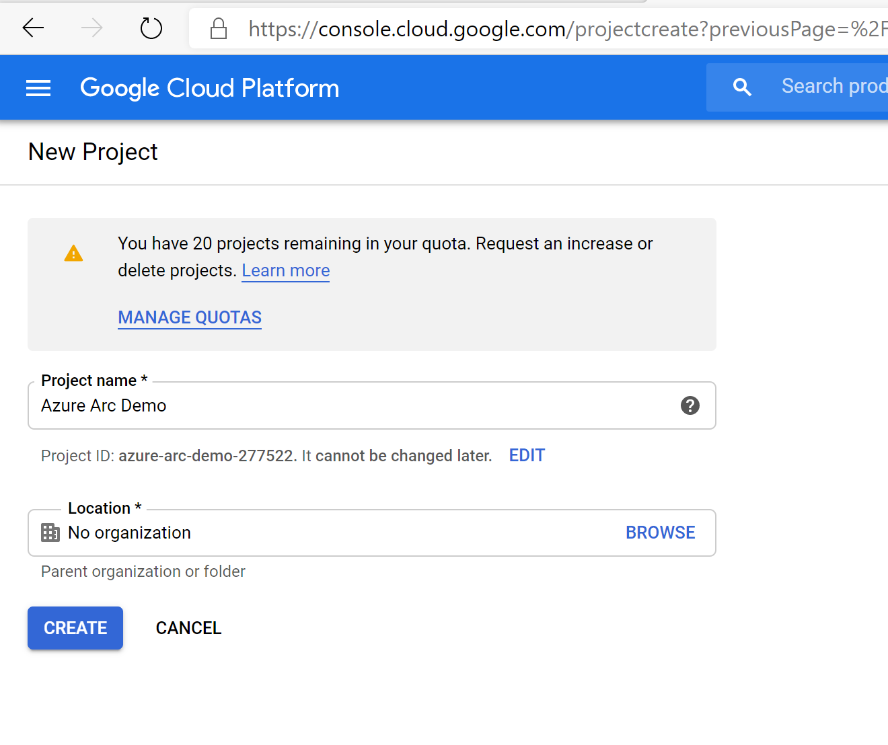

- Once the new project is created and selected in the dropdown at the top of the page, you must enable Compute Engine API access for the project. Click on "Enable APIs and Services" and search for "Compute Engine". Then click Enable to enable API access.

    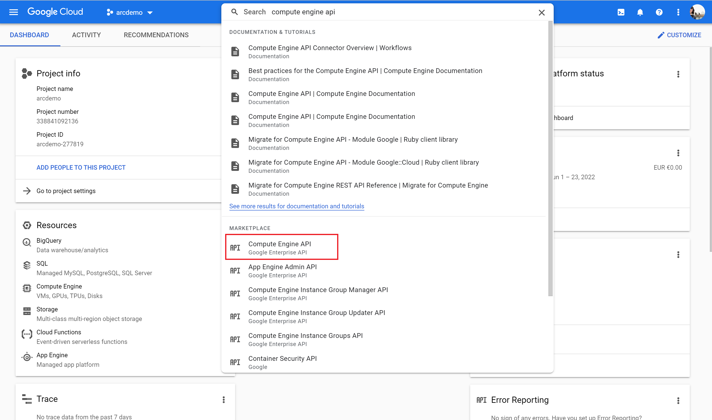

    

- Next, set up a service account key, which Terraform will use to create and manage resources in your GCP project. Go to the [create service account key page](https://console.cloud.google.com/apis/credentials/serviceaccountkey). Select "New Service Account" from the dropdown, give it a name, select Project then Owner as the role, JSON as the key type, and click Create. This downloads a JSON file with all the credentials that will be needed for Terraform to manage the resources. Copy the downloaded JSON file to the *azure_arc_servers_jumpstart/gcp/windows/terraform* directory.

    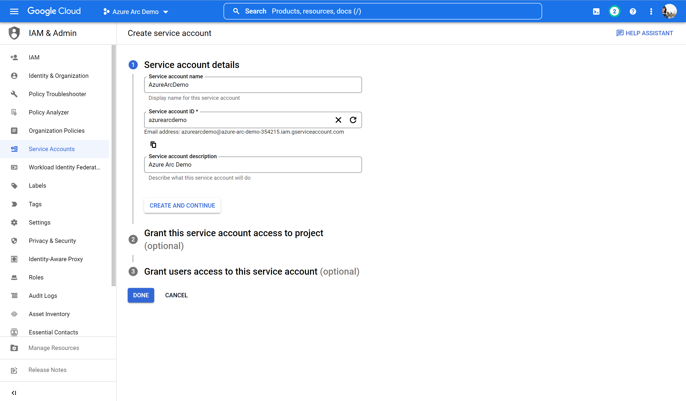

    

## Deployment

The only thing you need to do before executing the Terraform plan is to edit the tfvars file which will be used by the plan to customize it to your environment.

- Navigate to the [terraform folder](https://github.com/microsoft/azure_arc/tree/main/azure_arc_servers_jumpstart/gcp/ubuntu/terraform) and fill in the terraform.tfvars file with the values for your environment.

- Run the *`terraform init`* command which will download the required terraform providers.

- Next, Run the *`terraform apply --auto-approve`* command and wait for the plan to finish. Upon completion of the Terraform script, you will have deployed a GCP Windows Server 2019 VM and initiated a script to download the Azure Arc agent to the VM and connect the VM as a new Azure Arc-enabled server inside a new Azure resource group. It will take a few minutes for the agent to finish provisioning.

    

- After a few minutes, you should be able to open the Azure portal and navigate to the resource group "Arc-GCP-Demo". The Windows Server virtual machine created in GCP will be visible as a resource.

    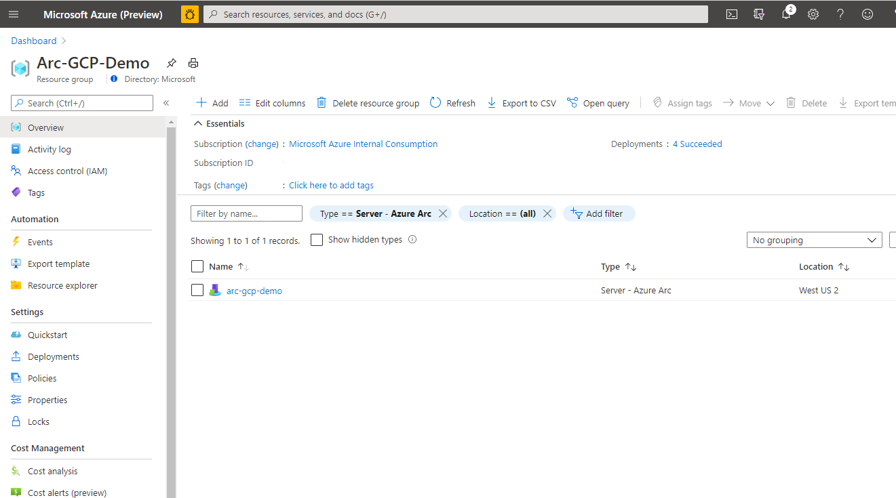

## Semi-Automated Deployment (Optional)

- The Terraform plan automatically installs the Azure Connected Machine agent and connects the VM to Azure as a managed resource by executing a PowerShell script when the VM is first booted.

    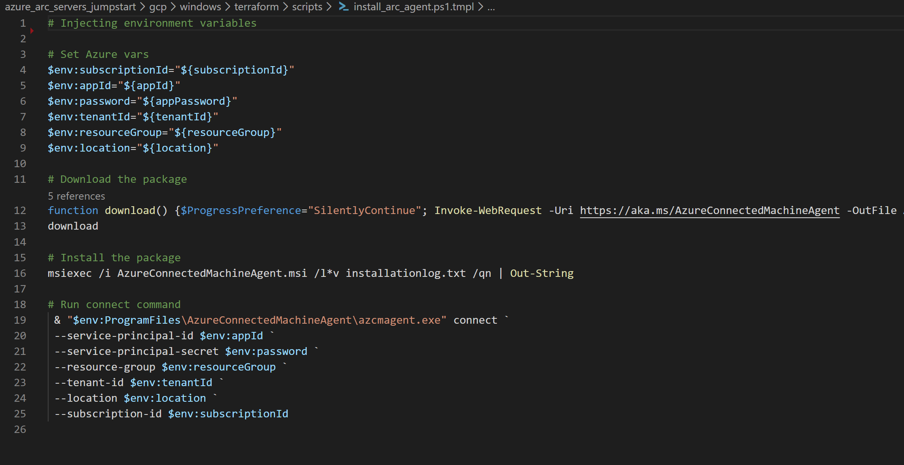

- If you want to demo/control the actual registration process, do the following:

- Before running the *`terraform apply`* command, open [*main.tf*](https://github.com/microsoft/azure_arc/blob/main/azure_arc_servers_jumpstart/gcp/windows/terraform/main.tf) and comment out the *`windows-startup-script-ps1 = local_file.install_arc_agent_ps1.content`* line and save the file.

    

- Run *`terraform apply --auto-approve`* as instructed above.

- Open the Google Cloud console and navigate to the [Compute Instance page](https://console.cloud.google.com/compute/instances), then click on the VM that was created.

    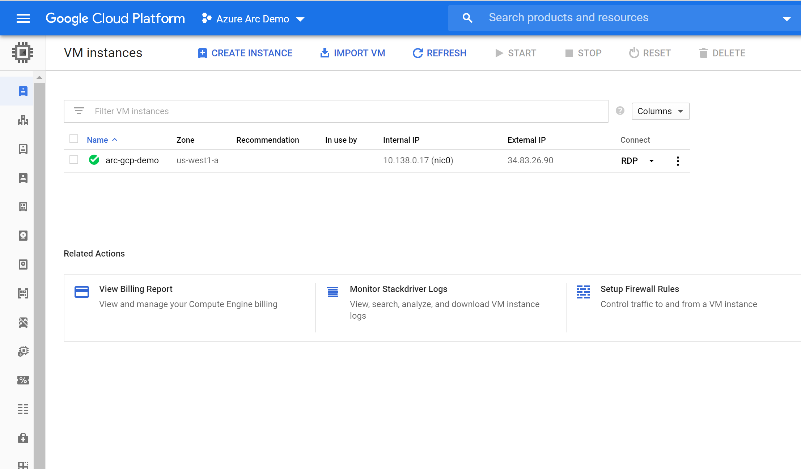

    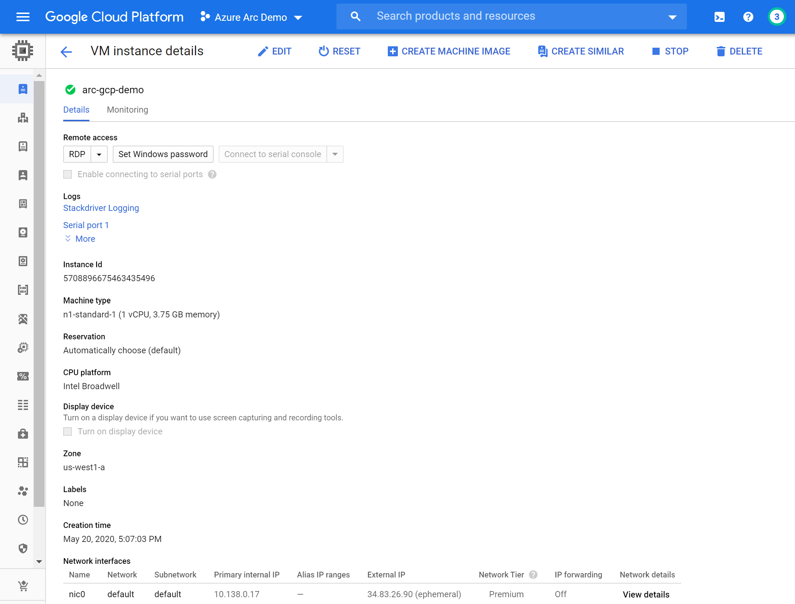

- Create a user and password for the VM by clicking "Set Password" and specifying a username.

    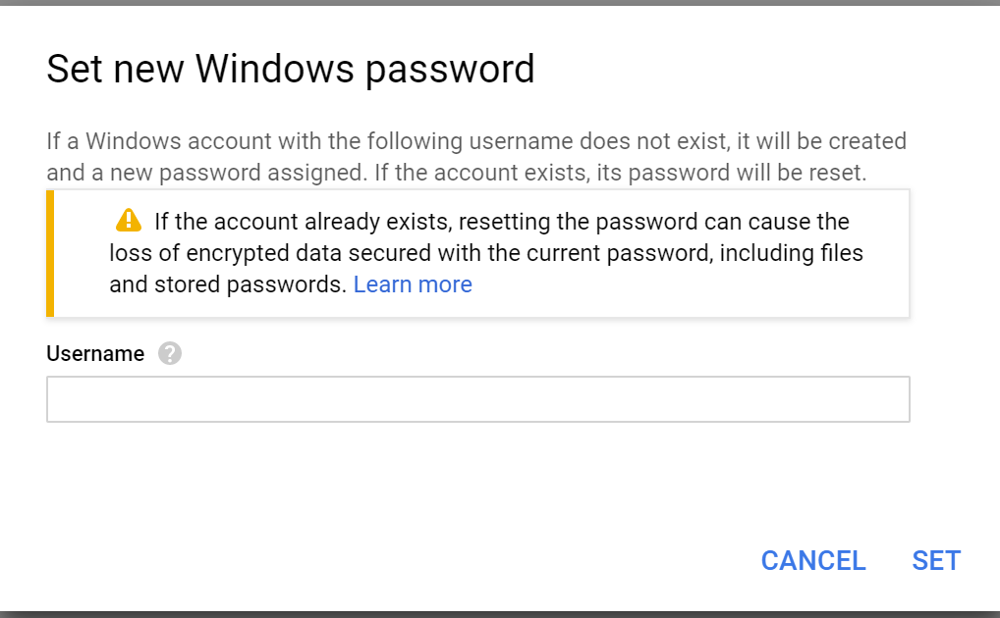

- RDP into the VM by clicking the RDP button from the VM page in Google Cloud console, and login with the username and password you just created.

    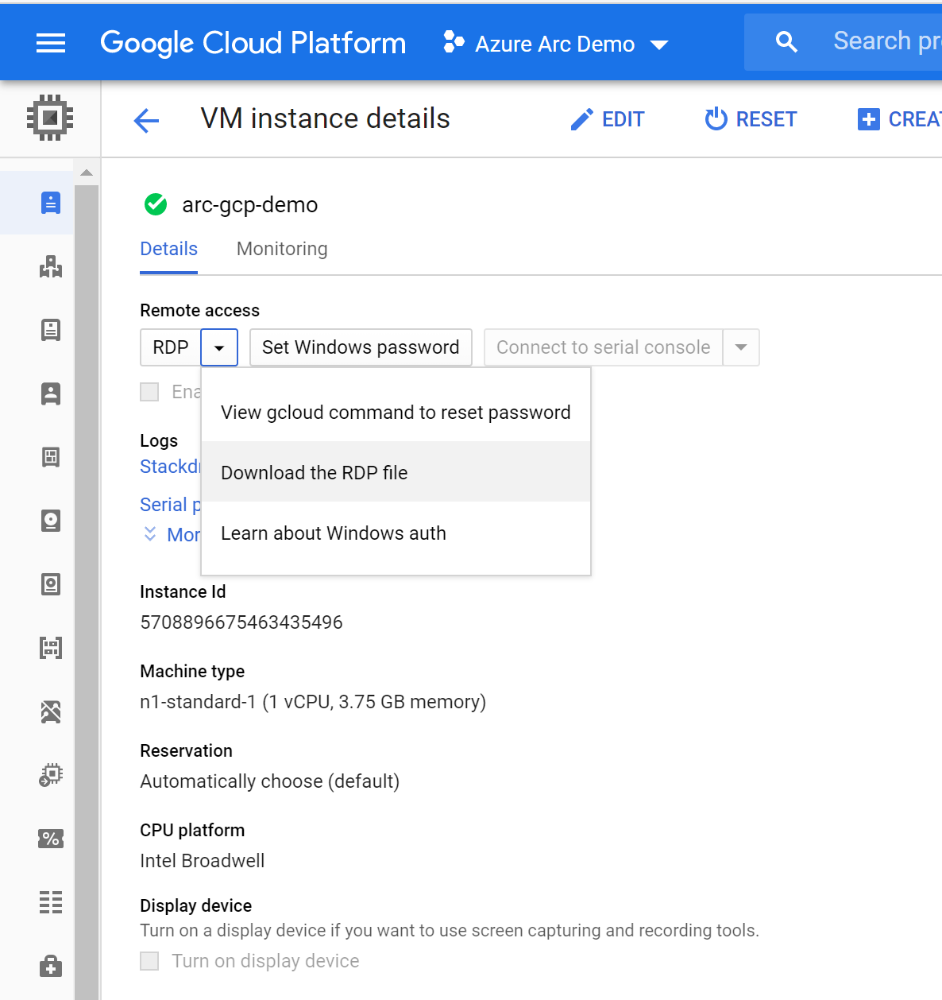

- Once logged in, open PowerShell ISE **as Administrator**. Make sure you are running the x64 version of PowerShell ISE and not x86. Once open, select File->New to create an empty .ps1 file. Then paste in the entire contents of *./scripts/install_arc_agent.ps1]*. Click the play button to execute the script. When complete, you should see the output showing successful onboarding of the machine.

    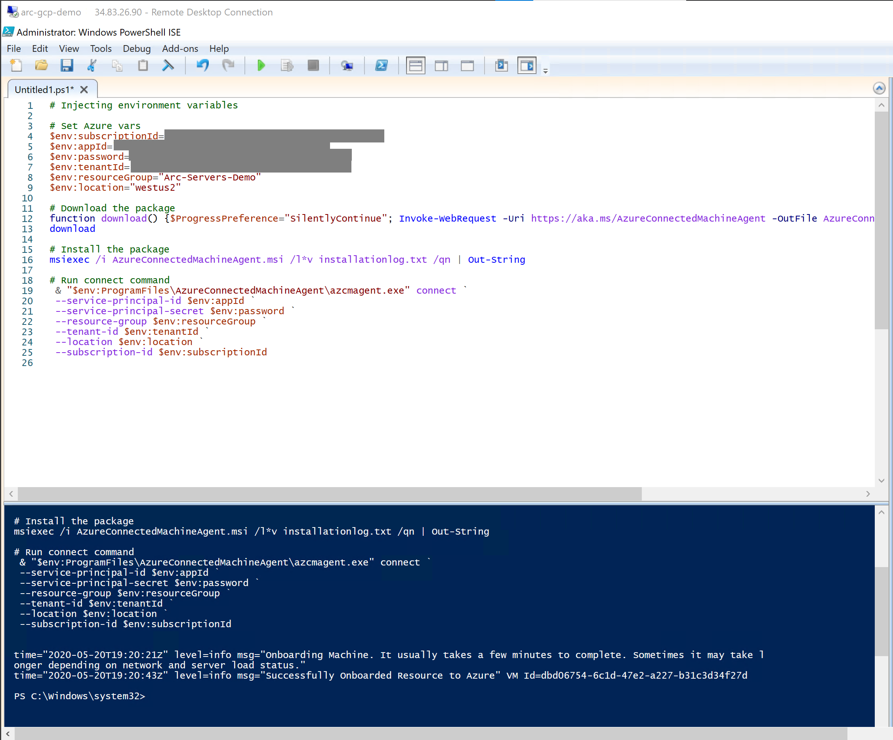

## Delete the deployment

- To delete all the resources you created as part of this demo use the *`terraform destroy --auto-approve`* command as shown below.

    

- Alternatively, you can delete the GCP VM directly from [GCP Console](https://console.cloud.google.com/compute/instances).

    
