# Jumpstart ArcBox "Full" Edition

## Overview

ArcBox is a solution that provides an easy to deploy sandbox for all things Azure Arc. ArcBox is designed to be completely self-contained within a single Azure subscription and resource group, which will make it easy for a user to get hands-on with all available Azure Arc technology with nothing more than an available Azure subscription.


### Use cases

- Sandbox environment for getting hands-on with Azure Arc technologies
- Accelerator for Proof-of-concepts or pilots
- Training tool for Azure Arc skills development
- Demo environment for customer presentations or events
- Rapid integration testing platform
- Infrastructure-as-code and automation template library for building hybrid cloud management solutions

## Azure Arc capabilities available in ArcBox

### Azure Arc-enabled servers

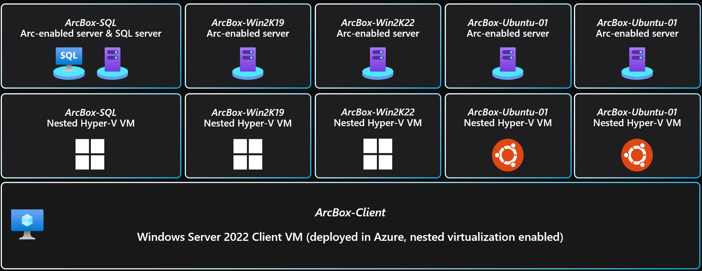

ArcBox includes five Azure Arc-enabled server resources that are hosted using nested virtualization in Azure. As part of the deployment, a Hyper-V host (_ArcBox-Client_) is deployed with five guest virtual machines. These machines, _ArcBox-Win2k22_, _ArcBox-Win2k19_, _ArcBox-SQL_, _ArcBox-Ubuntu-01_, and _ArcBox-Ubuntu-02_ are connected as Azure Arc-enabled servers via the ArcBox automation.

### Azure Arc-enabled Kubernetes

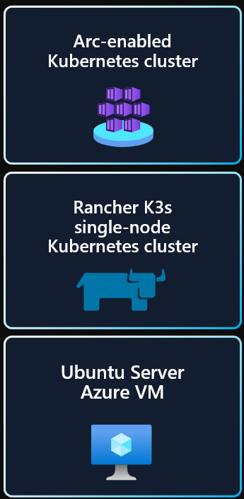

ArcBox deploys one single-node Rancher K3s cluster running on an Azure virtual machine. This cluster is then connected to Azure as an Azure Arc-enabled Kubernetes resource (_ArcBox-K3s_).

### Azure Arc-enabled data services

ArcBox deploys one single-node Rancher K3s cluster (_ArcBox-CAPI-MGMT_), which is then transformed to a [Cluster API](https://cluster-api.sigs.k8s.io/user/concepts.html) management cluster using the Cluster API Provider Azure(CAPZ), and a workload cluster is deployed onto the management cluster. The Azure Arc-enabled data services and data controller are deployed onto this workload cluster via a PowerShell script that runs when first logging into _ArcBox-Client_ virtual machine.

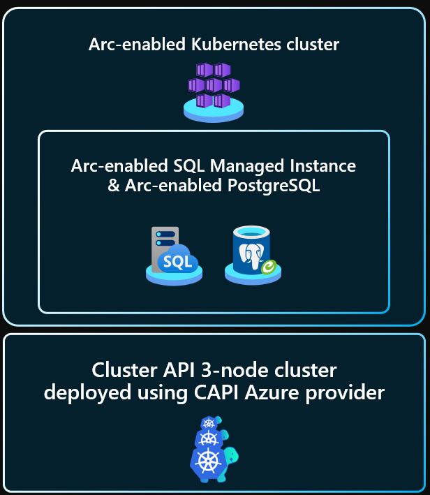

### Hybrid Unified Operations

ArcBox deploys several management and operations services that work with ArcBox's Azure Arc resources. These resources include an Azure Log Analytics workspace, an Azure Monitor workbook, Azure Policy assignments for deploying Azure Monitor agents on Windows and Linux Azure Arc-enabled servers, Azure Policy assignment for adding tags to resources, and a storage account used for staging resources needed for the deployment automation.


## ArcBox Azure Consumption Costs

ArcBox resources generate Azure Consumption charges from the underlying Azure resources including core compute, storage, networking and auxiliary services. Note that Azure consumption costs vary depending the region where ArcBox is deployed. Be mindful of your ArcBox deployments and ensure that you disable or delete ArcBox resources when not in use to avoid unwanted charges. Please see the [Jumpstart FAQ](../../faq/) for more information on consumption costs.

## Deployment Options and Automation Flow

ArcBox provides multiple paths for deploying and configuring ArcBox resources. Deployment options include:

- Azure portal
- ARM template via Azure CLI
- Bicep
- Terraform

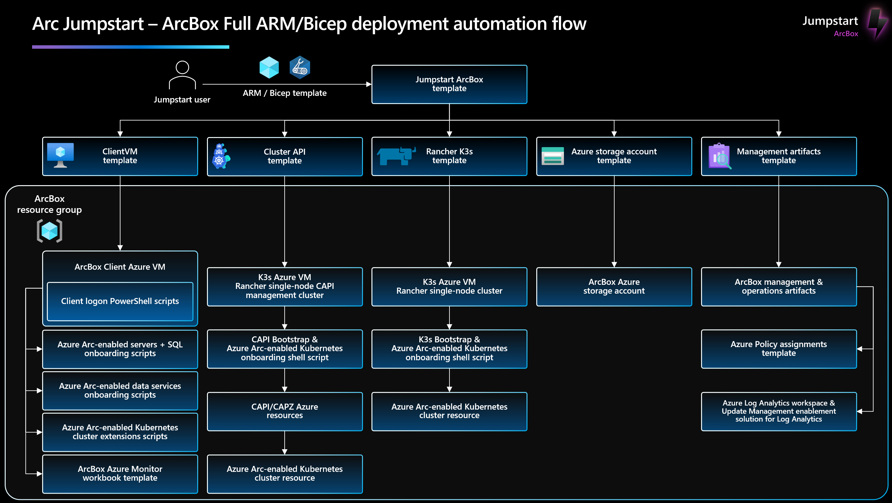

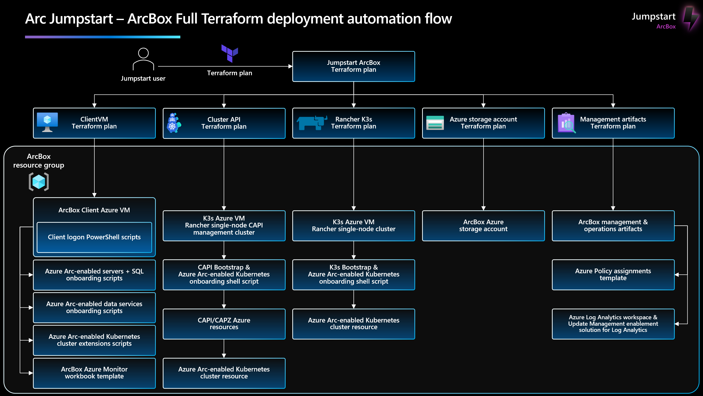

ArcBox uses an advanced automation flow to deploy and configure all necessary resources with minimal user interaction. The previous diagrams provide an overview of the deployment flow. A high-level summary of the deployment is:

- User deploys the primary ARM template (_azuredeploy.json_), Bicep file (_main.bicep_), or Terraform plan (_main.tf_). These objects contain several nested objects that will run simultaneously.
  - ClientVM ARM template/plan - deploys the Client Windows VM. This is the Hyper-V host VM where all user interactions with the environment are made from.
  - Storage account template/plan - used for staging files in automation scripts
  - Management artifacts template/plan - deploys Azure Log Analytics workspace and solutions and Azure Policy artifacts
- User remotes into Client Windows VM, which automatically kicks off multiple scripts that:
  - Deploy and configure five (5) nested virtual machines in Hyper-V
    - Windows Server 2022 VM - onboarded as Azure Arc-enabled server
    - Windows Server 2019 VM - onboarded as Azure Arc-enabled server
    - Windows VM running SQL Server - onboarded as Azure Arc-enabled SQL Server (as well as Azure Arc-enabled server)
    - 2 x Ubuntu VMs - onboarded as Azure Arc-enabled servers
  - Deploy an Azure Monitor workbook that provides example reports and metrics for monitoring ArcBox components

## Prerequisites

- [Install or update Azure CLI to version 2.53.0 and above](https://learn.microsoft.com/cli/azure/install-azure-cli?view=azure-cli-latest). Use the below command to check your current installed version.

  ```shell
  az --version
  ```

- Login to AZ CLI using the *`az login`* command.

- Ensure that you have selected the correct subscription you want to deploy ArcBox to by using the *`az account list --query "[?isDefault]"`* command. If you need to adjust the active subscription used by Az CLI, follow [this guidance](https://learn.microsoft.com/cli/azure/manage-azure-subscriptions-azure-cli#change-the-active-subscription).

- ArcBox must be deployed to one of the following regions. **Deploying ArcBox outside of these regions may result in unexpected results or deployment errors.**

  - East US
  - East US 2
  - Central US
  - West US 2
  - North Europe
  - West Europe
  - France Central
  - UK South
  - Australia East
  - Japan East
  - Korea Central
  - Southeast Asia

- **ArcBox Full requires 44 B-series and 16 DSv4-series vCPUs** when deploying with default parameters such as VM series/size. Ensure you have sufficient vCPU quota available in your Azure subscription and the region where you plan to deploy ArcBox. You can use the below Az CLI command to check your vCPU utilization.

  ```shell
  az vm list-usage --location <your location> --output table
  ```

  

- Register necessary Azure resource providers by running the following commands.

  ```shell
  az provider register --namespace Microsoft.HybridCompute --wait
  az provider register --namespace Microsoft.GuestConfiguration --wait
  az provider register --namespace Microsoft.Kubernetes --wait
  az provider register --namespace Microsoft.KubernetesConfiguration --wait
  az provider register --namespace Microsoft.ExtendedLocation --wait
  az provider register --namespace Microsoft.AzureArcData --wait
  az provider register --namespace Microsoft.OperationsManagement --wait
  ```

- Create Azure service principal (SP). To deploy ArcBox, an Azure service principal assigned with the _Owner_ Role-based access control (RBAC) role is required. You can use Azure Cloud Shell (or other Bash shell), or PowerShell to create the service principal.

  - (Option 1) Create service principal using [Azure Cloud Shell](https://shell.azure.com/) or Bash shell with Azure CLI:

    ```shell
    az login
    subscriptionId=$(az account show --query id --output tsv)
    az ad sp create-for-rbac -n "<Unique SP Name>" --role "Owner" --scopes /subscriptions/$subscriptionId
    ```

    For example:

    ```shell
    az login
    subscriptionId=$(az account show --query id --output tsv)
    az ad sp create-for-rbac -n "JumpstartArcBoxSPN" --role "Owner" --scopes /subscriptions/$subscriptionId
    ```

    Output should look similar to this:

    ```json
    {
    "appId": "XXXXXXXXXXXXXXXXXXXXXXXXXXXX",
    "displayName": "JumpstartArcBox",
    "password": "XXXXXXXXXXXXXXXXXXXXXXXXXXXX",
    "tenant": "XXXXXXXXXXXXXXXXXXXXXXXXXXXX"
    }
    ```

  - (Option 2) Create service principal using PowerShell. If necessary, follow [this documentation](https://learn.microsoft.com/powershell/azure/install-az-ps?view=azps-8.3.0) to install Azure PowerShell modules.

    ```powershell
    $account = Connect-AzAccount
    $spn = New-AzADServicePrincipal -DisplayName "<Unique SPN name>" -Role "Owner" -Scope "/subscriptions/$($account.Context.Subscription.Id)"
    echo "SPN App id: $($spn.AppId)"
    echo "SPN secret: $($spn.PasswordCredentials.SecretText)"
    ```

    For example:

    ```powershell
    $account = Connect-AzAccount
    $spn = New-AzADServicePrincipal -DisplayName "JumpstartArcBoxSPN" -Role "Owner" -Scope "/subscriptions/$($account.Context.Subscription.Id)"
    echo "SPN App id: $($spn.AppId)"
    echo "SPN secret: $($spn.PasswordCredentials.SecretText)"
    ```

    Output should look similar to this:

    

    > **Note:** If you create multiple subsequent role assignments on the same service principal, your client secret (password) will be destroyed and recreated each time. Therefore, make sure you grab the correct password.

    > **Note:** The Jumpstart scenarios are designed with as much ease of use in-mind and adhering to security-related best practices whenever possible. It is optional but highly recommended to scope the service principal to a specific [Azure subscription and resource group](https://learn.microsoft.com/cli/azure/ad/sp?view=azure-cli-latest) as well considering using a [less privileged service principal account](https://learn.microsoft.com/azure/role-based-access-control/best-practices).

- [Generate a new SSH key pair](https://learn.microsoft.com/azure/virtual-machines/linux/create-ssh-keys-detailed) or use an existing one (Windows 10 and above now comes with a built-in ssh client). The SSH key is used to configure secure access to the Linux virtual machines that are used to run the Kubernetes clusters.

  ```shell
  ssh-keygen -t rsa -b 4096
  ```

  To retrieve the SSH public key after it's been created, depending on your environment, use one of the below methods:
  - In Linux, use the `cat ~/.ssh/id_rsa.pub` command.
  - In Windows (CMD/PowerShell), use the SSH public key file that by default, is located in the _`C:\Users\WINUSER/.ssh/id_rsa.pub`_ folder.

  SSH public key example output:

  ```shell
  ssh-rsa o1djFhyNe5NXyYk7XVF7wOBAAABgQDO/QPJ6IZHujkGRhiI+6s1ngK8V4OK+iBAa15GRQqd7scWgQ1RUSFAAKUxHn2TJPx/Z/IU60aUVmAq/OV9w0RMrZhQkGQz8CHRXc28S156VMPxjk/gRtrVZXfoXMr86W1nRnyZdVwojy2++sqZeP/2c5GoeRbv06NfmHTHYKyXdn0lPALC6i3OLilFEnm46Wo+azmxDuxwi66RNr9iBi6WdIn/zv7tdeE34VAutmsgPMpynt1+vCgChbdZR7uxwi66RNr9iPdMR7gjx3W7dikQEo1djFhyNe5rrejrgjerggjkXyYk7XVF7wOk0t8KYdXvLlIyYyUCk1cOD2P48ArqgfRxPIwepgW78znYuwiEDss6g0qrFKBcl8vtiJE5Vog/EIZP04XpmaVKmAWNCCGFJereRKNFIl7QfSj3ZLT2ZXkXaoLoaMhA71ko6bKBuSq0G5YaMq3stCfyVVSlHs7nzhYsX6aDU6LwM/BTO1c= user@pc
  ```

## Deployment Option 1: Azure portal

- Click the <a href="https://portal.azure.com/#create/Microsoft.Template/uri/https%3A%2F%2Fraw.githubusercontent.com%2Fmicrosoft%2Fazure_arc%2Fmain%2Fazure_jumpstart_arcbox%2FARM%2Fazuredeploy.json" target="_blank"></a> button and enter values for the the ARM template parameters.

  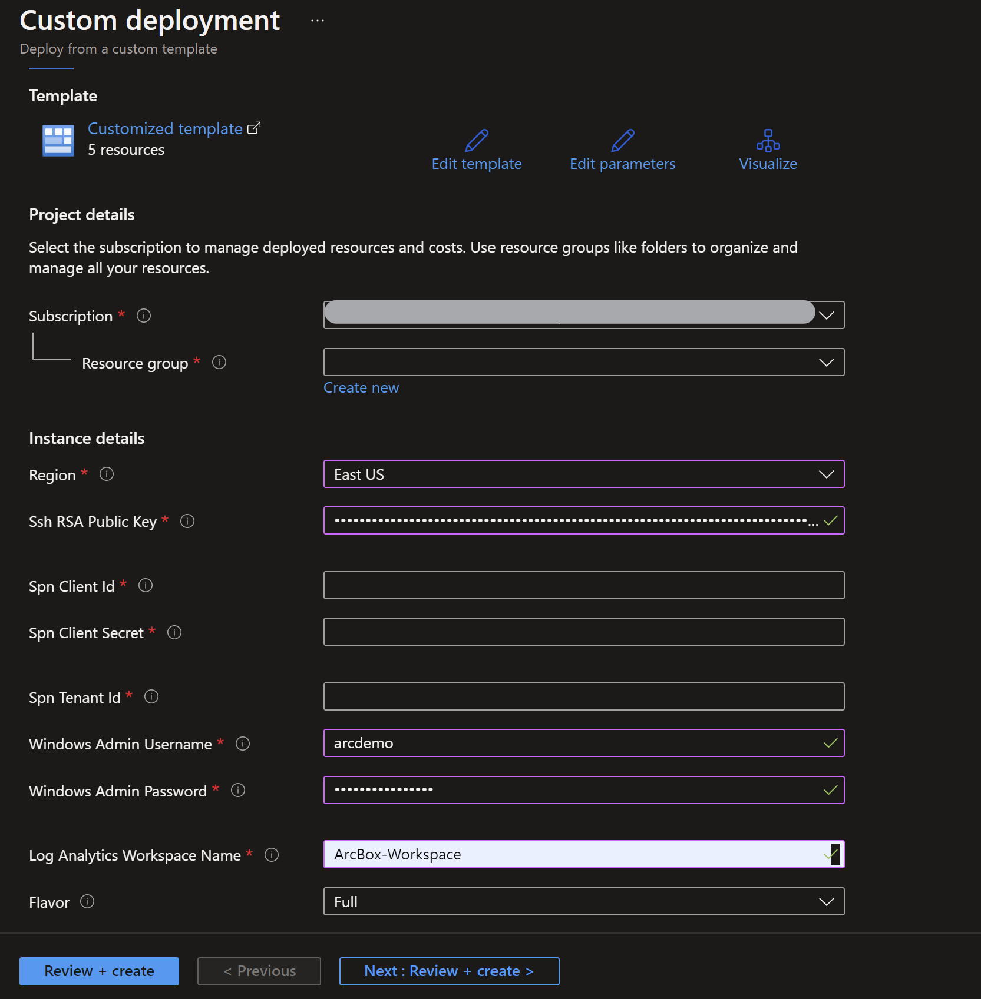

  

  

    > **Note:** If you see any failure in the deployment, please check the [troubleshooting guide](#basic-troubleshooting).

## Deployment Option 2: ARM template with Azure CLI

- Clone the Azure Arc Jumpstart repository

    ```shell
    git clone https://github.com/microsoft/azure_arc.git
    ```

- Edit the [azuredeploy.parameters.json](https://github.com/microsoft/azure_arc/blob/main/azure_jumpstart_arcbox/ARM/azuredeploy.parameters.json) ARM template parameters file and supply some values for your environment.
  - _`sshRSAPublicKey`_ - Your SSH public key
  - _`spnClientId`_ - Your Azure service principal id
  - _`spnClientSecret`_ - Your Azure service principal secret
  - _`spnTenantId`_ - Your Azure tenant id
  - _`windowsAdminUsername`_ - Client Windows VM Administrator name
  - _`windowsAdminPassword`_ - Client Windows VM Password. Password must have 3 of the following: 1 lower case character, 1 upper case character, 1 number, and 1 special character. The value must be between 12 and 123 characters long.
  - _`logAnalyticsWorkspaceName`_ - Unique name for the ArcBox Log Analytics workspace
  - _`flavor`_ - Use the value "Full" to specify that you want to deploy the full version of ArcBox

  

- Now you will deploy the ARM template. Navigate to the local cloned [deployment folder](https://github.com/microsoft/azure_arc/tree/main/azure_jumpstart_arcbox) and run the below command:

  ```shell
  az group create --name <Name of the Azure resource group> --location <Azure Region>
  az deployment group create \
  --resource-group <Name of the Azure resource group> \
  --template-file azuredeploy.json \
  --parameters azuredeploy.parameters.json
  ```

  

  

    > **Note:** If you see any failure in the deployment, please check the [troubleshooting guide](#basic-troubleshooting).

## Deployment Option 3: Bicep deployment via Azure CLI

- Clone the Azure Arc Jumpstart repository

  ```shell
  git clone https://github.com/microsoft/azure_arc.git
  ```

- Upgrade to latest Bicep version

  ```shell
  az bicep upgrade
  ```

- Edit the [main.parameters.json](https://github.com/microsoft/azure_arc/blob/main/azure_jumpstart_arcbox/bicep/main.parameters.json) template parameters file and supply some values for your environment.
  - _`sshRSAPublicKey`_ - Your SSH public key
  - _`spnClientId`_ - Your Azure service principal id
  - _`spnClientSecret`_ - Your Azure service principal secret
  - _`spnTenantId`_ - Your Azure tenant id
  - _`windowsAdminUsername`_ - Client Windows VM Administrator name
  - _`windowsAdminPassword`_ - Client Windows VM Password. Password must have 3 of the following: 1 lower case character, 1 upper case character, 1 number, and 1 special character. The value must be between 12 and 123 characters long.
  - _`logAnalyticsWorkspaceName`_ - Unique name for the ArcBox Log Analytics workspace
  - _`flavor`_ - Use the value "Full" to specify that you want to deploy the full version of ArcBox

  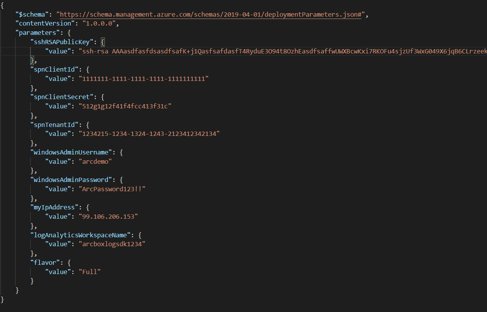

- Now you will deploy the Bicep file. Navigate to the local cloned [deployment folder](https://github.com/microsoft/azure_arc/tree/main/azure_jumpstart_arcbox/bicep) and run the below command:

  ```shell
  az login
  az group create --name "<resource-group-name>"  --location "<preferred-location>"
  az deployment group create -g "<resource-group-name>" -f "main.bicep" -p "main.parameters.json"
  ```

    > **Note:** If you see any failure in the deployment, please check the [troubleshooting guide](#basic-troubleshooting).

## Deployment Option 4: Terraform Deployment

- Clone the Azure Arc Jumpstart repository

  ```shell
  git clone https://github.com/microsoft/azure_arc.git
  ```

- Download and install the latest version of Terraform [here](https://www.terraform.io/downloads.html)

  > **Note:** Terraform 1.x or higher is supported for this deployment. Tested with Terraform v1.011.

- Create a `terraform.tfvars` file in the root of the terraform folder and supply some values for your environment.

  ```HCL
  azure_location    = "westus2"
  spn_client_id     = "1414133c-9786-53a4-b231-f87c143ebdb1"
  spn_client_secret = "fakeSecretValue123458125712ahjeacjh"
  spn_tenant_id     = "33572583-d294-5b56-c4e6-dcf9a297ec17"
  client_admin_ssh  = "C:/Temp/rsa.pub"
  deployment_flavor = "Full"
  ```

- Variable Reference:
  - **_`azure_location`_** - Azure location code (e.g. 'eastus', 'westus2', etc.)
  - **_`resource_group_name`_** - Resource group which will contain all of the ArcBox artifacts
  - **_`spn_client_id`_** - Your Azure service principal id
  - **_`spn_client_secret`_** - Your Azure service principal secret
  - **_`spn_tenant_id`_** - Your Azure tenant id
  - **_`client_admin_ssh`_** - SSH public key path, used for Linux VMs
  - **_`deployment_flavor`_** - Use the value "Full" to specify that you want to deploy the full version of ArcBox
  - _`client_admin_username`_ - Admin username for Windows & Linux VMs
  - _`client_admin_password`_ - Admin password for Windows VMs. Password must have 3 of the following: 1 lower case character, 1 upper case character, 1 number, and 1 special character. The value must be between 12 and 123 characters long.
  - **_`workspace_name`_** - Unique name for the ArcBox Log Analytics workspace

  > **Note:** Any variables in bold are required. If any optional parameters are not provided, defaults will be used.

- Now you will deploy the Terraform file. Navigate to the local cloned [deployment folder](https://github.com/microsoft/azure_arc/tree/main/azure_jumpstart_arcbox/terraform) and run the commands below:

  ```shell
  terraform init
  terraform plan -out=infra.out
  terraform apply "infra.out"
  ```

- Example output from `terraform init`:

  

- Example output from `terraform plan -out=infra.out`:

  

- Example output from `terraform apply "infra.out"`:

  

    > **Note:** If you see any failure in the deployment, please check the [troubleshooting guide](#basic-troubleshooting).

## Start post-deployment automation

Once your deployment is complete, you can open the Azure portal and see the ArcBox resources inside your resource group. You will be using the _ArcBox-Client_ Azure virtual machine to explore various capabilities of ArcBox such as GitOps configurations and Key Vault integration. You will need to remotely access _ArcBox-Client_.

  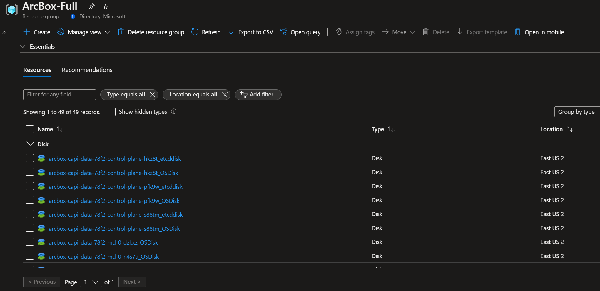

   > **Note:** For enhanced ArcBox security posture, RDP (3389) and SSH (22) ports are not open by default in ArcBox deployments. You will need to create a network security group (NSG) rule to allow network access to port 3389, or use [Azure Bastion](https://learn.microsoft.com/azure/bastion/bastion-overview) or [Just-in-Time (JIT)](https://learn.microsoft.com/azure/defender-for-cloud/just-in-time-access-usage?tabs=jit-config-asc%2Cjit-request-asc) access to connect to the VM.

### Connecting to the ArcBox Client virtual machine

Various options are available to connect to _ArcBox-Client_ VM, depending on the parameters you supplied during deployment.

- [RDP](#connecting-directly-with-rdp) - available after configuring access to port 3389 on the _ArcBox-NSG_, or by enabling [Just-in-Time access (JIT)](#connect-using-just-in-time-access-jit).
- [Azure Bastion](#connect-using-azure-bastion) - available if *`true`* was the value of your _`deployBastion`_ parameter during deployment.

#### Connecting directly with RDP

By design, ArcBox does not open port 3389 on the network security group. Therefore, you must create an NSG rule to allow inbound 3389.

- Open the _ArcBox-NSG_ resource in Azure portal and click "Add" to add a new rule.

  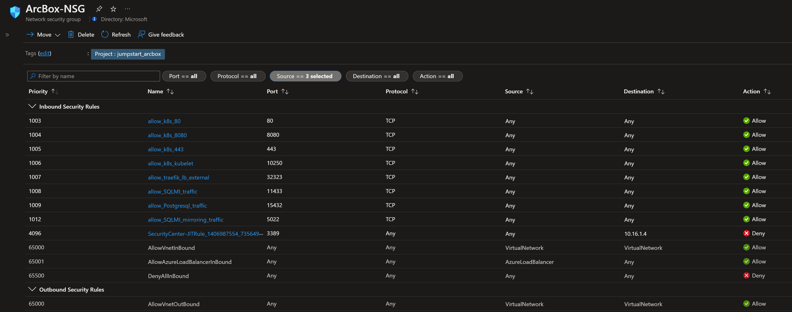

  

- Specify the IP address that you will be connecting from and select RDP as the service with "Allow" set as the action. You can retrieve your public IP address by accessing [https://icanhazip.com](https://icanhazip.com) or [https://whatismyip.com](https://whatismyip.com).

  

  

  

#### Connect using Azure Bastion

- If you have chosen to deploy Azure Bastion in your deployment, use it to connect to the VM.

  

  > **Note:** When using Azure Bastion, the desktop background image is not visible. Therefore some screenshots in this guide may not exactly match your experience if you are connecting to _ArcBox-Client_ with Azure Bastion.

#### Connect using just-in-time access (JIT)

If you already have [Microsoft Defender for Cloud](https://learn.microsoft.com/azure/defender-for-cloud/just-in-time-access-usage?tabs=jit-config-asc%2Cjit-request-asc) enabled on your subscription and would like to use JIT to access the Client VM, use the following steps:

- In the Client VM configuration pane, enable just-in-time. This will enable the default settings.

  

  

  

#### The Logon scripts

- Once you log into the _ArcBox-Client_ VM, multiple automated scripts will open and start running. These scripts usually take 10-20 minutes to finish, and once completed, the script windows will close automatically. At this point, the deployment is complete.

  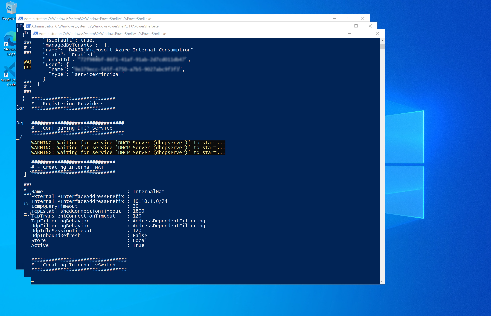

- Deployment is complete! Let's begin exploring the features of Azure Arc with ArcBox!

  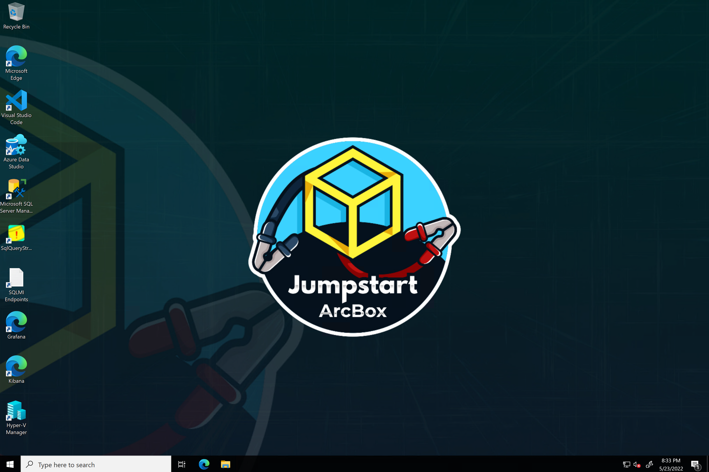

  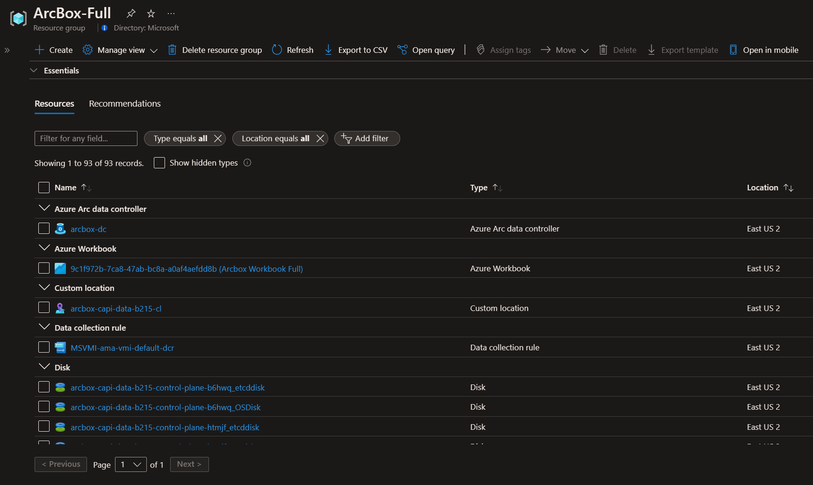

## Azure Arc-enabled SQL Server onboarding

- During deployment, a check is performed to determine whether or not the Service Principal being used has permissions of _'Microsoft.Authorization/roleAssignments/write'_ on the target resource group. This permission can be found in the Azure built-in roles of Owner, User Access Administrator, or you may have a custom RBAC role which provides this permission. If the Service Principal has been granted the rights to change the role assignments on the resource group, the Azure Arc-enabled SQL Server can be automatically onboarded as part of the port-deployment automation.

- In the event that the Service Principal does **not** have _'Microsoft.Authorization/roleAssignments/write'_ on the target resource group, and icon will created on the _ArcBox-Client_ desktop, which will allow you to onboard the Azure Arc-enabled SQL Server after the post-deployment automation is complete. To start the onboarding process in this scenario, simply click the _'Onboard SQL Server'_ icon on the desktop. This process should take around 10-15 minutes to complete.

  

- A pop-up box will walk you through the target SQL Server which will be onboarded to Azure Arc, as well as provide details around the flow of the onboarding automation and how to complete the Azure authentication process when prompted.

  

- The automation uses the PowerShell SDK to onboard the Azure Arc-enabled SQL Server on your behalf. To accomplish this, it will login to Azure with the _-UseDeviceAuthentication_ flag. The device code will be copied to the clipboard on your behalf, so you can simply paste the value into box when prompted.

  

- You'll then need to provide your Azure credentials to complete the authentication process. The user you login as will need _'Microsoft.Authorization/roleAssignments/write'_ permissions on the ArcBox resource group to complete the onboarding process.

  

- The output of each step of the onboarding process will be displayed in the PowerShell script window, so you'll be able to see where the script currently is in the process at all times.

  

- Once complete, you'll receive a pop-up notification informing you that the onboarding process is complete, and to check the Azure Arc blade in the Azure portal in the next few minutes.

  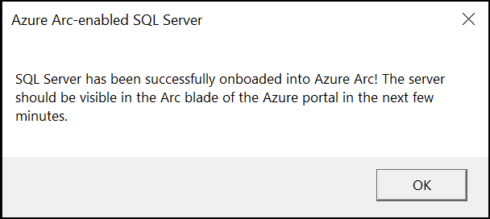

- From the Azure portal, the SQL Server should now be visible as an Azure Arc-enabled SQL Server.

  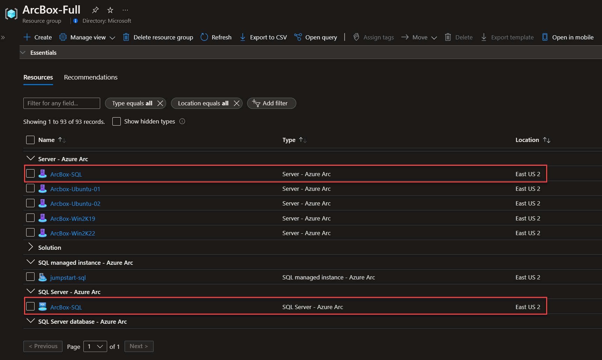

## Using ArcBox

After deployment is complete, its time to start exploring ArcBox. Most interactions with ArcBox will take place either from Azure itself (Azure portal, CLI or similar) or from inside the _ArcBox-Client_ virtual machine. When remoted into the client VM, here are some things to try:

- Open the Hyper-V Manager to access the ArcBox nested virtual machines, that are onboarded as Azure Arc-enabled servers.
&nbsp;

  Windows virtual machine credentials:

  ```text
  Username: Administrator
  Password: ArcDemo123!!
  ```

  Ubuntu virtual machine credentials:
  
  ```text
  Username: arcdemo
  Password: ArcDemo123!!
  ```

  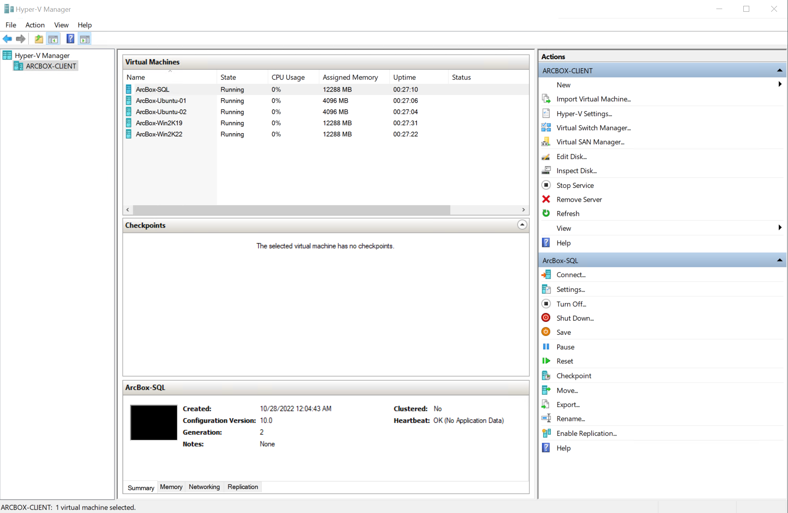

- Alternately, you can use Azure CLI to connect to one of the Azure Arc-enabled servers, Hyper-V Ubuntu virtual machines [using SSH](https://learn.microsoft.com/azure/azure-arc/servers/ssh-arc-overview?tabs=azure-cli). Open a PowerShell session and use the below commands.

    ```powershell
    az login -u $env:SPN_CLIENT_ID -p $env:SPN_CLIENT_SECRET -t $env:SPN_TENANT_ID --service-principal

    $serverName = "ArcBox-Ubuntu-01"
    $localUser = "arcdemo"
    az ssh arc --resource-group $Env:resourceGroup --name $serverName --local-user $localUser
    ```

    > **Note:** Server-side SSH is being provisioned asynchronously to the VMs in the automated provisioning scripts, so it might take up to 5 minutes after the ArcBox deployment scripts is finished until the _az ssh_ commands will run successfully.

    

    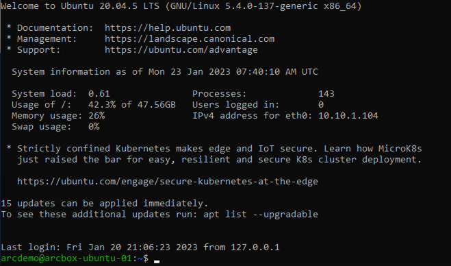

- Following the previous method, you can also use Azure CLI to connect to one of the Azure Arc-enabled servers, Hyper-V Windows Server virtual machines via SSH.

  ```powershell
  az login -u $env:SPN_CLIENT_ID -p $env:SPN_CLIENT_SECRET -t $env:SPN_TENANT_ID --service-principal

  $serverName = "ArcBox-Win2K22"
  $localUser = "Administrator"

  az ssh arc --resource-group $Env:resourceGroup --name $serverName --local-user $localUser
  ```

  

  

- In addition to SSH, you can also use Azure CLI to connect to one of the Azure Arc-enabled servers, Hyper-V Windows Server virtual machines using Remote Desktop tunneled via SSH.

  ```powershell
  az login -u $env:SPN_CLIENT_ID -p $env:SPN_CLIENT_SECRET -t $env:SPN_TENANT_ID --service-principal

  $serverName = "ArcBox-Win2K22"
  $localUser = "Administrator"

  az ssh arc --resource-group $Env:resourceGroup --name $serverName --local-user $localUser --rdp
  ```

  

- Use the included [kubectx](https://github.com/ahmetb/kubectx) tool to switch Kubernetes contexts between the Rancher K3s and AKS clusters.

  ```shell
  kubectx
  kubectx arcbox-capi
  kubectl get nodes
  kubectl get pods -n arc
  kubectx arcbox-k3s
  kubectl get nodes
  ```

  

- Open Azure Data Studio and explore the SQL MI and PostgreSQL instances.

  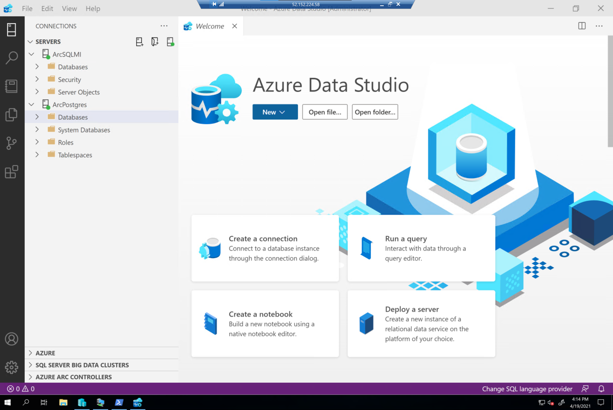

### ArcBox Azure Monitor workbook

Open the [ArcBox Azure Monitor workbook documentation](/azure_jumpstart_arcbox/workbook/flavors/Full) and explore the visualizations and reports of hybrid cloud resources.

  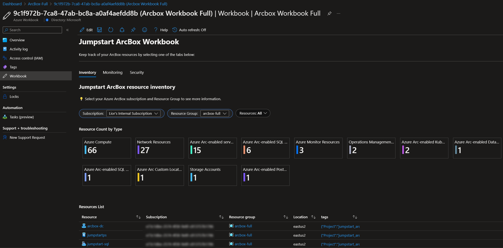

### Azure Arc-enabled data services operations

Open the [data services operations page](/azure_jumpstart_arcbox/data_ops/) and explore various ways you can perform operations against the Azure Arc-enabled data services deployed with ArcBox.

  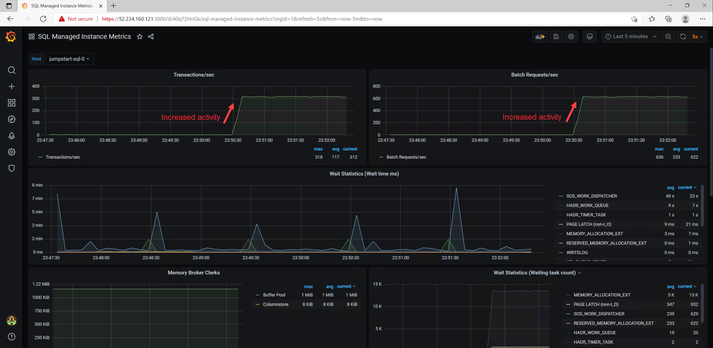

### Arc-enabled SQL Server - Best practices assessment

As part of the ArcBox deployment, SQL Server best practices assessment is configured and run. Open _ArcBox-SQL_ Arc-enabled SQL Server resource from the resource group deployed or Azure Arc service blade to view SQL Server best practice assessment results.

- The following screenshot shows the SQL Server best practices assessment page and the scheduled and previously ran assessments. If this page does not show assessment results click on the Refresh button to show assessments. Once displayed the assessments and results click on _View assessment_ results to see results.

  

  

  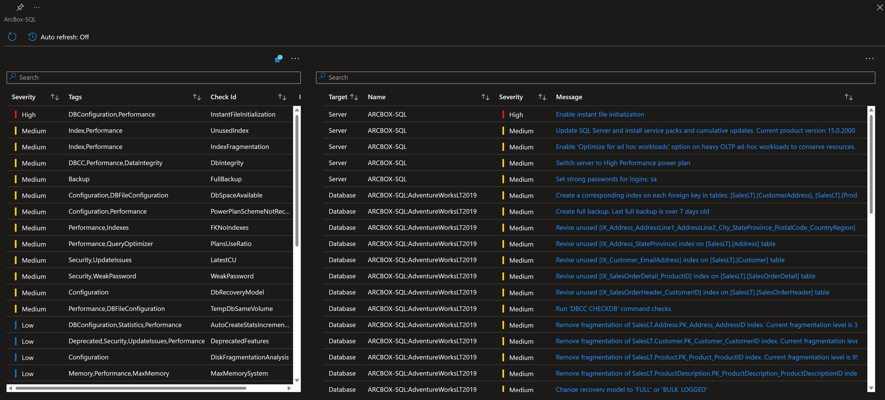

### Microsoft Defender for Cloud - SQL servers on machines

This section guides you through different settings for enabling Microsoft Defender for Cloud - SQL servers on machines. Most of these settings are already enabled during the logon script execution after logging in to _ArcBox-Client_ Azure VM. Even though these are pre-configured there might be delays in showing them in the Azure portal.

- Following are the settings of Microsoft Defender for Cloud - SQL servers on machines configured using automation scripts and can be reviewed in Azure portal.

  

  

- The below screenshots show Arc-enabled SQL Server Defender for Cloud enablement and protection status. Defender for Cloud for SQL Server is enabled at the subscription level, but the protection status is still showing as not enabled.

Please note it may take some time to show this status in the Azure portal, but still able to detect SQL threats generated by the test scripts.

  

- The below screenshot shows the SQL threats detected by Microsoft Defender for Cloud.

  

  > **Note:** Once in a while executing Defender for SQL test script (_testDefenderForSQL.ps1_) may fail due to delays in deploying SQLAdvancedThreatProtection Log Analytics solution and may not generate security incidents and alerts. If you do not find these security incidents and alerts, log in to nested SQL server VM _ArcBox-SQL_ in Hyper-V and execute the test script manually as shown below.

- The below screenshot shows the test script used to generate SQL threats, detect, and alert using Defender for Cloud for SQL servers. This script is copied on the nested _ArcBox-SQL_ Hyper-V virtual machine and can be used to run additional tests to generate security incidents and alerts.

  

- Open PowerShell window and change directory to _C:\ArcBox\agentScript_ folder and run _testDefenderForSQL.ps1_ PowerShell script to generate Defender for SQL incidents and alerts.

  

- The below screenshot shows an email alert sent by Defender for Cloud when a SQL threat is detected. By default, this email is sent to the registered contact email at the subscription level.
  

### Included tools

The following tools are including on the _ArcBox-Client_ VM.

- Azure Data Studio with Arc and PostgreSQL extensions
- kubectl, kubectx, helm
- Chocolatey
- Visual Studio Code
- Putty
- 7zip
- Terraform
- Git
- SqlQueryStress

### Next steps

ArcBox is a sandbox that can be used for a large variety of use cases, such as an environment for testing and training or a kickstarter for proof of concept projects. Ultimately, you are free to do whatever you wish with ArcBox. Some suggested next steps for you to try in your ArcBox are:

- Deploy sample databases to the PostgreSQL instance or to the SQL Managed Instance
- Use the included kubectx to switch contexts between the two Kubernetes clusters
- Deploy GitOps configurations with Azure Arc-enabled Kubernetes
- Build policy initiatives that apply to your Azure Arc-enabled resources
- Write and test custom policies that apply to your Azure Arc-enabled resources
- Incorporate your own tooling and automation into the existing automation framework
- Build a certificate/secret/key management strategy with your Azure Arc resources

Do you have an interesting use case to share? [Submit an issue](https://aka.ms/JumpstartIssue) on GitHub with your idea and we will consider it for future releases!

## Clean up the deployment

To clean up your deployment, simply delete the resource group using Azure CLI or Azure portal.

```shell
az group delete -n <name of your resource group>
```


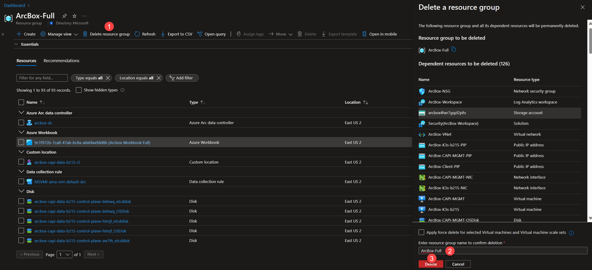

## Basic troubleshooting

Occasionally deployments of ArcBox may fail at various stages. Common reasons for failed deployments include:

- Invalid service principal id, service principal secret or service principal Azure tenant ID provided in _azuredeploy.parameters.json_ file.
- Invalid SSH public key provided in _azuredeploy.parameters.json_ file.
  - An example SSH public key is shown here. Note that the public key includes "ssh-rsa" at the beginning. The entire value should be included in your _azuredeploy.parameters.json_ file.

      

- Not enough vCPU quota available in your target Azure region - check vCPU quota and ensure you have at least 52 available. See the [prerequisites](#prerequisites) section for more details.
- Target Azure region does not support all required Azure services - ensure you are running ArcBox in one of the supported regions listed in the above section "ArcBox Azure Region Compatibility".
- "BadRequest" error message when deploying - this error returns occasionally when the Log Analytics solutions in the ARM templates are deployed. Typically, waiting a few minutes and re-running the same deployment resolves the issue. Alternatively, you can try deploying to a different Azure region.

  

  

### Exploring logs from the _ArcBox-Client_ virtual machine

Occasionally, you may need to review log output from scripts that run on the _ArcBox-Client_, _ArcBox-CAPI-MGMT_ or _ArcBox-K3s_ virtual machines in case of deployment failures. To make troubleshooting easier, the ArcBox deployment scripts collect all relevant logs in the _C:\ArcBox\Logs_ folder on _ArcBox-Client_. A short description of the logs and their purpose can be seen in the list below:

| Log file | Description |
| ------- | ----------- |
| _C:\ArcBox\Logs\Bootstrap.log_ | Output from the initial bootstrapping script that runs on _ArcBox-Client_. |
| _C:\ArcBox\Logs\ArcServersLogonScript.log_ | Output of _ArcServersLogonScript.ps1_ which configures the Hyper-V host and guests and onboards the guests as Azure Arc-enabled servers. |
| _C:\ArcBox\Logs\DataServicesLogonScript.log_ | Output of _DataServicesLogonScript.ps1_ which configures Azure Arc-enabled data services baseline capability. |
| _C:\ArcBox\Logs\deployPostgreSQL.log_ | Output of _deployPostgreSQL.ps1_ which deploys and configures PostgreSQL with Azure Arc. |
| _C:\ArcBox\Logs\deploySQL.log_ | Output of _deploySQL.ps1_ which deploys and configures SQL Managed Instance with Azure Arc. |
| _C:\ArcBox\Logs\installCAPI.log_ | Output from the custom script extension which runs on _ArcBox-CAPI-MGMT_ and configures the Cluster API for Azure cluster and onboards it as an Azure Arc-enabled Kubernetes cluster. If you encounter ARM deployment issues with _ubuntuCapi.json_ then review this log. |
| _C:\ArcBox\Logs\installK3s.log_ | Output from the custom script extension which runs on _ArcBox-K3s_ and configures the Rancher cluster and onboards it as an Azure Arc-enabled Kubernetes cluster. If you encounter ARM deployment issues with _ubuntuRancher.json_ then review this log. |
| _C:\ArcBox\Logs\MonitorWorkbookLogonScript.log_ | Output from _MonitorWorkbookLogonScript.ps1_ which deploys the Azure Monitor workbook. |
| _C:\ArcBox\Logs\SQLMIEndpoints.log_ | Output from _SQLMIEndpoints.ps1_ which collects the service endpoints for SQL MI and uses them to configure Azure Data Studio connection settings. |

  

### Exploring installation logs from the Linux virtual machines

In the case of a failed deployment, pointing to a failure in either the _ubuntuRancherDeployment_ or the _ubuntuCAPIDeployment_ Azure deployments, an easy way to explore the deployment logs is available directly from the associated virtual machines.

  

- Depends on which deployment failed, connect using SSH to the associated virtual machine public IP:
  - _ubuntuCAPIDeployment_ - _ArcBox-CAPI-MGMT_ virtual machine.
  - _ubuntuRancherDeployment_ - _ArcBox-K3s_ virtual machine.

    Since you are logging in using the provided SSH public key, all you need is the _arcdemo_ username.

      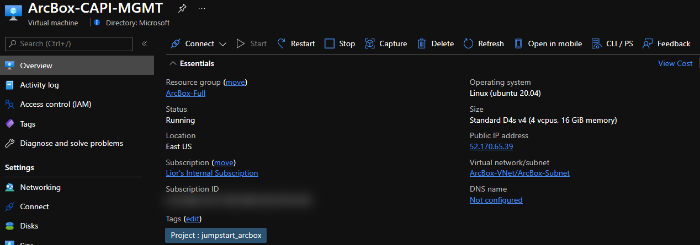

      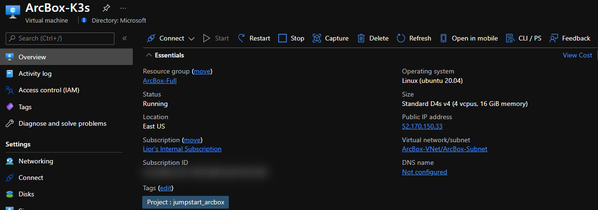

- As described in the message of the day (motd), depends on which virtual machine you logged into, the installation log can be found in the _jumpstart_logs_ folder. This installation logs can help determine the root cause for the failed deployment.
  - _ArcBox-CAPI-MGMT_ log path: _jumpstart_logs/installCAPI.log_
  - _ArcBox-K3s_ log path: _jumpstart_logs/installK3s.log_

      

- From the screenshot below, looking at _ArcBox-CAPI-MGMT_ virtual machine CAPI installation log using the `cat jumpstart_logs/installCAPI.log` command, we can see the _az login_ command failed due to bad service principal credentials.

  

  

- You might randomly get a similar error in the _InstallCAPI.log_ to `Error from server (InternalError): error when creating "template.yaml": Internal error occurred: failed calling webhook "default.azuremachinetemplate.infrastructure.cluster.x-k8s.io": failed to call webhook: Post "https://capz-webhook-service.capz-system.svc:443/mutate-infrastructure-cluster-x-k8s-io-v1beta1-azuremachinetemplate?timeout=10s": EOF`. This is an issue we are currently investigating. To resolve please redeploy ArcBox.

If you are still having issues deploying ArcBox, please [submit an issue](https://aka.ms/JumpstartIssue) on GitHub and include a detailed description of your issue, the Azure region you are deploying to, the flavor of ArcBox you are trying to deploy. Inside the _C:\ArcBox\Logs_ folder you can also find instructions for uploading your logs to an Azure storage account for review by the Jumpstart team.
