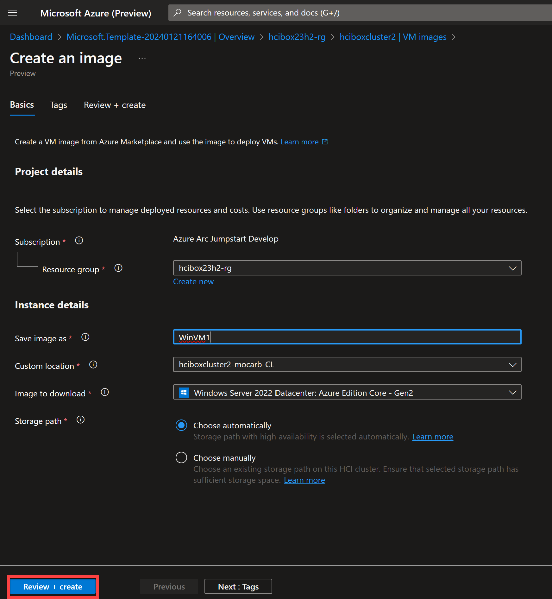

## Virtual machine provisioning with Azure Arc

Azure Stack HCI supports [VM provisioning the Azure portal](https://learn.microsoft.com/azure-stack/hci/manage/manage-arc-virtual-machines). Like all Azure Stack HCI clusters, the HCIBox cluster comes preconfigured with the components needed for VM management through Azure portal. Follow this guide to configure a basic VM from a marketplace image.

## Create Virtual Machine images from Azure marketplace

Before you can create virtual machines on your HCI cluster from Azure portal, you must create some VM images that can be used as a base. These images can be imported from Azure marketplace or provided directly by the user. In this use case you will create an image from Azure marketplace.

- Navigate to your cluster resource inside the HCIBox resource group and click it.

  

- Click on "VM Images" in the menu and then click the "Add VM image" dropdown and select "From Azure Marketplace."

  

- In this example we will select Windows Server 2022 Core Azure Edition from the list of images. Give your VM image a name, select the default custom location from the dropdown, and leave the storage path set to "Choose automatically."

  

## Next steps

Review the [Azure Stack HCI VM management](https://learn.microsoft.com/azure-stack/hci/manage/azure-arc-enabled-virtual-machines#what-is-azure-arc-resource-bridge) documentation for additional information.
