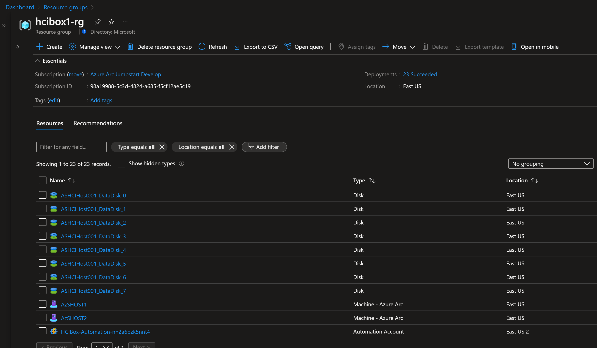
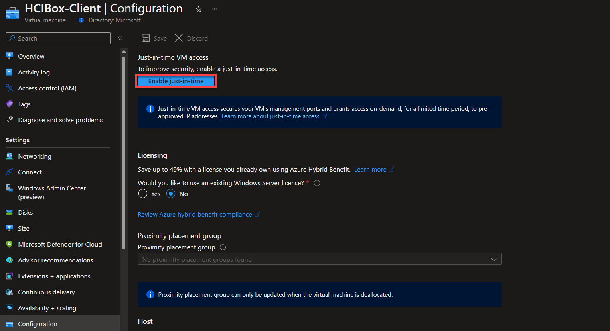
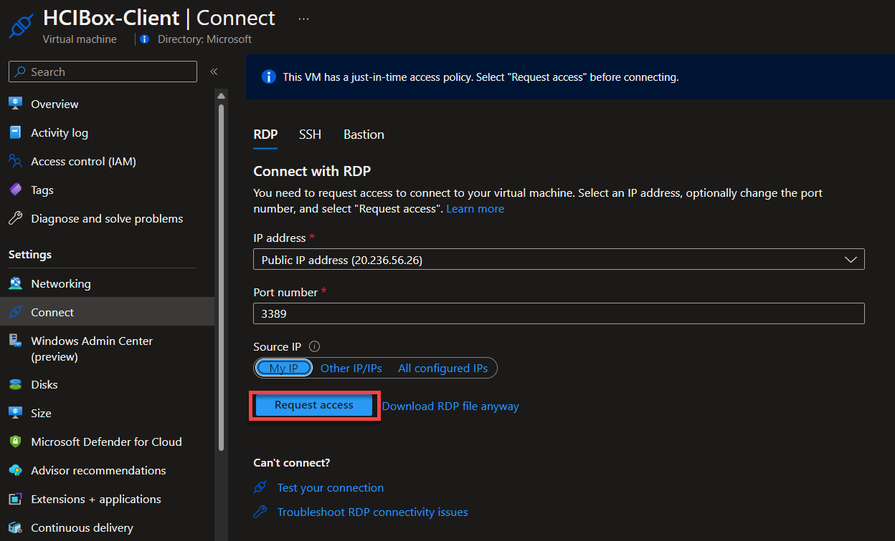
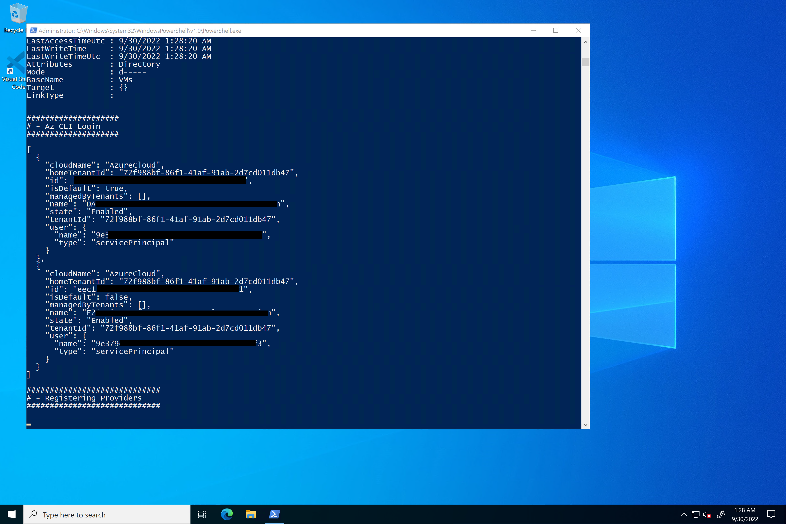
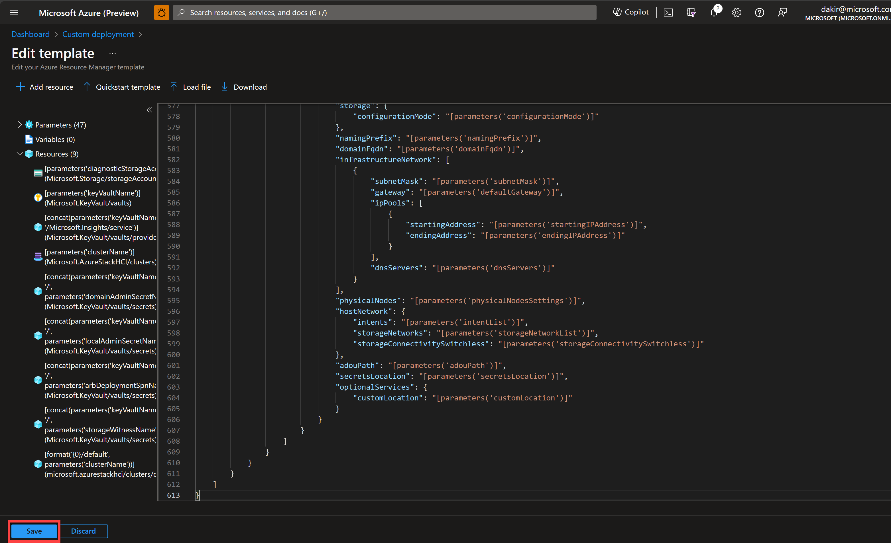
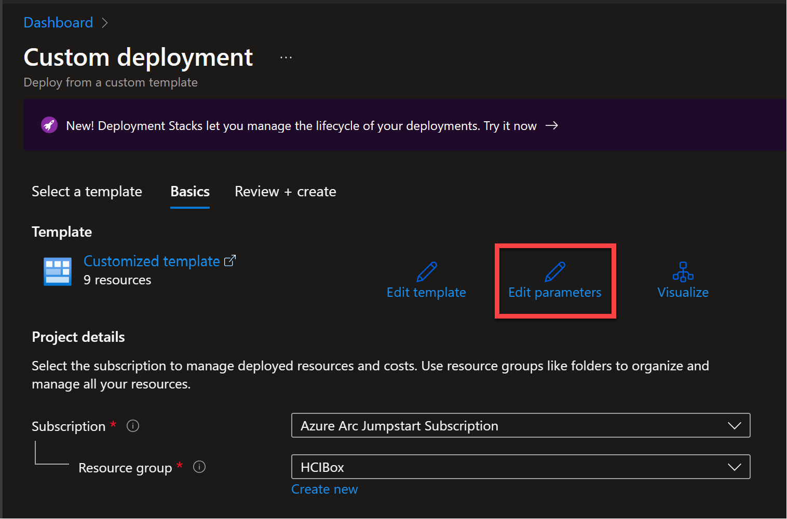
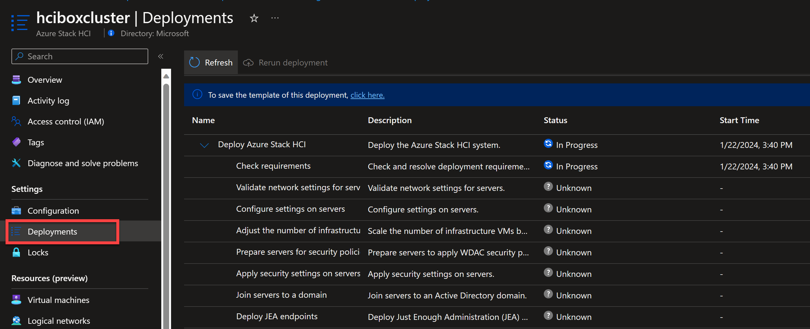

## Start post-deployment automation

Once your bicep deployment is complete with Azure CLI or Azure Developer CLI, you can open the Azure portal and see the initial HCIBox resources inside your resource group. Now you must remote into the _HCIBox-Client_ VM to continue the next phase of the deployment.

  

   > **Note:** For enhanced HCIBox security posture, RDP (3389) and SSH (22) ports are not open by default in HCIBox deployments. You will need to create a network security group (NSG) rule to allow network access to port 3389, or use [Azure Bastion](https://learn.microsoft.com/azure/bastion/bastion-overview) or [Just-in-Time (JIT)](https://learn.microsoft.com/azure/defender-for-cloud/just-in-time-access-usage?tabs=jit-config-asc%2Cjit-request-asc) access to connect to the VM.

### Connecting to the HCIBox Client virtual machine

Various options are available to connect to _HCIBox-Client_ VM, depending on the parameters you supplied during deployment.

- [RDP](#connecting-directly-with-rdp) - available after configuring access to port 3389 on the _Arc-App-Client-NSG_, or by enabling [Just-in-Time access (JIT)](#connect-using-just-in-time-access-jit).
- [Azure Bastion](#connect-using-azure-bastion) - available if *`true`* was the value of your _`deployBastion`_ parameter during deployment.

#### Connecting directly with RDP

By design, HCIBox does not open port 3389 on the network security group. Therefore, you must create an NSG rule to allow inbound 3389.

  > **Note:** If you deployed with Azure Developer CLI then this step is automatically done for you as part of the automation.

- Open the _HCIBox-NSG_ resource in Azure portal and click "Add" to add a new rule.

  

  

- Specify the IP address that you will be connecting from and select RDP as the service with "Allow" set as the action. You can retrieve your public IP address by accessing [https://icanhazip.com](https://icanhazip.com) or [https://whatismyip.com](https://whatismyip.com).

  

  

  

#### Connect using Azure Bastion

- If you have chosen to deploy Azure Bastion in your deployment, use it to connect to the VM.

  

  > **Note:** When using Azure Bastion, the desktop background image is not visible. Therefore some screenshots in this guide may not exactly match your experience if you are connecting to _HCIBox-Client_ with Azure Bastion.

#### Connect using just-in-time access (JIT)

If you already have [Microsoft Defender for Cloud](https://learn.microsoft.com/azure/defender-for-cloud/just-in-time-access-usage?tabs=jit-config-asc%2Cjit-request-asc) enabled on your subscription and would like to use JIT to access the Client VM, use the following steps:

- In the Client VM configuration pane, enable just-in-time. This will enable the default settings.

  

  

  

#### The Logon scripts

- Once you log into the _HCIBox-Client_ VM, a PowerShell script will open and start running. **This script will take between 1-2 hours to finish**, and once completed, the script window will close automatically. At this point, the infrastructure deployment is complete.

  

  > **Note:** The automation will take 1-2 hours to fully complete. Do not close the PowerShell window during this time. When automation is completed successfully the PowerShell window will close and the desktop background will be changed to the HCIBox wallpaper.

- Infrastructure deployment is complete. Review the logs in C:\HCIBox\Logs for any issues.

- Check in Azure portal that both HCI nodes have been onboarded as Arc-enabled servers.

- Verify that both of the Arc-enabled servers have successfully installed the three HCI extensions: TelemetryAndDiagnostics, AzureEdgeLifecycleManager, and AzureEdgeDeviceManagement

  

### Azure portal Azure Stack HCI cluster validation and deployment

Azure Stack HCI uses a two-step process to create and register clusters in Azure using an ARM template.

  1. **Validate** - an ARM template is deployed with a "validate" flag. This begins the final cluster validation step and takes around 20 minutes.
  2. **Deploy** - the same ARM template is redeployed with the "deploy" flag. This deploys the cluster and Arc infrastructure and registers the cluster. This step takes around 2-3 hours.

#### Validate cluster in Azure portal

- Before submitting the ARM deployment, you need to add your user account as a Key Vault Administrator on the HCIBox resource group. Navigate to the resource group then click "Access Control (IAM)" and then "Add role assignment". Select the "Key Vault Administrator role" then click on to the next screen to select your user account and assign your user the role.

  

- Now you will use the generated ARM template to validate the HCI cluster in Azure portal. Open File Explorer on _HCIBox-Client_ and navigate to the _C:\HCIBox_ folder. Right click on the folder and open in VSCode.

- Open and review the hci.json and hci.parameters.json files in VSCode. Verify that the parameters file looks correct without "staging" placeholder values.

- Navigate to Azure portal and type "custom deployment" in the search bar, then select "Deploy a custom template".

  

- Select "Build your own template in the editor".

  

- Paste the contents of hci.json into the editor and click "Save".

  

- Click "Edit parameters" and then paste the contents of hci.parameters.json into the editor and click "Save."

  

- Click through again on "Create" and then "Review and Create" to start the validation phase of cluster deployment.

  

#### Deploy cluster in Azure portal

- When validation is complete navigate to the cluster resource in your HCIBox resource group and then click the "Deploy now" link.

  

- Click the link to deploy the validated cluster resource and then click through again to deploy the cluster. The cluster may take several hours to deploy.

  

- If you navigate elsewhere in the Azure Portal, you can return monitor progress on the Deployments tab of the cluster resource.

  

#### Deployment complete

- Once the HCIBox cluster is deployed it's time to start exploring various HCIBox features. Head on to the [Using HCIBox](/azure_stack_hcibox/using_hcibox) guide for next steps.
