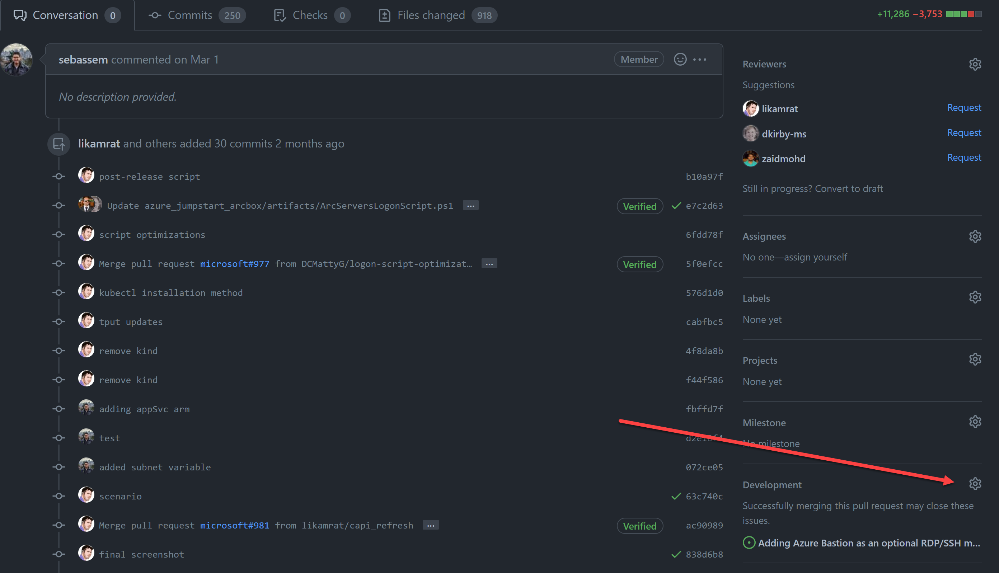
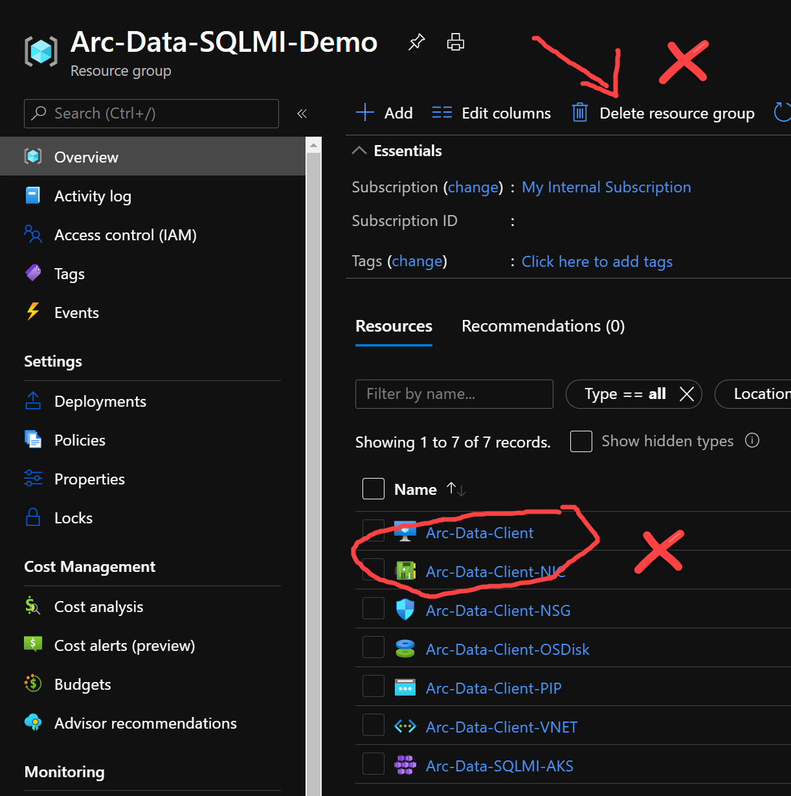
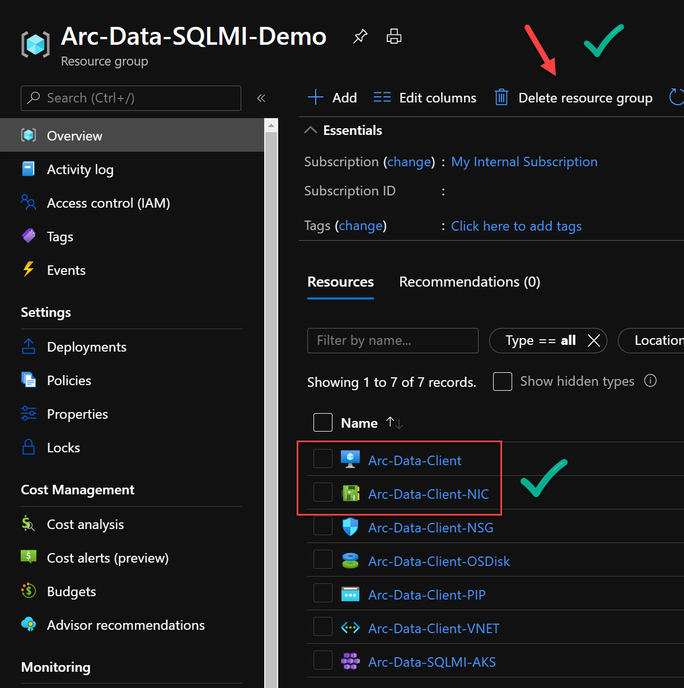

## Jumpstart contribution guidelines

**Welcome to Arc Jumpstart contribution guidelines!**

We extend our heartfelt gratitude for considering a contribution to Arc Jumpstart – your dedication is immensely valued! Our Jumpstart repository thrives on high-quality, detail-oriented bundled automation and documents.

Use these guidelines as a roadmap for crafting a successful, polished contribution that aligns with our standards. For newcomers, we encourage you to explore the raw code of existing scenarios, which offer valuable insights into the approved scenario format and encompass all the guidelines outlined here. If you have questions, our team of Arc Jumpstart project maintainers is available to help.

## Code reviews

The Arc Jumpstart is a mix of various automation scripts and techniques, code styles, and documentation.

Before anything gets published, a code review process will be done by one of the Jumpstart core maintainers. We want your contribution to be widely adopted and meet the highest standards possible, and we’re here to help you get there!

## Issues, pull requests, and discussions

Before diving into your contribution, it's crucial to establish clear communication within our open source community. To streamline collaboration and maintain transparency, we ask that contributors [open an issue](https://aka.ms/JumpstartIssue) and start a discussion or [pull request (PR)](https://aka.ms/JumpstartFeature) before initiating work on their proposed changes. Opening an issue allows for discussion and consensus-building around the proposed idea, ensuring that it aligns with the project's goals and existing work.

[GitHub Discussions](https://aka.ms/JumpstartDiscussions), an additional avenue, provides an interactive platform for community members to engage in conversations, ask questions, and share ideas. A pull request serves as a tangible proposal, demonstrating the changes you wish to implement. By following this process and utilizing GitHub Discussions, we foster a collaborative environment where ideas are shared, reviewed, and refined collectively, ensuring the continuous improvement of our project. Your active participation and adherence to these guidelines are essential to the success of our collaborative efforts.

When submitting your PR, make sure to associate the issue the PR is solving, so once merged, the issue will be closed automatically.

## Code placement

Before submitting a pull request (PR), we encourage you to consult with one of the project maintainers regarding the placement of your code and documentation within the folder structure. Maintainers have a deep understanding of the project's architecture and organization, ensuring that your contribution seamlessly integrates with the existing codebase. By seeking their guidance, you can make informed decisions about where your changes best fit. Collaboration with maintainers not only ensures that your efforts align with the project's vision but also fosters a collaborative spirit that is vital to the success of our open source community. Reach out to us; we're here to help you make meaningful contributions that positively impact our project.

## Relying on existing documents and code

In our collaborative open source environment, we value consistency and adherence to established guidelines. To ensure that your contributions align with our project's goals and maintain the project's integrity, we strongly encourage you to rely on existing documents and code, which embody years of collective knowledge, encompassing nuanced best practices, coding standards, and project-specific conventions.

Guidelines for relying on existing resources:

1. **Documentation:** Before drafting new documentation, thoroughly explore our existing documentation to understand the preferred writing style, formatting, and content structure. If you find gaps or inaccuracies, feel free to update and improve the existing documents.

2. **Codebase:** Examine the existing codebase to comprehend the project's architecture, coding patterns, and coding style. Emulate the existing coding practices to maintain consistency across the project. If you need to introduce new features or modifications, ensure they align with the existing code's logic and structure.

## Prerequisites guidelines

Every Jumpstart scenario or solution must start with a comprehensive "Prerequisites" section, which sets the foundation for a seamless user experience. Please follow these guidelines:

1. **Automation priority:** Exercise discernment in identifying prerequisites that can be automated. If a prerequisite can be incorporated into the automation flow, it should seamlessly integrate within the scenario, enhancing user convenience and minimizing manual intervention.

2. **Reviewer's insight:** Embrace feedback and reviewer input during the pull request code review process. Our reviewers possess valuable expertise and may identify opportunities to automate specific prerequisites. Your receptiveness to these suggestions enriches the collaborative spirit of our community.

3. **Referencing existing scenarios:** As highlighted in the previous section, we strongly encourage referencing existing scenarios. Drawing inspiration from established templates not only fosters consistency but also reduces the likelihood of future refactoring or unnecessary modifications. Utilize these references as a scaffold to build robust and efficient prerequisites for your scenario.

## Markdown linting and style guidelines

To uphold the professional presentation and readability of our content, it is imperative that all scenarios and README files should adhere to standard markdown and linting rules. Please follow these guidelines:

1. **Utilize standard markdown:** Ensure that your content follows the standard markdown syntax, guaranteeing uniformity and ease of understanding for our readers.

2. **Editor recommendation:** We recommend using [Visual Studio Code (VS Code)](https://code.visualstudio.com/) for your editing needs. VS Code offers a robust Integrated Development Environment (IDE) experience, augmented by its support for extensions tailored to markdown editing.

3. **Markdown linting:** Before submitting a pull request (PR) for a new or updated scenario, conduct thorough markdown linting. This process helps identify and rectify errors, ensuring the accuracy and professionalism of our documentation. If you opt for VS Code as your editor, we strongly advise installing the [_markdownlint_](https://marketplace.visualstudio.com/items?itemName=DavidAnson.vscode-markdownlint) extension. This extension streamlines the linting process, enabling efficient and effective identification of markdown-related issues and typos.

### Markdown linting example and resolution guidelines

To help ensure error-free documentation, familiarize yourself with common issues that may arise while writing your scenario and how they are resolved. Here we explain the markdown rules flagged by the linting extension, along with step-by-step instructions on rectifying violations.

1. **Heading structure:** Ensure proper hierarchy in your headings. Markdownlint may highlight inconsistencies in heading levels. To resolve this, adjust the number of hash symbols (#) to match the desired heading level.

2. **Link formatting:** Markdownlint detects malformed or broken links. Verify that your links are correctly formatted, including both the square brackets for the link text and the parentheses for the URL. Fix any broken links by providing the correct URL.

3. **List formatting:** Maintain consistent list indentation and bullet point styles. Markdownlint helps identify misaligned or improperly formatted lists. To resolve this, align list items correctly and ensure consistent bullet points or numbers.

4. **Code block indentation:** Markdownlint ensures code blocks are correctly indented. If your code blocks are flagged, adjust the indentation to match the surrounding text. This enhances code readability and presentation.

5. **Image syntax:** If you include images, Markdownlint checks the syntax. Ensure that image links are correctly formatted, enclosing the alt text in square brackets and the image URL in parentheses. Correct any syntax errors to display images properly.

Below is an example showing common issues you may see while writing your scenario. [Here](https://marketplace.visualstudio.com/items?itemName=DavidAnson.VSCode-markdownlint), you can find detailed explanations of the markdown rules highlighted by the extension and how to fix a violation of these rules.

## Screenshot quality and standards

Exceptional quality, accuracy, and cleanliness in screenshots are paramount for delivering an outstanding Jumpstart scenario and reader experience. Please follow these guidelines:

1. **Clarity and precision:** Ensure screenshots are clear, sharp, and accurately represent the content they illustrate. High-resolution images enhance visibility and comprehension for our readers.

2. **Relevance and context:** Capture screenshots that directly relate to the scenario's steps and provide essential context. Irrelevant or extraneous visuals can confuse readers and dilute the instructional value.

3. **Consistency in appearance:** Maintain a consistent visual style across all screenshots within a document. Consistency enhances the professional appearance of our scenarios and fosters a cohesive reading experience.

4. **Annotations and highlights:** When necessary, use annotations or highlights to draw attention to specific elements within the screenshot. Arrows, circles, or textual callouts can guide readers' focus and emphasize crucial details.

5. **Editing documentation:** As a crucial step in the process, ensure that screenshots are seamlessly integrated into the documentation. Pay attention to formatting, alignment, and captions to create a polished and cohesive visual narrative.

6. **Resolution and format:** Opt for commonly used image formats like PNG or JPEG and ensure an appropriate resolution. Images that are too large may slow down the document's loading time, so strike a balance between quality and file size.

7. **Accessibility:** Consider readers with visual impairments. If using annotations, provide alternative descriptions for screen readers to ensure accessibility for all users.

### Screenshot formatting

- Screenshots must be saved in _png_ file format.

- Highlight borders and arrows must be used in a non-freeform fashion. Choose a color and line width that make sense (contrast-wise) so it will be embedded nicely in the screenshot.

- When using step numbers, make sure these are positioned correctly and visible to the reader.

- Be aware of sensitive information (i.e. subscription id, passwords, service principals, etc.) in your screenshots and be sure to blur/mask it out.

- For Azure portal related screenshots, we recommend using the ["Az Mask"](https://chrome.google.com/webstore/detail/az-mask/amobeamdmdnloajcaiomgegpakjdiacm) browser extension.

## Code blocks and commands formatting

In Jumpstart, code blocks and commands play a pivotal role in conveying technical information accurately. To ensure adherence to markdown rules and maintain our scenario standards, it is imperative that each code block and command utilize the correct markdown language highlighter.

1. **Markdown language highlighter:** Choose the appropriate markdown language highlighter for each code block and command. Markdown supports a wide array of programming languages and scripting formats. By specifying the correct language highlighter, you enable syntax highlighting, improving the readability and comprehension of the code.

2. **Consistency across scenarios:** Maintain consistency in markdown language highlighters across all scenarios. Consistent formatting creates a seamless reading experience for users navigating various scenarios.

3. **Command line inputs:** When presenting command-line inputs, use the appropriate shell language highlighter (e.g., Bash, PowerShell) to accurately represent the command syntax. Properly formatted command examples ensure that users can replicate the steps without encountering unexpected errors.

4. **Editing and review:** During the editing and review process, pay close attention to code block formatting. Reviewers and contributors should collaborate to confirm that the correct language highlighter is applied to each code snippet and command, refining the content for accuracy and consistency.

## Managing credentials, secrets, and passwords

The importance of safeguarding credentials, secrets, and passwords cannot be overstated. When crafting code and guides for our scenarios, utmost care must be taken to protect sensitive information. Here are essential guidelines to ensure the secure handling of such data:

1. **Masking sensitive information:** Whether it's a credential included in the code or a secret/password displayed as part of terminal output, it is imperative to mask these details from the reader. Masking ensures that sensitive information remains confidential and inaccessible to unauthorized individuals.

2. **Environment variables:** Encourage the use of environment variables for storing sensitive information. By employing environment variables, credentials and secrets can be securely managed outside the codebase, reducing the risk of accidental exposure in version control systems.

3. **Encryption and hashing:** Whenever feasible, advocate for encryption and hashing techniques to secure sensitive data. Encrypting passwords and sensitive configuration files adds an extra layer of protection, making it more difficult for malicious entities to access the stored information..

4. **Educational context:** If it is necessary to demonstrate specific operations involving credentials or secrets for educational purposes, clearly highlight that the displayed information is for instructional use only and should be replaced with appropriate values in a real-world scenario.

5. **Regular review:** During the review process, pay meticulous attention to any code that involves sensitive information. Reviewers and contributors should collaborate to confirm that sensitive details are appropriately masked and secured, ensuring that the scenario content meets our stringent security standards.

Thank you for your vigilance in safeguarding credentials, secrets, and passwords, enhancing the overall security of our Jumpstart scenarios.

## Naming conventions and branding guidelines

In the realm of Jumpstart, precise naming conventions and accurate representation of tech terms, brand names, and various identifiers are essential. Consistency and clarity in how we write company names, products, features, and other technical terminology help maintain professionalism and coherence across our documentation. Please follow these guidelines:

1. **Consistent spelling and capitalization:** Ensure consistent spelling and capitalization of company names, products, and features throughout the documentation.

2. **Official branding guidelines:** Familiarize yourself with the official branding guidelines provided by companies and organizations. Adhere to their specified naming conventions, trademarks, and logos. Respect trademarked terms and use them in accordance with the guidelines outlined by the respective entities.

3. **Acronyms and abbreviations:** Clearly define and introduce acronyms and abbreviations before using them in the text. Once introduced, use the abbreviated form consistently to prevent confusion.

4. **Technical terminology:** When dealing with technical terms, use industry-standard names whenever applicable. Avoid jargon and abbreviations that might not be universally understood. If specialized terms are necessary, provide clear explanations to ensure readers comprehend the context.

5. **Version numbers:** When referencing software products or tools, include version numbers to indicate the specific version being discussed. This information is vital for readers to match the documentation with their software environment accurately.

6. **Branding in code:** If code snippets or configuration examples involve brand-specific elements, ensure that the naming conventions within the code align with the official branding guidelines. Consistency between textual explanations and code examples is key.

7. **Review and collaboration:** During the review process, pay attention to naming conventions and branding. Reviewers and contributors should collaborate to confirm that all names and terms are accurately represented.
