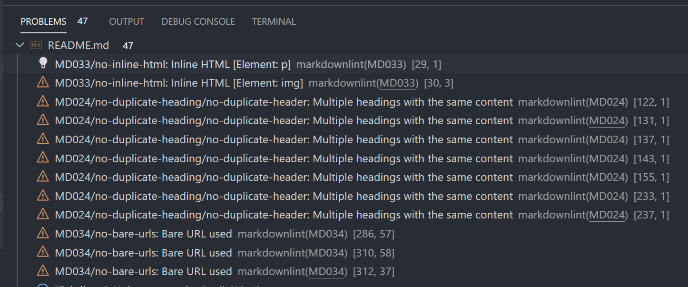
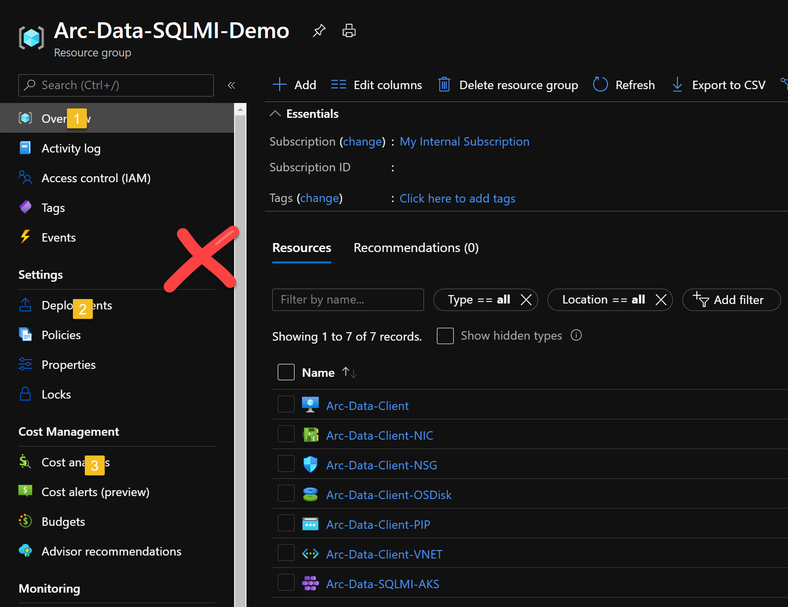
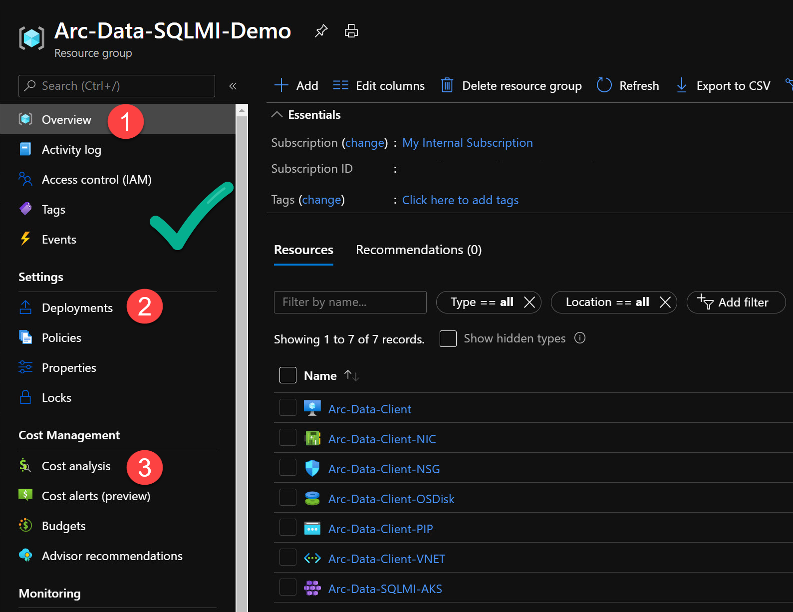
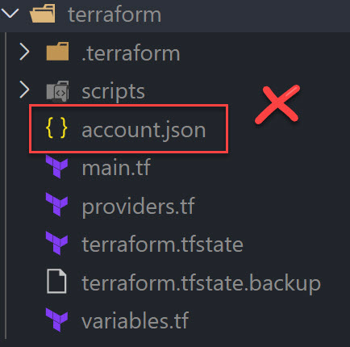

## Jumpstart contribution guidelines

**Welcome to Arc Jumpstart contribution guidelines!**

We extend our heartfelt gratitude for considering a contribution to Arc Jumpstart – your dedication is immensely valued! Our Jumpstart repository thrives on high-quality, detail-oriented bundled automation and documents. 

To ensure your contribution aligns seamlessly with our standards, we are here to provide comprehensive guidelines. These guidelines are your roadmap to crafting a successful and polished contribution. For newcomers, we encourage exploring the raw code of existing scenarios; these exemplars offer invaluable insights into the approved scenario format and encompass all the guidelines outlined here. Should any queries arise, our team of Jumpstart project maintainers is readily available to assist. Together, let's elevate the excellence of our shared contributions!

## Code reviews

The Arc Jumpstart is a mix of various automation scripts and techniques, code styles, and documentation.

Before anything gets published, a code review process will be done by one of the Jumpstart core maintainers. We want your contribution to be successful and widely adopted, and to meet the highest standards possible - we are here to help you get there!

## Issues, pull requests and discussions

Before diving into your contribution, it's crucial to establish clear communication within our open-source community. To streamline collaboration and maintain transparency, we kindly request contributors to [open an issue](https://aka.ms/JumpstartIssue), start a discussion, or a [pull request (PR)](https://aka.ms/JumpstartFeature) before initiating work on their proposed changes. Opening an issue allows for discussion and consensus-building around the proposed idea, ensuring that it aligns with the project's goals and existing work.

[GitHub Discussions](https://aka.ms/JumpstartDiscussions), an additional avenue, provides an interactive platform for community members to engage in conversations, ask questions, and share ideas. A pull request serves as a tangible proposal, demonstrating the changes you wish to implement. By following this process and utilizing GitHub Discussions, we foster a collaborative environment where ideas are shared, reviewed, and refined collectively, ensuring the continuous improvement of our project. Your active participation and adherence to these guidelines are essential to the success of our collaborative efforts.

When submitting your PR, make sure to associate the issue the PR is solving, so once merged, the issue will be closed automatically.

## Code placement

Before submitting a pull request (PR), we encourage contributors to consult with one of the project maintainers regarding the placement of their code and documentation within the folder structure. Maintainers have a deep understanding of the project's architecture and organization, ensuring that your contribution seamlessly integrates with the existing codebase. By seeking their guidance, you can make informed decisions about where your changes best fit, enhancing the overall coherence and maintainability of the project. Collaboration with maintainers not only ensures that your efforts align with the project's vision but also fosters a collaborative spirit that is vital to the success of our open-source community. Reach out to us; we're here to help you make meaningful contributions that positively impact our project.

## Relying on existing documents and code

In our collaborative open-source environment, we highly value consistency and adherence to established guidelines. To ensure that your contributions align seamlessly with our project's goals and maintain the project's integrity, we strongly encourage you to rely on existing documents and code wherever possible. Our existing documentation and codebase embody years of collective knowledge, encompassing nuanced best practices, coding standards, and project-specific conventions. By referring to these resources, you gain invaluable insights into the project's expectations, enhancing the quality and coherence of your contributions.

Guidelines for relying on existing resources:

1. **Documentation:** Before drafting new documentation, thoroughly explore our existing documentation to understand the preferred writing style, formatting, and content structure. If you find gaps or inaccuracies, feel free to update and improve the existing documents.

2. **Codebase:** Examine the existing codebase to comprehend the project's architecture, coding patterns, and coding style. Emulate the existing coding practices to maintain consistency across the project. If you need to introduce new features or modifications, ensure they align with the existing code's logic and structure.

By building upon the foundation laid by our existing documents and code, you contribute to a harmonious and efficient development process. Your efforts not only preserve the project's integrity but also empower our community to collaborate seamlessly. Thank you for your dedication to upholding our project standards and ensuring the longevity of our shared open-source endeavor.

## Prerequisites guidelines

In alignment with our commitment to excellence, every Jumpstart scenario or solution must commence with a comprehensive "Prerequisites" section, setting the foundation for a seamless user experience. To ensure clarity and efficiency, please adhere to the following guidelines when crafting this crucial segment:

1. **Automation Priority:** Exercise discernment in identifying prerequisites that can be automated. If a prerequisite can be incorporated into the automation flow, it should seamlessly integrate within the scenario, enhancing user convenience and minimizing manual intervention.

2. **Reviewer's Insight:** Embrace feedback and reviewer input during the pull request code review process. Our reviewers possess valuable expertise and may identify opportunities to automate specific prerequisites. Your receptiveness to these suggestions enriches the collaborative spirit of our community.

3. **Referencing Existing Scenarios:** As highlighted in the previous section, we strongly encourage referencing existing scenarios. Drawing inspiration from established templates not only fosters consistency but also reduces the likelihood of future refactoring or unnecessary modifications. Utilize these references as a scaffold to build robust and efficient prerequisites for your scenario.

By upholding these standards, you contribute to the creation of high-quality, user-friendly solutions within our Jumpstart repository. Thank you for your dedication to excellence and your collaborative spirit, ensuring the success of our shared endeavors.

## Markdown linting and style guidelines

In upholding the professional presentation and readability of our content, it is imperative that all scenarios and README files adhere to standard markdown and linting rules. To maintain consistency across our documentation, kindly observe the following guidelines:

1. **Utilize Standard Markdown:** Ensure that your content follows the standard markdown syntax, guaranteeing uniformity and ease of understanding for our readers.

2. **Editor Recommendation:** We recommend using [Visual Studio Code (VS Code)](https://code.visualstudio.com/) for your editing needs. VS Code offers a robust Integrated Development Environment (IDE) experience, augmented by its support for extensions tailored to markdown editing.

3. **Markdown Linting:** Before submitting a pull request (PR) for a new or updated scenario, conduct thorough markdown linting. This process helps identify and rectify errors, ensuring the accuracy and professionalism of our documentation. If you opt for VS Code as your editor, we strongly advise installing the [_markdownlint_](https://marketplace.visualstudio.com/items?itemName=DavidAnson.vscode-markdownlint) extension. This extension streamlines the linting process, enabling efficient and effective identification of markdown-related issues and typos.

By adhering to these markdown linting and style guidelines, you contribute significantly to the clarity and coherence of our documentation. Your attention to these details enhances the overall user experience and reflects our commitment to quality.

### Markdown linting example and resolution guidelines

To assist you in navigating the markdown linting process, we provide a comprehensive example of common issues that may arise while writing your scenario. Familiarizing yourself with these issues and their resolutions ensures a smooth and error-free documentation experience. Below, you'll find detailed explanations of markdown rules flagged by the linting extension, along with step-by-step instructions on rectifying violations:

1. **Heading Structure:** Ensure proper hierarchy in your headings. Markdownlint may highlight inconsistencies in heading levels. To resolve this, adjust the number of hash symbols (#) to match the desired heading level.

2. **Link Formatting:** Markdownlint detects malformed or broken links. Verify that your links are correctly formatted, including both the square brackets for the link text and the parentheses for the URL. Fix any broken links by providing the correct URL.

3. **List Formatting:** Maintain consistent list indentation and bullet point styles. Markdownlint helps identify misaligned or improperly formatted lists. To resolve this, align list items correctly and ensure consistent bullet points or numbers.

4. **Code Block Indentation:** Markdownlint ensures code blocks are correctly indented. If your code blocks are flagged, adjust the indentation to match the surrounding text. This enhances code readability and presentation.

5. **Image Syntax:** If you include images, Markdownlint checks the syntax. Ensure that image links are correctly formatted, enclosing the alt text in square brackets and the image URL in parentheses. Correct any syntax errors to display images properly.

Below you can find an example of common markdown lint issues that will be presented to you as you are writing your scenario and must be fixed. [Here](https://marketplace.visualstudio.com/items?itemName=DavidAnson.VSCode-markdownlint), you can find detailed explanations of the markdown rules highlighted by the extension and how to fix a violation of these rules.

By addressing these common issues as you write your scenario, you contribute to the overall professionalism and accessibility of our documentation. Your attention to these details not only enhances the quality of your contributions but also elevates the user experience for all readers.

## Screenshot quality and standards

Exceptional quality, accuracy, and cleanliness in screenshots are paramount for delivering an outstanding Jumpstart scenario and reader experience. This section outlines essential guidelines and examples to uphold the highest standards for our screenshots:

1. **Clarity and Precision:** Ensure screenshots are clear, sharp, and accurately represent the content they illustrate. High-resolution images enhance visibility and comprehension for our readers.

2. **Relevance and Context:** Capture screenshots that directly relate to the scenario's steps and provide essential context. Irrelevant or extraneous visuals can confuse readers and dilute the instructional value.

3. **Consistency in Appearance:** Maintain a consistent visual style across all screenshots within a document. Consistency enhances the professional appearance of our scenarios and fosters a cohesive reading experience.

4. **Annotations and Highlights:** When necessary, use annotations or highlights to draw attention to specific elements within the screenshot. Arrows, circles, or textual callouts can guide readers' focus and emphasize crucial details.

5. **Editing Documentation:** As a crucial step in the process, ensure that screenshots are seamlessly integrated into the documentation. Pay attention to formatting, alignment, and captions to create a polished and cohesive visual narrative.

6. **Resolution and Format:** Opt for commonly used image formats like PNG or JPEG and ensure an appropriate resolution. Images that are too large may slow down the document's loading time, so strike a balance between quality and file size.

7. **Accessibility:** Consider readers with visual impairments. If using annotations, provide alternative descriptions for screen readers to ensure accessibility for all users.

By adhering to these screenshot standards and meticulously editing the documentation to integrate screenshots seamlessly, you enhance the overall clarity and effectiveness of our Jumpstart scenarios.

### Screenshot formatting

- Screenshots must be saved in _png_ file format.
- Either highlight boarders and/or arrows must be used in a non-freeform fashion. Choose a color and line width that make sense (contrast-wise) so it will be embedded nicely in the screenshot.

- When using step numbers, make sure these are positioned correctly and visible to the reader.

- Be aware of sensitive information (i.e. subscription id, passwords, service principals, etc.) in your screenshots and be sure to blur/mask it out.

- For Azure portal related screenshots, we recommend using the ["Az Mask"](https://chrome.google.com/webstore/detail/az-mask/amobeamdmdnloajcaiomgegpakjdiacm) browser extension.

## Code blocks and commands formatting

In Jumpstart, code blocks and commands play a pivotal role in conveying technical information accurately. To ensure adherence to markdown rules and maintain our scenario standards, it is imperative that each code block and command utilizes the correct markdown language highlighter. This meticulous attention to formatting not only enhances the visual clarity of the content but also ensures consistency and professionalism throughout our documentation.

1. **Markdown Language Highlighter:** Choose the appropriate markdown language highlighter for each code block and command. Markdown supports a wide array of programming languages and scripting formats. By specifying the correct language highlighter, you enable syntax highlighting, improving the readability and comprehension of the code.

2. **Consistency Across Scenarios:** Maintain consistency in markdown language highlighters across all scenarios. Consistent formatting creates a seamless reading experience for users navigating various scenarios. This uniformity reinforces our commitment to providing a standardized and user-friendly environment.

3. **Command Line Inputs:** When presenting command-line inputs, use the appropriate shell language highlighter (e.g., Bash, PowerShell) to accurately represent the command syntax. Properly formatted command examples ensure that users can replicate the steps without encountering unexpected errors.

4. **Editing and Review:** During the editing and review process, pay close attention to code block formatting. Reviewers and contributors should collaborate to confirm that the correct language highlighter is applied to each code snippet and command, refining the content for accuracy and consistency.

By meticulously adhering to these guidelines, the Jumpstart maintain a high standard of quality and professionalism. Clear, properly formatted code blocks and commands empower our readers to engage effectively with the technical content, fostering an environment of learning and collaboration.

## Managing credentials, secrets, and passwords

The significance of safeguarding credentials, secrets, and passwords cannot be overstated. When crafting code and guides for our scenarios, utmost caution must be exercised to protect sensitive information. Here are essential guidelines to ensure the secure handling of such data:

1. **Masking Sensitive Information:** Whether it's a credential included in the code or a secret/password displayed as part of terminal output, it is imperative to mask these details from the reader. Masking ensures that sensitive information remains confidential and inaccessible to unauthorized individuals, enhancing the security of our scenarios.

2. **Environment Variables:** Encourage the use of environment variables for storing sensitive information. By employing environment variables, credentials and secrets can be securely managed outside the codebase, reducing the risk of accidental exposure in version control systems.

3. **Encryption and Hashing:** Whenever feasible, advocate for encryption and hashing techniques to secure sensitive data. Encrypting passwords and sensitive configuration files adds an extra layer of protection, making it significantly challenging for malicious entities to access the stored information.

4. **Educational Context:** If it is essential to demonstrate specific operations involving credentials or secrets for educational purposes, clearly highlight that the displayed information is for instructional use only and should be replaced with appropriate values in a real-world scenario.

5. **Regular Review:** During the review process, pay meticulous attention to any code that involves sensitive information. Reviewers and contributors should collaborate to confirm that sensitive details are appropriately masked and secured, ensuring that the scenario content meets our stringent security standards.

By adhering to these guidelines, we uphold the integrity and confidentiality of sensitive information within our scenarios. Your diligence in implementing these security measures reinforces our commitment to providing reliable and trustworthy documentation to our users. Thank you for your vigilance in safeguarding credentials, secrets, and passwords, enhancing the overall security of our Jumpstart scenarios.

## Naming conventions and branding guidelines

In the realm of Jumpstart, precise naming conventions and accurate representation of tech terms, brand names, and various identifiers are essential. Consistency and clarity in how we write company names, products, features, and other technical terminology are crucial for maintaining professionalism and coherence across our documentation. Here are the guidelines to adhere to when dealing with naming conventions and branding:

1. **Consistent Spelling and Capitalization:** Ensure consistent spelling and capitalization of company names, products, and features throughout the documentation. Maintaining uniformity in these aspects enhances readability and establishes a professional tone.

2. **Official Branding Guidelines:** Familiarize yourself with the official branding guidelines provided by companies and organizations. Adhere to their specified naming conventions, trademarks, and logos. Respect trademarked terms and use them in accordance with the guidelines outlined by the respective entities.

3. **Acronyms and Abbreviations:** Clearly define and introduce acronyms and abbreviations before using them in the text. Once introduced, use the abbreviated form consistently to prevent confusion.

4. **Technical Terminology:** When dealing with technical terms, use industry-standard names whenever applicable. Avoid jargon and abbreviations that might not be universally understood. If specialized terms are necessary, provide clear explanations to ensure readers comprehend the context.

5. **Version Numbers:** When referencing software products or tools, include version numbers to indicate the specific version being discussed. This information is vital for readers to match the documentation with their software environment accurately.

6. **Branding in Code:** If code snippets or configuration examples involve brand-specific elements, ensure that the naming conventions within the code align with the official branding guidelines. Consistency between textual explanations and code examples is key.

7. **Review and Collaboration:** During the review process, pay attention to naming conventions and branding. Reviewers and contributors should collaborate to confirm that all names and terms are accurately represented, adhering to the specified guidelines.

By adhering to these guidelines, we maintain professionalism and clarity in our documentation, ensuring that readers can confidently engage with the content. Your commitment to precise naming conventions and accurate branding significantly contributes to the credibility and reliability of the Jumpstart.
